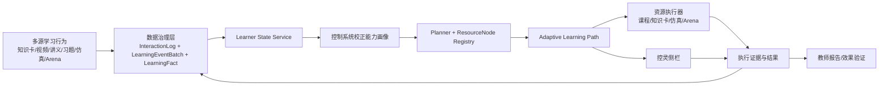
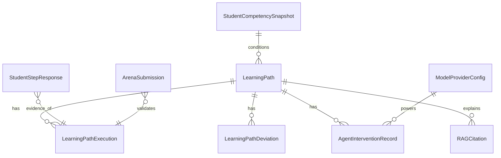

# 基于 integration 现状的控制系统校正能力画像驱动学习路径规划与控灵伴学闭环实施方案

本报告按要求以已启用的 GitHub 连接器 `api_tool: GitHub` 所提取的 `yong-wei/act` 仓库证据为主，外部资料仅用于补强模型兼容层与现代自适应学习方法论。结论很明确：**当前 integration 分支已经具备做成“控制系统校正能力闭环”最小可用产品的骨架，不需要推倒重来；真正该做的是把已有的 Learner State、AdaptiveAssessment、ResourceNode/Planner、Arena 与控灵运行时，收束成一个单目标、可解释、可追踪、可验证的闭环产品。** 第一优先级不是再造更多工作台，而是把“画像诊断 → 路径生成 → 资源执行 → 仿真/Arena 验证 → 控灵纠偏 → 教师报告”做成一个一体化对象流。当前最大短板有三处：**学习路径没有成为一等持久化对象、学生端没有真正的自适应学习中心、模型/引用层仍不够专业级。** 仓库现有新栈、数据治理链和智能体工具链已经足以支撑这次重构。fileciteturn9file0L7-L14 fileciteturn9file0L82-L120 fileciteturn8file0L8-L29 fileciteturn19file0L67-L140 fileciteturn21file0L19-L79 fileciteturn31file0L66-L105

## 执行摘要

如果只允许专攻一个具体实现，我建议聚焦为：

**“控制系统校正能力的画像驱动学习路径规划与控灵伴学闭环”**

原因不是概念上好听，而是它正好压中仓库现有能力最密集的交叉区。集成分支已经有：一套现代 Web 平台壳；事件与能力快照的数据治理链；自适应作答的持久化与能力更新；Learner State Service；支持多资源类型的 ResourceNode/Planner；Arena 的服务端评测思路；以及控灵的工具注册、权限与上下文注入机制。也就是说，**“诊断—推荐—执行—验证—追踪”所需的零件几乎都在，只是没有被装配成一个学生可见、教师可验、评审可演示的产品对象。** fileciteturn8file0L8-L29 fileciteturn44file0L3-L41 fileciteturn45file0L248-L263 fileciteturn19file0L150-L243 fileciteturn23file0L3-L16 fileciteturn7file0L94-L116 fileciteturn31file0L235-L284

从工程优先级看，我的判断是：

| 优先级 | 应做事项 | 目的 |
|---|---|---|
| P0 | 把 `LearningPath` 升级为闭环对象，补齐执行日志、证据引用、替代路径 | 解决“有推荐、无闭环”的根缺陷 |
| P0 | 落地学生端“自适应学习中心”单页 | 让所有已有能力有统一入口 |
| P0 | 强制控灵回答带引用、带画像依据、带路径上下文 | 解决智能体回答不可追溯的问题 |
| P1 | 打通 Arena 与综合仿真到路径执行结果 | 让“学会”变成“能做成” |
| P1 | 落地教师报告页与导出 API | 让评估、教学与比赛展示成立 |
| P1 | 模型兼容层从单一 provider 扩展到 OpenAI-compatible + Anthropic-compatible | 解掉上线和比赛环境的技术债 |
| P2 | 路径效果验证自动化、演示脚本、九月材料包 | 做出可提交、可复现的交付件 |

从教育技术视角看，这也是正确切口。现代自适应学习平台的核心不是“自动推题”这么窄，而是基于学习者过程数据，动态调整内容、顺序与支持方式；知识追踪则正是刻画学习者知识状态演化的基础任务；而有效的学习路径系统往往要显式处理时间预算、资源图结构与在失败时追加辅助资源的机制。你当前要做的闭环，和这一方法论是对齐的。citeturn12search1turn12search0turn12search8

## 仓库现状与真正差距

### 已有能力足够支撑这次实施

集成分支已经不是“只有页面”的雏形。`package.json` 所反映的技术栈已经升级到 Next.js 16、React 19、Prisma 7 与 Tailwind 4，这意味着前端壳、路由层、数据库迁移机制和可维护性都处在可做系统级集成的状态。fileciteturn9file0L7-L14 fileciteturn9file0L82-L120

数据治理侧已经不是纯日志堆放。现有设计里已经出现 `InteractionLog`、`LearningEventBatch`、`LearningFact`、`StudentCompetencySnapshot`、`StudentProfileSummary`、`ClassCompetencySnapshot`、`StudentRiskFlag`、`LearningRecommendation`、`StudentStepResponse`、`ClassSessionReport` 等对象，说明仓库实际上已经接受了“事件—事实—画像—风险—建议”这一治理路线。这个方向是对的。fileciteturn8file0L8-L29 fileciteturn8file0L31-L35

自适应作答链路也已经具备闭环雏形。答题提交路由会把作答结果落到持久化层，而持久化层已经涉及能力更新、答题记录和建议更新，说明“题目作答不是孤立行为，而是画像更新的证据源”这一理念已经写进系统。fileciteturn44file0L3-L41 fileciteturn45file0L248-L263 fileciteturn46file0L9-L20

Learner State Service 已经具备将能力快照、风险和推荐汇总成学习者状态的能力；Planner 则已经不是单一题目推荐器，而是支持多种资源节点类型和路径上下文的更一般化框架。现有 ResourceNode 类型已经覆盖课程步骤、知识节点、知识卡、视频、音频、讲义、练习、仿真、Arena、反思、AI 干预、项目等，这正是你要做多模态学习路径的关键基础。fileciteturn19file0L67-L140 fileciteturn19file0L150-L243 fileciteturn23file0L3-L16 fileciteturn23file0L227-L249

学生自适应学习中心实际上也有合同化迹象。现有合同已经规划了 readiness、recommended resources、path map、next action、coach panel、insight timeline、risk cards 以及 feature flag，这说明仓库已经开始把“学习中心”视为产品面，而不是分散的小功能。fileciteturn28file0L105-L149 fileciteturn30file0L47-L64

控灵运行时同样不是空壳。现有工具注册、权限级别和聊天运行时已经体现出：它能够拿到页面上下文、学习者状态、用户路径、长程记忆，并调用受权限约束的工具。这对“伴学闭环”非常关键，因为这意味着控灵已经可以被改造成一个 **path-aware copilot**，而不只是一般问答机器人。fileciteturn31file0L66-L105 fileciteturn31file0L235-L284 fileciteturn50file0L146-L203

### 但真正关键的缺口不在零件，而在收束

当前最大问题，不是缺少模块，而是**缺少一个稳定的主对象**。现有 `LearningPath` 结构偏轻，离“可解释、可偏航、可纠偏、可计量”的专业路径对象还有明显距离；执行日志、路径偏离、干预记录、证据引用都还没有成为一等公民。结果是：系统里有画像、有事件、有建议，但没有一个真正可持续追踪的“学习回合”。fileciteturn37file0L188-L206 fileciteturn38file0L9-L86

第二个缺口是学生体验层。现在的基础设计仍然更像“若干能力点的散装上线”，而不是“单一目标驱动的学习中心”。对于“控制系统校正能力”而言，学生需要看到的不是许多功能入口，而是一个明确的任务链：**我当前在哪个能力层级，我为什么被推荐这条路径，我下一步该去哪一个资源，我做完之后如何验证自己真的更接近有效校正。** 现有合同方向是对的，但还没有把这条主线真正做出来。fileciteturn28file0L105-L149

第三个缺口是智能体专业性。控灵虽然已经有工具与上下文，但仓库证据显示 provider 适配层目前仍然基本限定在 SiliconFlow，一旦你要兼容比赛环境、校内部署、OpenAI-compatible 网关或 Anthropic-compatible 服务，当前实现会成为明显瓶颈。而且，现有智能体回答还缺少强制引用协议，这会直接削弱可追溯性与专业感。fileciteturn49file0L17-L48

第四个缺口是最终验证对象。Arena 已经有服务端评测和排行榜逻辑思路，但它与学习路径之间还没有形成真正的数据回流：Arena 结果还没有变成路径调整的核心证据，仿真失败分析也还没有被控灵和画像更新统一吸收。于是“学”和“做”还是分家的。fileciteturn7file0L94-L116

### 目标闭环应该长成这样



这里真正关键的是：**路径和执行证据必须回流到画像**。否则这就不是闭环，只是推荐。

## 页面与交互实施方案

这一部分我给出的立场很明确：**不要再增加“更多工作台”，而要把学生端做成一个“学习中心 + launchTarget 跳转”的统一调度面。** 仓库现有 ResourceNode 已经支持把具体学习资源外链到不同目标，因此前端的主任务不是再造所有资源壳，而是把资源之间的次序、理由、证据与状态呈现好。fileciteturn23file0L227-L249

### 学生端自适应学习中心

**建议路由**

`/learn/adaptive-center/[courseId]?goal=control-correction`

如果你想更贴近仓库已有命名，也可以保留一个兼容别名：

`/adaptive/learning-center/[courseId]?goal=control-correction`

**页面目标**

让学生在单页上完成五件事：

1. 看见当前“控制系统校正能力”画像。
2. 看见为什么推荐这条路径。
3. 依次打开资源并形成执行证据。
4. 在仿真或 Arena 中验证。
5. 在遇到失败时，由控灵基于实时上下文进行纠偏。

**关键组件**

| 组件 | 作用 | 数据来源 |
|---|---|---|
| `CorrectionCompetencyHero` | 显示当前能力等级、目标等级、最近提升点 | Learner State + latest path |
| `CompetencyRadar` | 展示校正能力分维度雷达 | Learner State snapshot |
| `PathMapPanel` | 展示主路径、替代路径、当前节点 | Planner output |
| `NextBestActionCard` | 显示下一步资源与理由 | latest path |
| `ReadinessGate` | 判断是否可以进入仿真/Arena | learner readiness规则 |
| `EvidenceTimeline` | 展示最近证据（看过、答过、仿真结果、Arena 提交） | execution logs |
| `CitationDrawer` | 展示推荐与回答的依据来源 | RAGCitation |
| `KonlingDock` | 伴学侧栏 | ai/chat runtime |

**建议后端接口**

| 路径 | 方法 | 用途 |
|---|---|---|
| `/api/learner-state/me?courseId=...&goal=control-correction` | GET | 获取画像与风险 |
| `/api/learning-paths/plan` | POST | 生成或重算路径 |
| `/api/learning-paths/:id` | GET | 获取路径详情 |
| `/api/learning-paths/:id/execute` | POST | 写入执行证据 |
| `/api/learning-paths/:id/deviations` | POST | 记录偏离/跳过/失败 |
| `/api/resources/nodes?goal=control-correction` | GET | 拉取资源节点元数据 |
| `/api/rag/retrieve` | POST | 拉取回答/推荐引用 |
| `/api/ai/chat` | POST | 控灵问答与干预 |

**计划生成请求示例**

```json
{
  "courseId": "ac-2026-s2",
  "goal": "control-correction",
  "studentId": "stu_1024",
  "targetLevel": "independent_design",
  "timeBudgetMinutes": 90,
  "allowedResourceTypes": ["knowledge_card", "video", "lecture", "exercise", "simulation", "arena"],
  "constraints": {
    "mustIncludeSimulation": true,
    "mustEndWithArena": true,
    "maxConsecutivePassiveMinutes": 20
  },
  "useLatestLearnerState": true
}
```

**计划响应示例**

```json
{
  "pathId": "lp_cc_20260603_001",
  "version": 3,
  "goal": "control-correction",
  "status": "active",
  "summary": {
    "diagnosis": "时域指标理解较强，频域裕度判断与超前校正选型薄弱",
    "estimatedMinutes": 82,
    "expectedLift": {
      "frequency_margin_analysis": 0.18,
      "lead_compensation_design": 0.22,
      "arena_readiness": 0.15
    }
  },
  "nodes": [
    {
      "id": "kc_bode_margin_01",
      "type": "knowledge_card",
      "title": "相位裕度与超前校正关系",
      "launchTarget": "/knowledge-cards/kc_bode_margin_01",
      "whyRecommended": "最近两次仿真中存在带宽与超调冲突判断失误"
    },
    {
      "id": "sim_lead_design_01",
      "type": "simulation",
      "title": "超前校正仿真任务",
      "launchTarget": "/simulations/lead-design-01"
    },
    {
      "id": "arena_servo_01",
      "type": "arena",
      "title": "伺服系统校正挑战",
      "launchTarget": "/arena/challenges/servo-01"
    }
  ],
  "alternatives": [
    {
      "trigger": "simulation_failed_twice",
      "fallbackNodeIds": ["lecture_bode_02", "exercise_margin_03"]
    }
  ]
}
```

### 教师端报告页

**建议路由**

`/teacher/reports/adaptive/[courseId]?goal=control-correction`

**关键组件**

| 组件 | 作用 |
|---|---|
| `CohortCompetencyHeatmap` | 看班级在哪些校正维度上整体薄弱 |
| `PathFunnel` | 看路径采纳率、完成率、偏离率 |
| `ResourceEffectMatrix` | 看不同资源对能力提升的贡献 |
| `ArenaTransferBoard` | 看路径是否真正转化为 Arena 有效提交 |
| `InterventionAcceptancePanel` | 看控灵建议被采纳的比例与效果 |
| `StudentDrilldownDrawer` | 下钻到个人学习轨迹与关键证据 |

**建议接口**

| 路径 | 方法 | 用途 |
|---|---|---|
| `/api/teacher/adaptive-reports/:courseId?goal=control-correction` | GET | 总体报告 |
| `/api/teacher/adaptive-reports/:courseId/export` | POST | 导出报表 |
| `/api/teacher/adaptive-reports/:courseId/student/:studentId` | GET | 个体下钻 |

**报告响应示例**

```json
{
  "courseId": "ac-2026-s2",
  "goal": "control-correction",
  "snapshotDate": "2026-06-03",
  "cohortSize": 126,
  "metrics": {
    "pathAdoptionRate": 0.81,
    "pathCompletionRate": 0.63,
    "avgCompetencyLift": 0.17,
    "arenaValidSubmissionRate": 0.54,
    "konlingInterventionAcceptanceRate": 0.61
  },
  "topWeakDimensions": [
    "lead_compensation_design",
    "frequency_margin_analysis",
    "constraint_tradeoff_explanation"
  ],
  "resourceContribution": [
    { "resourceId": "kc_bode_margin_01", "lift": 0.08 },
    { "resourceId": "sim_lead_design_01", "lift": 0.13 }
  ]
}
```

### 控灵侧栏

**建议挂载方式**

不是单独再造“AI 页面”，而是在以下页面右侧统一挂载：

- 自适应学习中心
- 知识卡页面
- 仿真页面
- Arena 挑战页面
- 互动课程学习页

**侧栏模式**

| 模式 | 触发条件 | 作用 |
|---|---|---|
| `diagnose` | 进入学习中心 | 解释画像与路径 |
| `coach` | 正在执行某资源 | 实时伴学、答疑 |
| `correct` | 仿真多次失败/Arena 失败 | 分析失败与纠偏 |
| `reflect` | 完成节点后 | 促成反思与证据沉淀 |

控灵当前已有受权限约束的工具体系和聊天运行时，因此最合适的做法不是另做一套 agent，而是把路径上下文、执行证据、引用协议强行注入现有运行时。fileciteturn31file0L66-L105 fileciteturn50file0L146-L203

## API 与数据库兼容重构

### API 设计立场

这里我不建议引入 GraphQL。原因很简单：仓库当前已经明显以 App Router + Route Handlers 的 REST 风格为主，自适应答题提交路由和 `api/ai/chat` 都是这个方向。现在引入 GraphQL 只会额外制造一层聚合与缓存复杂度，并不会直接提高这次闭环实施的成功率。更合理的做法是：**继续走 REST，但把 DTO、状态枚举、错误语义和回滚兼容策略做规范。** fileciteturn44file0L3-L41 fileciteturn50file0L146-L203

### 新增与修改 API 列表

| 路径 | 方法 | 类型 | 说明 | 兼容策略 |
|---|---|---|---|---|
| `/api/learner-state/me` | GET | 新增包装层 | 汇总 Learner State + correction goal | 兼容现有 LSS 输出 |
| `/api/learning-paths/plan` | POST | 新增 | 生成路径 | 不影响旧推荐接口 |
| `/api/learning-paths/:id` | GET | 新增 | 读取路径详情 | 可供旧页面只读使用 |
| `/api/learning-paths/:id/execute` | POST | 新增 | 写执行日志 | 追加式，不破坏旧表 |
| `/api/learning-paths/:id/deviations` | POST | 新增 | 记录偏离和失败 | 追加式 |
| `/api/learning-paths/:id/interventions` | POST | 新增 | 记录控灵干预 | 追加式 |
| `/api/rag/retrieve` | POST | 新增 | 检索与组装引用 | 仅被控灵和推荐层调用 |
| `/api/model-providers` | GET/POST | 新增管理接口 | 读取/更新 provider 配置 | 管理员权限 |
| `/api/teacher/adaptive-reports/:courseId` | GET | 新增 | 教师报告 | 与现有报表并行 |
| `/api/teacher/adaptive-reports/:courseId/export` | POST | 新增 | 导出图表与表格 | 独立导出 |

### 鉴权与回滚策略

鉴权建议沿用现有会话体系，不另起炉灶。角色最少分四级：

| 角色 | 权限 |
|---|---|
| student | 读取自己的画像、路径、执行、控灵会话 |
| teacher | 读取所属课程班级报告与个体下钻 |
| admin | 配置 provider、阈值、资源节点种子 |
| service | 后台 planner、report、sync 任务 |

回滚策略要克制：

1. **所有迁移采用 additive 方式。**
2. 旧的 `LearningRecommendation` 保留，只是改为从最新 `LearningPath.summary` 做映射输出。
3. 旧的推荐页面如果仍在使用，可继续读 `LearningRecommendation`，由后台同步映射。
4. provider 配置如果新表不可用，自动回退到环境变量。
5. `/api/ai/chat` 若无路径上下文，自动退化为当前普通控灵会话，而不是报错。

### 数据表兼容方案

当前仓库已经有画像、作答、推荐和较轻的路径实体，所以最合理方案不是新建一堆重名表去打架，而是：**优先扩展现有 `LearningPath`，只新增真正缺失的审计与证据表。** `LearningPath` 目前过轻，这是需要补强的核心。fileciteturn37file0L188-L206 fileciteturn38file0L9-L86

| 对象 | 现状判断 | 推荐动作 | 说明 |
|---|---|---|---|
| `LearningPath` | 已有但过轻 | **扩展** | 作为闭环主对象，不新建同义表 |
| `StudentCompetencySnapshot` | 可复用 | 保留 | 继续作为画像快照 |
| `StudentProfileSummary` | 可复用 | 保留 | 教师端概览仍可复用 |
| `StudentStepResponse` | 可复用 | 保留 | 继续作为答题证据 |
| `LearningRecommendation` | 语义过窄 | 兼容保留 | 由路径摘要映射生成 |
| `ArenaSubmission` | 预期已有相关链路 | 对接 | 成为路径终局验证证据 |
| `LearningPathExecution` | 缺失 | **新增** | 记录节点执行、完成、失败 |
| `LearningPathDeviation` | 缺失 | **新增** | 记录偏离、跳过、失败归因 |
| `RAGCitation` | 缺失 | **新增** | 回答与推荐的引用协议落库 |
| `AgentInterventionRecord` | 缺失 | **新增** | 记录控灵建议、采纳与效果 |
| `ModelProviderConfig` | 缺失 | **新增** | 管理 ServiceID 与 provider 配置 |

### 建议字段最小增量

**对 `LearningPath` 增加**

- `goal_type`
- `goal_ref`
- `planner_version`
- `status`
- `current_node_id`
- `input_snapshot_ref`
- `path_payload_json`
- `explanation_payload_json`
- `alternative_payload_json`
- `entry_resource_node_id`
- `ending_validation_type`
- `last_execution_at`

**新增 `LearningPathExecution`**

- `id`
- `path_id`
- `node_id`
- `resource_type`
- `status`
- `started_at`
- `ended_at`
- `evidence_json`
- `derived_lift_json`
- `arena_submission_id`
- `simulation_run_id`

**新增 `RAGCitation`**

- `id`
- `owner_type` `answer | recommendation | report`
- `owner_id`
- `source_type`
- `source_ref`
- `span_ref`
- `quote_hash`
- `retrieval_score`
- `evidence_confidence`
- `display_title`
- `display_href`

**新增 `ModelProviderConfig`**

- `service_id`
- `provider_kind`
- `base_url`
- `model_name`
- `auth_mode`
- `api_key_secret_ref`
- `supports_tool_use`
- `supports_reasoning`
- `supports_vision`
- `is_enabled`
- `priority`

### 推荐的实体关系



## 资源图、RAG 与控灵工具链

### 先把“控制系统校正能力”画像定义清楚

这一闭环要成功，画像维度必须比“会不会做题”更工程化。建议把“控制系统校正能力”拆成如下向量：

\[
\mathbf{p}=
[
K_{\text{time-domain}},
K_{\text{root-locus}},
K_{\text{frequency-domain}},
D_{\text{method-selection}},
D_{\text{constraint-tradeoff}},
E_{\text{simulation}},
E_{\text{arena}},
R_{\text{reflection}},
A_{\text{AI-collaboration}}
]
\]

其中：

- \(K\)：知识掌握类
- \(D\)：设计决策类
- \(E\)：实验与验证类
- \(R\)：反思复盘类
- \(A\)：AI 协作与证据意识类

这个扩充是必要的。因为现代自适应平台不只是根据成绩，还会结合进展、参与度、行为轨迹和支持偏好来动态调节路径；而知识追踪的核心任务本来就是刻画学习者知识状态的演化。你这里如果还只用“题目正确率”，路径规划会非常粗糙。citeturn12search1turn12search0turn12search18

### 路径生成的评分原则

我建议 planner 采用一个可解释的多目标评分，而不是一上来就黑箱强化学习：

\[
\text{score}(n)=
w_1\Delta \text{mastery}+
w_2\Delta \text{design\_readiness}+
w_3\Delta \text{arena\_readiness}
-w_4\text{time\_cost}
-w_5\text{redundancy}
+w_6\text{evidence\_confidence}
+w_7\text{modality\_diversity}
\]

这个公式的好处是：

- 教师能解释；
- 学生能理解为什么被推荐；
- 评审能看出系统不是“随机拼资源”。

在此基础上，再逐步把在线权重更新、Bandit 或 RL 引入，不会妨碍当前落地。

### 资源节点种子清单

仓库现有 ResourceNode 类型已经覆盖知识卡、视频、音频、讲义、练习、仿真、Arena 等，因此首批种子不应追求大而全，而应围绕“控制系统校正能力”做一个小而硬的路径图。fileciteturn23file0L3-L16 fileciteturn23file0L227-L249

| id | type | knowledgeCoverage | estimatedTime | prerequisiteIds | launchTarget | evidenceInstrumentation | confidence |
|---|---|---|---:|---|---|---|---:|
| `kc_perf_idx_01` | 知识卡 | 性能指标、超调、调节时间、稳态误差 | 8 | - | `/knowledge-cards/kc_perf_idx_01` | `knowledge_card.view.completed` | 0.95 |
| `lecture_root_locus_01` | 讲义 | 根轨迹基本规则、主导极点 | 12 | `kc_perf_idx_01` | `/lectures/root-locus-01` | `lecture.read.progress>=0.8` | 0.9 |
| `video_bode_margin_01` | 视频 | 幅值裕度、相位裕度、带宽 | 15 | `kc_perf_idx_01` | `/videos/bode-margin-01` | `video.watch.ratio>=0.8` | 0.9 |
| `exercise_margin_01` | 习题 | 裕度判断、频域读图 | 12 | `video_bode_margin_01` | `/adaptive-practice/frequency-margin-01` | `adaptive_answer.mastery_update` | 0.92 |
| `kc_lead_lag_01` | 知识卡 | 超前、滞后、滞后-超前校正适用场景 | 10 | `exercise_margin_01` | `/knowledge-cards/kc_lead_lag_01` | `knowledge_card.quiz.passed` | 0.88 |
| `simulation_lead_design_01` | 仿真 | 超前校正参数整定、指标折中 | 20 | `kc_lead_lag_01` | `/simulations/lead-design-01` | `simulation.run.completed` | 0.93 |
| `simulation_compound_01` | 仿真 | 复合校正、稳态精度与动态性能协调 | 20 | `simulation_lead_design_01` | `/simulations/compound-01` | `simulation.metric.threshold_met` | 0.85 |
| `lecture_blackbox_ident_01` | 讲义 | 黑箱辨识与校正前建模 | 12 | `simulation_lead_design_01` | `/lectures/blackbox-ident-01` | `lecture.annotation.saved` | 0.8 |
| `arena_servo_01` | Arena | 伺服对象校正挑战 | 18 | `simulation_compound_01` | `/arena/challenges/servo-01` | `arena.submission.valid` | 0.95 |
| `arena_ship_01` | Arena | 船舶/复杂对象黑箱校正 | 25 | `lecture_blackbox_ident_01` | `/arena/challenges/ship-01` | `arena.score.recorded` | 0.82 |
| `reflection_tradeoff_01` | 反思 | 说明为什么选择该校正策略 | 6 | `arena_servo_01` | `/reflection/tradeoff-01` | `reflection.submitted` | 0.88 |
| `ai_intervention_patch_01` | AI 干预 | 控灵给出失败分析与纠偏方案 | 5 | `simulation_lead_design_01` | `konling://coach/correction-failure` | `agent.intervention.accepted` | 0.86 |

### RAG 引用协议规范

这一部分必须强制，不要做成“可选增强”。否则控灵会很快退化成普通聊天助手。

**建议协议对象**

```json
{
  "citationId": "cit_001",
  "ownerType": "answer",
  "ownerId": "msg_abc123",
  "sourceType": "knowledge_card",
  "sourceRef": "kc_lead_lag_01",
  "spanRef": "card#2",
  "displayTitle": "知识卡：超前校正与相位裕度",
  "displayHref": "/knowledge-cards/kc_lead_lag_01#card-2",
  "retrievalScore": 0.91,
  "evidenceConfidence": 0.88,
  "quoteHash": "sha256:..."
}
```

**强制策略**

| 场景 | 最低引用要求 |
|---|---|
| 概念性答疑 | 至少 1 条内容引用 |
| 个性化推荐 | 至少 1 条内容引用 + 1 条画像/执行证据引用 |
| 仿真失败分析 | 至少 1 条仿真轨迹引用 + 1 条知识来源引用 |
| Arena 纠偏 | 至少 1 条排行榜/提交结果引用 + 1 条方法论引用 |
| 教师报告结论 | 至少 1 条统计口径引用 |

**失败兜底**

若检索证据的 `evidenceConfidence < 0.6`，控灵不应装作确定，而应显式告诉学生：
“当前证据不足，我能给你一个候选方向，但这不是已验证结论。”

**可视化模板**

在控灵回答底部统一显示：

- `来源`：知识卡/讲义/视频/仿真日志/Arena 记录
- `依据你的情况`：最近能力快照 + 最近失败证据
- `可追溯链接`：点击跳到具体片段

例如：

> 你这次超调高、相位裕度又不足，更可能是超前校正相位提升不够，而不是单纯增大比例增益。
> 来源：`[知识卡·超前校正] [本次仿真日志] [你的最近画像]`

OpenAI Responses API 原生支持工具、会话状态、函数调用与附加 include 数据；Anthropic 的工具循环则要求应用层处理 `tool_use/tool_result` 往返。因此，把引用协议变成统一中间层对象，是兼容多 provider 的必要前提。citeturn11view0turn13view1turn13view0

### 控灵工具链设计

仓库当前已有工具注册与权限控制，这非常适合继续扩展，而不是推倒重写。建议形成如下工具组：fileciteturn31file0L66-L105 fileciteturn31file0L235-L284

| 工具 | 权限等级 | 作用 |
|---|---|---|
| `get_page_context` | Read | 当前页面、资源、课程、节点信息 |
| `get_learner_state` | Read | 当前画像、风险、最近提升与薄弱点 |
| `get_path_context` | Read | 当前路径、下一节点、替代路径 |
| `get_recent_evidence` | Read | 最近答题、仿真、Arena 证据 |
| `search_knowledge_graph` | Read | 检索知识卡、讲义、转录文本 |
| `retrieve_rag_citations` | Read | 组装回答引用 |
| `suggest_next_step` | Recommend | 给出下一步建议 |
| `analyze_simulation_failure` | Recommend | 对仿真失败做因果分析 |
| `analyze_arena_submission` | Recommend | 解释 Arena 无效/低分原因 |
| `propose_controller_patch` | Approval | 生成参数修正建议，需用户确认 |
| `record_intervention` | Write-Audit | 写干预记录 |
| `write_long_term_memory` | Write-Audit | 写长程记忆摘要 |

**上下文注入顺序**

1. 页面上下文
2. 实时画像
3. 当前路径上下文
4. 最近执行证据
5. 长程记忆摘要
6. RAG 检索结果
7. 工具可用清单

**示例剧本**

**诊断剧本**
进入学习中心时，控灵先读取 learner state 和 latest path，自动解释：你强在哪里、弱在哪里、为什么是这条路径。

**推荐剧本**
学生问“为什么不是直接进 Arena”，控灵读取 readiness gate 和当前能力缺口，给出引用式解释。

**仿真失败分析剧本**
学生连续两次仿真失败，控灵读取 simulation trace + 相关知识卡 + 最近题目失误模式，判断问题属于“方法选错”还是“参数修正方向错”。

**纠偏剧本**
如果 Arena 提交无效，控灵不直接替学生改答案，而是给出“先补哪一类资源，再回到哪一个仿真，再重新提交”的回退路径。

**工具调用示例**

```json
{
  "tool": "analyze_simulation_failure",
  "args": {
    "simulationRunId": "simrun_20260603_17",
    "pathId": "lp_cc_20260603_001",
    "attachKnowledge": true,
    "attachLearnerState": true
  }
}
```

### 模型兼容层设计

这里必须直说：**当前 provider 设计太窄。** 仓库证据显示现阶段 provider 适配层基本只认 SiliconFlow；这在技术验证阶段没问题，但在比赛、生产与长期运维上都不够。fileciteturn49file0L17-L48

**建议适配器接口**

```ts
interface ModelProviderAdapter {
  serviceId: string
  providerKind: "openai-compatible" | "anthropic-compatible"
  supports: {
    tools: boolean
    reasoning: boolean
    vision: boolean
    jsonSchema: boolean
    streaming: boolean
  }
  generate(input: NormalizedLLMRequest): Promise<NormalizedLLMResponse>
  stream(input: NormalizedLLMRequest): AsyncIterable<NormalizedLLMEvent>
  normalizeToolCall(raw: unknown): NormalizedToolCall[]
  normalizeCitations(raw: unknown): NormalizedCitation[]
}
```

**建议支持的两类 provider**

| 类型 | 对接方式 | 关键差异 |
|---|---|---|
| OpenAI-compatible baseURL | 统一走 Responses 或 Chat API 兼容层 | 支持会话状态、工具、并行 tool calls、streaming |
| Anthropic-compatible | 统一走 Messages API 兼容层 | 工具循环是 `tool_use → tool_result`，会话默认无状态 |

OpenAI Responses API 支持会话状态、previous response、工具、MCP 工具、函数调用和 streaming；Anthropic Messages API 更强调 stateless 的自定义 agent loop，而工具调用需要应用层回送 `tool_result`。这意味着仓库需要的不是“再写一个 provider if-else”，而是**统一中间语义层**。citeturn11view0turn13view0turn13view1

**仓库中可复用点**

| 可复用 | 原因 |
|---|---|
| 现有聊天运行时 | 已经有上下文注入与工具装配 |
| 现有 provider 入口 | 可演进为 registry |
| 现有 `serviceId` 思路 | 适合作为稳定模型配置键 |
| 现有控灵工具体系 | 可被不同 provider 统一消费 |

**当前不适配点**

| 不适配点 | 后果 |
|---|---|
| provider 枚举过窄 | 无法快速切换服务 |
| 缺少 DB 化 `ModelProviderConfig` | 无法让管理员在线切换 |
| 缺少 capability matrix | 不知道某 provider 能否严格工具调用/视觉/推理 |
| 缺少统一 citation normalize | 跨 provider 的回答展示不一致 |

## 路径持久化、效果验证与交付

### 路径输入输出 schema

规划器输入不应只是“给我推荐资源”，而应成为一个标准对象：

```json
{
  "studentId": "stu_1024",
  "courseId": "ac-2026-s2",
  "goal": {
    "type": "competency",
    "ref": "control-correction",
    "targetLevel": "independent_design"
  },
  "learnerStateRef": "lss_20260603_001",
  "timeBudgetMinutes": 90,
  "constraints": {
    "mustIncludeSimulation": true,
    "mustEndWithArena": true,
    "maxPassiveMinutes": 20
  },
  "allowedTypes": ["knowledge_card", "video", "lecture", "exercise", "simulation", "arena"],
  "teacherPolicy": {
    "allowAgentPatch": false,
    "requireReflection": true
  }
}
```

输出则必须带解释、替代路径与停止条件：

```json
{
  "pathId": "lp_cc_20260603_001",
  "plannerVersion": "ccp-v1.2.0",
  "nodeSequence": ["kc_bode_margin_01", "exercise_margin_01", "simulation_lead_design_01", "arena_servo_01"],
  "alternatives": [
    {
      "when": "exercise_mastery_below_0.6",
      "replaceWith": ["lecture_root_locus_01", "kc_lead_lag_01"]
    }
  ],
  "stopConditions": [
    "arena_valid_submission_once",
    "estimated_lift_reached",
    "time_budget_exhausted"
  ],
  "explanation": {
    "diagnosis": "频域裕度分析与方法选型薄弱",
    "keyEvidenceRefs": ["evi_01", "evi_02"],
    "whyThisPath": "先补频域判断，再做仿真迁移，最后 Arena 验证"
  }
}
```

### 执行、偏离与纠偏记录

这部分必须落地成审计对象，而不是临时前端状态。

| 记录类型 | 典型值 |
|---|---|
| `execution.status` | `started / completed / failed / abandoned` |
| `deviation.type` | `skip / timeout / help_request / manual_jump / resource_fail` |
| `intervention.kind` | `diagnosis / hint / rollback / fallback_path / reflection_prompt` |
| `intervention.outcome` | `accepted / ignored / rejected / partially_accepted` |

这会直接决定你后续能不能给出“控灵干预接受率”“失败后纠偏成功率”这样的效果证据。

### 效果验证报告设计

这里不能只做主观演示，必须做自动指标。建议至少输出以下指标：

| 指标 | 定义 | 图表建议 |
|---|---|---|
| 路径采纳率 | 已开始路径人数 / 已生成路径人数 | 漏斗图 |
| 路径完成率 | 完成路径人数 / 已开始路径人数 | 漏斗图 |
| 校正能力提升 | 前后画像差值 | 雷达对比图、箱线图 |
| 题目前后能力提升 | 自适应题前后 mastery 变化 | 折线图 |
| 仿真达标率 | 达到仿真门槛人数 / 参与人数 | 柱状图 |
| Arena 有效提交率 | 有效提交人数 / 提交人数 | 柱状图 |
| 控灵干预接受率 | 被采纳干预次数 / 总干预次数 | 柱状图 |
| 干预后成功率 | 干预后达标次数 / 被采纳干预次数 | 柱状图 |
| 引用覆盖率 | 带引用回答数 / 总回答数 | 折线图 |
| 资源贡献度 | 单资源使用后能力提升贡献 | 热力图 |

**导出 API 建议**

- `/api/teacher/adaptive-reports/:courseId/export?format=xlsx`
- `/api/teacher/adaptive-reports/:courseId/export?format=pdf`

### 演示脚本

这个闭环非常适合做演示，因为它天然有故事线。

**用户故事**

一名学生在“控制系统校正能力”中，时域指标基础尚可，但频域裕度理解薄弱，常在超前/滞后选型上失误。系统基于其最近自适应习题、知识卡浏览、一次仿真失败记录与 Arena 无效提交，生成一条 90 分钟内可完成的路径：知识卡 → 练习 → 仿真 → Arena。学生在仿真中再次失败，控灵读取仿真日志和画像，指出真正问题是相位裕度补偿不足而不是比例系数太小，并给出回退到一张知识卡和一个练习节点的纠偏路径。学生完成后重新进入 Arena，得到首个有效提交。教师端报告则同步显示该学生与班级的能力提升与干预效果。

**演示步骤**

| 步骤 | 演示点 | 验证点 |
|---|---|---|
| 预置学生画像 | 展示薄弱维度 | 画像不是空白页 |
| 打开学习中心 | 路径自动生成 | 推荐理由可解释 |
| 打开知识卡/视频/讲义 | 节点执行被记录 | EvidenceTimeline 更新 |
| 完成自适应习题 | 画像实时更新 | mastery 变化可见 |
| 进入仿真 | 失败后触发控灵纠偏 | 回答带引用、带依据 |
| 接受纠偏并回退资源 | 路径被动态调整 | alternative path 生效 |
| 再进 Arena | 得到有效提交 | 闭环成立 |
| 打开教师报告 | 看个体与班级变化 | 指标、图表、可导出 |

### 九月提交材料清单

这一部分我建议直接按“可复现工程包”准备，而不要只准备展示件。

| 类别 | 建议内容 |
|---|---|
| 代码清单 | 学习中心前端、路径 API、执行日志、RAG 引用层、控灵工具扩展、provider 兼容层、报表导出 |
| 数据库迁移 | Prisma migration、回滚说明、数据填充脚本 |
| 资源种子 | correction path 资源节点种子 JSON/TS、知识覆盖映射表 |
| 模型配置 | `ModelProviderConfig` 样例、ServiceID 列表、能力矩阵 |
| 演示数据 | 测试班级、测试学生、路径执行样例、Arena 提交样例 |
| 效果验证 | 指标样本、导出报表、图表截图、计算脚本 |
| 演示视频 | 5–8 分钟赛用脚本 + 15 分钟完整版脚本 |
| 用户反馈 | 学生体验表、教师使用反馈表、控灵帮助有效性问卷 |
| 部署说明 | 环境变量、provider 配置、迁移步骤、回滚步骤、权限说明 |
| 合规说明 | 数据脱敏、审计日志、智能体引用与解释机制 |
| 方案文档 | 本实施方案的精简版、系统架构图、闭环流程图 |

## 最终判断

这次实施不该再以“做一个更大的平台”为目标，而应以**做成一个专业、闭环、可衡量的能力提升对象**为目标。仓库现状已经说明：数据治理链、路径规划骨架、控灵运行时、Arena 思路和自适应题目持久化都在。真正欠缺的是把它们收束成一个主对象，并且让这个对象在学生端、教师端和智能体端都可见、可追踪、可解释。fileciteturn8file0L8-L29 fileciteturn19file0L67-L140 fileciteturn21file0L194-L245 fileciteturn31file0L235-L284

如果只做最关键的一刀，我的建议仍然不变：**先把“控制系统校正能力”做成第一条真正跑通的画像驱动学习路径闭环。** 这条线一旦打通，后续再扩展到黑箱辨识、综合控制、虚拟仿真迁移，都会变成同一框架下的资源和目标扩展，而不是再做一套新系统。这个选择既符合 integration 分支当前的真实形态，也更符合一个现代智慧自适应教学平台应该具备的能力边界：基于多源证据构建动态画像，以可解释路径驱动多模态学习，以智能体做过程纠偏，以仿真和竞技做真实性验证。citeturn12search1turn12search0turn12search8