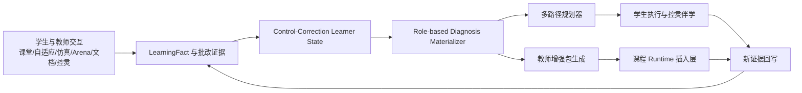
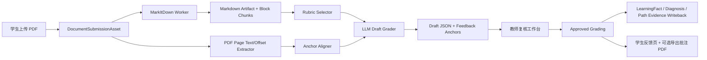
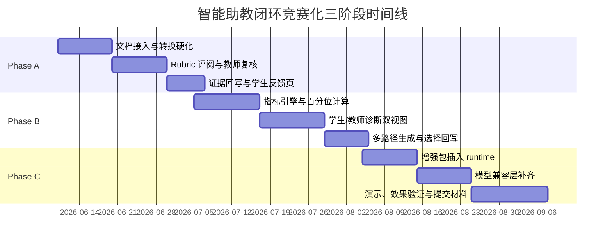

# yong-wei/act 集成分支智能助教闭环评估与竞赛化实施报告

## 执行摘要

从本对话中已经提取出的 integration 分支近 20 个 PR 与关键文件证据看，`act` 已经不再停留在“课程平台 + 数据治理雏形”的阶段，而是形成了较完整的**智能助教闭环骨架**：课程 runtime 与任务工作台负责真实学习与设计活动，互动课堂、自适应练习、仿真、Arena、批改与控灵对话形成证据流，证据又被写回 learner state、role-based diagnosis、learning path、teacher report、prep pack 与 RAG 语料层。项目文档已经明确把“学习证据采集 → 能力画像更新 → 定性/定量诊断 → 多路径推荐 → 资源执行 → 作业/试题批改 → 下次课增强包 → 控灵伴学解释与追踪”定义为两条主线之一。fileciteturn95file0L9-L21 fileciteturn96file0L18-L27

就“能不能做竞赛演示”而言，若以**控制系统校正能力**为主线，当前仓库里已经有足够多的可复用资产：学习者数据面与任务工作台的 UI 重构、控制校正 learner-state goal slice、控制校正 ResourceNode 路径图、路径轮次持久化、证据缓存回写、role-based diagnosis materializer、governed evidence RAG corpus、文档批改工作台、教师增强包生成、Konling 教学助教模式，以及 synthetic intelligent teaching assistant demo package。换言之，**基础设施已经够了，缺的是把这些基础设施压缩成一个高可信、可追溯、可解释、可验证的作品故事线。** fileciteturn64file4 fileciteturn64file5 fileciteturn64file6 fileciteturn69file9 fileciteturn69file8 fileciteturn69file7 fileciteturn69file5 fileciteturn103file0 fileciteturn106file0 fileciteturn70file1 fileciteturn64file15 fileciteturn70file0 fileciteturn64file12

真正的短板不是“有没有页面”和“有没有服务”，而是三件事。第一，当前学情诊断仍偏“goal slice + diagnosis claim”，还没有被硬化成“能力维度 → 观测指标点 → 明确计算依据 → 定量分数 → 百分位 → 定性判断 → 教师/学生双视图”的成熟报告模型。第二，文档批改链路虽然已经打通，但 `createDraftRubricGrading` 目前仍体现出明显的 scaffold 特征，离高质量专业评阅还有一段距离。第三，配置层已支持 `openai-compatible` 与 `anthropic-compatible` provider kind，但 runtime registry 尚未把 Anthropic-compatible 真正接起来；如果不补，控灵与批改等需要工具调用、系统消息归并与结构化输出的场景会留下协议空洞。fileciteturn79file0L41-L85 fileciteturn79file0L240-L262 fileciteturn76file0L18-L204 fileciteturn77file0L142-L164 fileciteturn92file0L3-L15 fileciteturn92file0L40-L55 fileciteturn94file0L15-L36

竞赛导向上，最合理的目标不是继续扩功能，而是把已有实现硬化成 **“自动控制原理智能助教闭环”**：学生提交 PDF 作业或平台内结构化任务 → AI 草拟 Rubric 批改 → 教师复核 → 证据回写 learner state → 生成个体/班级学情诊断 → 派生多条风格鲜明的学习路径 → 教师生成并插入下次课增强包 → 跟踪后续表现变化。这个故事线与 XH-202620 所强调的助教场景、助学场景、知识库/RAG、智能工作流、内容可追溯、个性化与自适应是正对齐的。fileciteturn63file1

## 证据基础与当前平台判断

本报告以**本对话中已提取出的 integration 分支近 20 个 PR 与关键文件证据**为主轴，并补充 Microsoft、Anthropic、OpenAI 与讯飞等官方资料。下面的判断只建立在已落到证据层的 PR 和文件之上，不对未被提取的仓库内容做臆测。

项目当前的整体架构，已经从“单体课程页面集合”推进到“统一学习证据中台 + 多视图衍生”的方向。更新后的项目说明直接把课程 runtime、课堂/自主学习、互动/仿真/Arena/资源/控灵/批改统一纳入事件链路，并让学习事实、画像、路径证据、班级诊断、教师报告从同一证据层派生。与此同时，文档中明确了两条主线：控制校正学习路径与全课程智能助教。这个判断不是抽象概括，而是与近几个功能簇相互印证的：控制校正 learner-state 画像切片、控制校正 ResourceNode 路径图、路径轮次持久化、执行偏离与干预写回 evidence cache、role-based diagnosis materializer、governed RAG corpus、文档 Rubric 批改、教师 prep pack 生成、Konling 教学助教模式与 synthetic demo package。fileciteturn95file0L9-L21 fileciteturn96file0L18-L27 fileciteturn69file9 fileciteturn69file8 fileciteturn69file7 fileciteturn69file5 fileciteturn103file0 fileciteturn106file0 fileciteturn70file1 fileciteturn64file15 fileciteturn70file0 fileciteturn64file12

近 20 个 PR 中，另一条明显主线是**UI 表层已经进入竞赛化整理阶段**。PR #361 到 #366 不只是“换皮”，而是在清理叙事：mission-workspace contract 把 Control Workbench、Arena、邮轮仿真与 runtime 提升为统一任务工作区；知识图谱与数据中心开始显式表达 source quality、freshness、privacy scope、status；学习者数据面开始围绕 learner record、current path、evidence confidence、missing sources、next action 组织，而不是散落的 profile/growth/evidence/adaptive-practice 页面。也就是说，平台已经具备“让评委看见功能”的基本表层。fileciteturn64file6 fileciteturn64file5 fileciteturn64file4

这正好切中了 XH-202620 的切题要求。官方要求本质上不是“做一个大而全的平台”，而是在特定学科垂类大模型与教学/科研场景中，把知识库、RAG、智能工作流、多模态交互、场景化开发和个性化自适应做成一个**专业、可信、可验证**的作品；同时，还要给出代码、Demo、效果验证报告、伦理说明和真实目标用户反馈。对于教学类作品，学习效果或效率提升、典型任务完成质量、两名以上真实用户反馈乃至 50 人以上规模应用数据，都是明确加分项。fileciteturn63file1



这里真正关键的一点是：**现阶段不该再扩张更多概念性模块，而该把已有模块压缩成一个闭环案例。** 如果继续扩成“全课程、全场景、全模型”的笼统平台，优势会被稀释；如果抓住“控制校正能力”这一条最强主线，项目反而会更像成熟作品，而不是实验性代码堆叠。这个判断也与仓库现有资产最匹配，因为控制校正相关的 learner state、ResourceNode、路径执行与教师报告，已经明显先于其他主题成熟。fileciteturn69file9 fileciteturn69file8 fileciteturn69file7 fileciteturn82file0L63-L120 fileciteturn83file0L128-L139

## Demo-ready 与 Scaffold 判定

当前仓库最适合采用三档判定，而不是粗暴二分。严格意义上的“可演示”，是指已经具备较完整的 UI/状态/流程并适合真实走查；“脚本化可演示”是指功能链路存在，但算法质量或真实场景鲁棒性不足，更适合比赛脚本；“骨架”则意味着接口或契约已成形，但还不足以支撑可信演示。

| 功能域 | 判定 | 主要证据 | 判断理由 |
|---|---|---|---|
| 学习者数据面与页面治理 | 可演示 | PR #363，学习者界面围绕 learner record、current path、evidence confidence、missing sources、next action 重构。fileciteturn64file4 | 已经具备学生端展示承载面，适合作为学生画像、路径与证据视图入口。 |
| 统一任务工作台 | 可演示 | PR #361，将 Control Workbench、Arena、邮轮仿真与 runtime 提升为 mission-workspace contract，并加入 provenance、return target、evidence rail、support drawer。fileciteturn64file6 | 任务导向清晰，适合集成“工作—批改—回写—再学习”的竞赛故事线。 |
| 知识图谱与数据中心表层 | 可演示 | PR #362，对知识图谱/数据中心引入 source quality、freshness、privacy scope、status 等语义。fileciteturn64file5 | 已经不是静态知识页，而是可以承载证据质量与引用来源说明。 |
| 控制校正 learner-state 切片 | 可演示 | PR #304，已有 control-correction goal slice，包含维度、来源覆盖、freshness、confidence、privacy、fallback markers。fileciteturn69file9 | 这是竞赛版“控制校正画像”的直接底座。 |
| 控制校正资源图与路径轮次 | 可演示 | PR #305、#322、#324，已有资源图、路径轮次持久化、执行偏离/干预回写 evidence cache。fileciteturn69file8 fileciteturn69file7 fileciteturn69file5 | 可直接支撑“多路径推荐 + 执行追踪 + 结果回写”的主线。 |
| Governed evidence RAG corpus | 可演示 | PR #333，已有 governed learning-evidence RAG corpus、retrieval、retention 与 citation verification contract。fileciteturn106file0 fileciteturn88file0L3-L35 fileciteturn88file0L188-L274 | 证据型 RAG 底层已够，但仍需补真实知识库索引与拦截策略。 |
| Role-based diagnosis materializer | 脚本化可演示 | PR #335，学生视图、教师班级视图、教师个体视图和 service 视图的 role-based diagnosis materializer 已存在。fileciteturn103file0 | 结构有了，但“维度—指标点—公式—百分位”尚未最终硬化。 |
| 文档提交与 Rubric 批改工作台 | 脚本化可演示 | PR #338 已加入 document submission、MarkItDown conversion、rubric grading、teacher approval、governed evidence writeback；但 `createDraftRubricGrading` 仍体现草拟逻辑。fileciteturn70file1 fileciteturn76file0L18-L204 fileciteturn77file0L142-L164 | 流程存在，算法质量不足；适合赛前硬化。 |
| 教师增强包生成 | 脚本化可演示 | PR #340 及相关测试已能基于 diagnosis、report metrics、path outcomes、grading summaries、ResourceNode metadata 生成候选增强项，并要求教师 review gating。fileciteturn64file15 fileciteturn86file0L133-L241 fileciteturn100file0L170-L253 | 候选内容与审核都有，但“如何稳定嵌回课程主干”还没完成。 |
| Konling 教学助教模式 | 脚本化可演示 | PR #342 注册 teaching-assistant modes，含 scoped tools、citations、privacy policies、output contracts。fileciteturn70file0 | 适合高质量 scripted demo，但需要与 diagnosis、grading 和 path 的动作链进一步打通。 |
| Synthetic intelligent teaching assistant demo | 可演示 | PR #343 打包了 student diagnosis/path/resource flows 与 teacher grading/report/prep evidence。fileciteturn64file12 | 非常适合竞赛路演，但不能替代真实效果验证。 |
| Anthropic-compatible runtime | 骨架 | provider-config 已定义 `anthropic-compatible`，但 provider-registry 仍报“requires a native adapter before runtime use”。fileciteturn92file0L3-L15 fileciteturn92file0L40-L55 fileciteturn94file0L15-L36 | 配置完成，运行未完成。 |
| 学情定量/百分位报告 | 骨架 | control-correction goal slice 已有维度、置信与来源字段，但还未看到完整的指标点、公式、分位数与增长分位数模型。fileciteturn79file0L41-L85 fileciteturn79file0L240-L262 | 这是最值得下一轮补强的部分。 |

最重要的结论不是“哪些还没做”，而是：**现在能拿来做比赛路演的功能已经足够多，但它们尚未在一个证据严谨的学情诊断模型下被统一。** 这也是为什么下一步不该继续大拆大建，而应围绕控制校正能力画像，把批改、诊断、路径与增强包统一到一个事实真源之下。fileciteturn95file0L9-L21 fileciteturn103file0

## 控制校正能力画像与学情诊断设计

### 事实真源与双视图原则

仓库里已经有三个非常关键的底座：控制校正 learner-state goal slice、role-based diagnosis materializer，以及路径执行/偏离/干预回写到 evidence feature cache 的链路。我的建议不是替换这三者，而是在其上再加一层**可解释指标引擎**。也就是说，事实真源仍然来自 LearningFact、AdaptiveAssessmentAnswer、DocumentRubricGrading、SimulationRun、ArenaSubmission、Konling 交互日志及现有缓存；新增的是“诊断指标定义表 + 指标快照表 + 报告视图物化器”。这样，教师视图与学生视图就可以从同一事实真源派生，但强调点不同。fileciteturn69file5 fileciteturn79file0L41-L85 fileciteturn79file0L240-L262 fileciteturn103file0

教师视图应重点回答“**哪里不会、为什么不会、哪类证据支持这个判断、我下一次课该如何干预**”；学生视图应重点回答“**我当前在哪些维度强/弱、我在班级中的相对位置、证据来自哪些具体任务、下一步我有哪几条不同风格的路径可选**”。这意味着同一个 `DiagnosisReportSnapshot` 可以投影出两个页面契约：教师端强调根因树、证据冲突、班级聚类与增强包入口；学生端强调雷达图、定性解释、可执行举措与多路径卡片。仓库现有的学习者数据面和教师报告体系，正适合承接这种双视图。fileciteturn64file4 fileciteturn82file0L63-L120 fileciteturn83file0L128-L139

### 定量评分、百分位与增长分位数

建议把每个能力维度拆到“指标点”层，而不是让模型直接写一段学情总结。具体计算模型如下。

对于某个指标点 \(i\)，先从事实真源查询原始值 \(x_i\)，再归一化为 \(s_i \in [0,100]\)。常用归一化规则如下：

\[
s_i = 100 \cdot x_i \quad \text{当} \; x_i \in [0,1]
\]

\[
s_i = 100 \cdot \frac{x_i - l_i}{u_i - l_i} \quad \text{当指标越大越好}
\]

\[
s_i = 100 \cdot \left(1 - \frac{x_i - l_i}{u_i - l_i}\right) \quad \text{当指标越小越好}
\]

\[
s_i = 100 \cdot \frac{r_i - 1}{k_i - 1} \quad \text{当来自 } k_i \text{ 级 Rubric}
\]

每个指标点再计算一个置信度 \(c_i\)：

\[
c_i = w_i^{src} \cdot \left(1 - e^{-n_i/\tau}\right) \cdot e^{-\Delta t_i/H_i} \cdot a_i
\]

其中，\(w_i^{src}\) 是来源可信度，建议取：Arena 官方评测 \(1.00\)、仿真分数化结果 \(0.90\)、教师已复核批改 \(0.90\)、自适应题 \(0.80\)、结构化课堂事实 \(0.70\)、控灵日志推断 \(0.55\)。\(n_i\) 是证据条数，\(\tau\) 可先取 5；\(\Delta t_i\) 是距今时间，\(H_i\) 可按能力类型设为 45–90 天；\(a_i\) 是跨来源一致性系数，可由高价值来源间标准差反推。这个设计的目的，是把“看过一次”和“多次在高价值任务中验证过”明确区分开来。相关事实来源与缓存链路在仓库中已经存在。fileciteturn69file5 fileciteturn79file0L240-L262

某个能力维度 \(d\) 的最终分数定义为：

\[
S_d = \frac{\sum_{i \in d} w_i \cdot s_i \cdot c_i}{\sum_{i \in d} w_i \cdot c_i}
\]

维度置信度定义为：

\[
C_d = \frac{\sum_{i \in d} w_i \cdot c_i}{\sum_{i \in d} w_i}
\]

班级百分位定义为经验百分位：

\[
P_d = 100 \cdot \frac{\operatorname{rank}(S_d)-0.5}{N}
\]

其中 \(N\) 是同教学班有效样本数。这样可以直接用于雷达图的“分数层”和“百分位层”。

增长百分位不应直接拿全班增量排序，否则会惩罚高基线学生、放大小样本波动。建议使用**条件增长百分位**：先按上一个快照的相同维度分数把学生分到基线分组 \(B(\cdot)\)，再在相同基线组内比较增量：

\[
\Delta S_d = S_d^{(t)} - S_d^{(t-1)}
\]

\[
G_d = 100 \cdot \frac{\operatorname{rank}_{B(S_d^{(t-1)})}(\Delta S_d)-0.5}{|B(S_d^{(t-1)})|}
\]

当某个基线桶样本过少时，退化到相邻桶合并；若学生没有历史快照，则增长百分位显示为“—”，同时触发冷启动规则。这个设计与仓库现有快照式 learner-state/diagnosis/path 持久化思路相容，并不要求重写主数据模型。fileciteturn69file7 fileciteturn79file0L240-L262

### 控制校正能力维度与指标点设计

现有 `control-correction` goal slice 已经把维度框架定在时域分析、根轨迹推理、频域裕度分析、方法选择、约束权衡、仿真验证、Arena 迁移、反思、AI 协作这九个方向上。我的建议是保留这九维，不再发散扩维；真正需要扩充的是每一维的**观测指标点**与**计算依据**。fileciteturn79file0L41-L85

| 维度 | 观测指标点 | 建议数据查询或公式 | 备注 |
|---|---|---|---|
| 时域分析 | 超调量/调节时间/稳态误差题正确率；课堂互动中的时域题得分；作业中时域指标计算 Rubric；仿真达到时域指标的达成率 | `avg(is_correct)` from `AdaptiveAssessmentAnswer` where `knowledge_tag in ('overshoot','settling_time','steady_state_error')`; `avg(score)` from `LearningFact` where `fact_type='interactive.response'` and `skill_tag='time-domain'`; `avg(rubric_score_norm)` from `DocumentRubricGrading` where `criterion_tag in ('time-domain-calc','metric-interpretation')`; `count(sim_pass)/count(sim_total)` from `SimulationRun` where `goal='control-correction'` | 最稳的学科主维度之一，权重可高一些 |
| 根轨迹推理 | 根轨迹概念题正确率；极点/零点移动与稳定性判断 Rubric；交互工作台中的参数调节推断题；控灵提示后再次作答改善率 | `AdaptiveAssessmentAnswer` + `knowledge_tag in ('root-locus','pole-zero')`; `DocumentRubricGrading` with `criterion_tag in ('root-locus-reasoning','stability-judgement')`; `LearningFact` from runtime widgets; `post_hint_correct_rate - pre_hint_correct_rate` from hint-linked facts | 这里要分“会画图”和“会解释” |
| 频域裕度分析 | 裕度/带宽/截止频率题正确率；Bode/Nyquist 解释 Rubric；Arena 中裕度约束通过率；仿真/工作台对频响图读取正确率 | `AdaptiveAssessmentAnswer` where `knowledge_tag in ('gain-margin','phase-margin','bandwidth')`; `DocumentRubricGrading` on `criterion_tag in ('frequency-margin-calc','bode-interpretation')`; `ArenaSubmission.valid_hard_constraints / total`; `LearningFact` from frequency-domain widgets | 与 Arena 约束最强相关 |
| 方法选择 | 超前/滞后/PID/复合校正选择题；报告中方案选择 Rubric；不同对象条件下方法选择成功率；错误方法被放弃后重选成功率 | `AdaptiveAssessmentAnswer` on `method-selection`; `DocumentRubricGrading` with `criterion_tag='controller-selection'`; `ArenaSubmission` grouped by controller family and success; `LearningFact` detecting revised choice after failure | 这一维是“会不会选方法”，不是“会不会调参数” |
| 约束权衡 | Arena 硬约束通过率；控制量饱和/相位裕度/带宽越界次数；报告中对工程权衡的解释 Rubric；仿真中约束修正后的改善率 | `1 - violation_count/attempt_count` from `ArenaSubmission`; normalized inverse of `SimulationRun.violation_index`; `DocumentRubricGrading` with `criterion_tag in ('constraint-awareness','tradeoff-justification')`; `improvement_after_constraint_fix` | 教师视图中要重点强调根因 |
| 仿真验证 | 仿真任务完成率；最终指标相对基线改善幅度；是否进行多轮验证；报告中的结果解释与图表引用质量 | `count(completed)/count(assigned)` from `SimulationRun`; normalized `metric_gain`; `count(validation_runs)`; `DocumentRubricGrading` on `criterion_tag in ('simulation-evidence','result-interpretation')` | 体现“设计—验证”闭环意识 |
| Arena 迁移与综合设计 | 官方有效提交率；最佳正式成绩；跨对象迁移完成度；失败后重试与提升幅度 | `count(valid_official)/count(total)` and normalized best score from `ArenaSubmission`; count of completed object families; delta between first and best valid score | 这是竞赛冲击力最高的一维 |
| 反思与复盘 | 反思节点完成率；复盘报告 Rubric；失败原因定位的精确度；后续路径采纳率 | `LearningFact` from reflection nodes; `DocumentRubricGrading` on `criterion_tag in ('reflection-quality','error-attribution')`; compare stated cause vs actual violated metrics; `accepted_path_node_ratio` | 不再把反思当作文案，而是当能力证据 |
| AI 协作与验证 | 使用控灵后的验证动作比例；带来源引用的问题提问比例；采纳 AI 建议后的有效性；对 AI 建议的修正/拒绝质量 | `count(validation_after_ai)/count(ai_help_sessions)` from `Konling logs + LearningFact`; `count(cited_queries)/count(total_queries)`; `AI-suggested-action -> subsequent pass`; `teacher-reviewed rubric on AI-use reflection` | 这一维是“会用 AI 并会验证”，不是“用得多就高分” |

在这九维之外，我建议再做一层**认知与策略画像**，但不要把它混到学科能力雷达里。它更适合作为路径推荐的修正因子。建议至少保留五个特征：初始准备度、节奏稳定性、资源模态偏好、求助方式、坚持度与自我调节。冷启动可分为两种：显性冷启动采用 8–12 分钟的 control-correction 入门诊断；隐性冷启动则根据首次一到两次资源浏览、任务停留、控灵提问与互动作答，先生成一个低置信的认知画像，待第二轮推荐前覆盖更新。学生在多条特色路径中的选择，也应反向写回“资源偏好”和“任务偏好”。这一点与现有路径轮次、evidence cache 与 role-based diagnosis 机制是兼容的。fileciteturn69file7 fileciteturn69file5 fileciteturn103file0

### 学生与教师界面的具体实现

学生学情报告页面建议直接挂在既有 learner data plane 内，而不是再生一个孤立路由。页面结构应包含四个区域：一个双层雷达图，第一层是维度分数 \(S_d\)，第二层是维度百分位 \(P_d\)；一个“定性分析”区，对每一维给出判断句、最强证据、下一步举措；一个“成长视图”，展示增长百分位 \(G_d\) 与置信度变化；一个“证据抽屉”，汇总作业片段、仿真结果、Arena 记录和控灵辅助片段。学习者数据面本身已经围绕 learner record、current path、evidence confidence 和 next action 重构，所以这套 UI 不是另起炉灶，而是顺势加一个 diagnosis tab。fileciteturn64file4

教师界面不应复用学生页面的语言与布局。教师最需要看的是三个东西：班级共性薄弱点、同类错误聚类和干预抓手。因此教师侧首页应采用“班级维度分布 + 异常群组 + 典型证据 + 进入增强包”的布局。个体页则突出“维度分数/百分位/增长百分位 + 根因树 + 时间序列 + 批改片段 + 路径执行偏离 + 控灵求助模式”。已有教师报告 API 与 role-based diagnosis materializer，决定了这部分更适合做“视图派生”，而不是重做一套教师画像后端。fileciteturn82file0L63-L120 fileciteturn83file0L128-L139 fileciteturn103file0

## 文档批改、RAG 与教师增强包闭环

### PDF 作业批改的升级方案

当前仓库已经具备文档提交流水线、MarkItDown conversion、Rubric grading、teacher approval 与 governed evidence writeback 的整体骨架，且已有教师批改工作台与学生反馈面；但从 `createDraftRubricGrading` 的逻辑看，草案评分仍然明显偏 scaffold，需要升级为真正的**证据化评阅工作流**。fileciteturn70file1 fileciteturn76file0L18-L204 fileciteturn77file0L142-L164

MarkItDown 作为第一阶段的文档解析底座是合适的。其官方说明强调它是面向 LLM 的 Markdown 转换工具，支持 PDF、Word、Excel、图片、音频、HTML、ZIP 等输入，并提供命令行与插件机制；同时，官方也明确提示它具有当前进程同等 I/O 权限，服务端使用时应清洗输入，并优先调用更窄的 `convert_local()`、`convert_stream()` 等 API，而不是在不受控场景中直接使用最宽泛的 `convert()`。这与平台未来“学生上传 PDF，后台 Worker 转 Markdown，再进入批改”的运行方式是匹配的。citeturn7view0turn11view0turn11view1turn11view3

建议的文档批改工作流如下：



这条链路的核心不是“让模型给一个总分”，而是把提交物分成**可追踪的块级证据**。我建议新增或硬化以下实体，尽量采用增量式 Prisma 改动，而不是推翻现有批改模型：

```ts
model DocumentSubmissionAsset {
  id                String   @id @default(cuid())
  userId            String
  courseId          String?
  assignmentId      String?
  originalFileUrl   String
  mimeType          String
  sha256            String   @unique
  status            String   // uploaded | converted | graded | reviewed | written_back
  createdAt         DateTime @default(now())
  updatedAt         DateTime @updatedAt
}

model DocumentConversionArtifact {
  id                String   @id @default(cuid())
  submissionId      String
  engine            String   // markitdown
  engineVersion     String
  markdownText      String   @db.LongText
  chunkIndexJson    Json     // [{chunkId, headingPath, text, tokenCount}]
  pageAnchorMapJson Json?    // [{chunkId, page, textStart, textEnd, bbox?}]
  qualityFlagsJson  Json?
  createdAt         DateTime @default(now())
}

model DocumentRubricAssessment {
  id                String   @id @default(cuid())
  submissionId      String
  rubricId          String
  runType           String   // draft | teacher-reviewed | final
  modelProvider     String?
  modelName         String?
  scoreTotal        Float?
  structuredJson    Json
  reviewedBy        String?
  reviewedAt        DateTime?
  writebackStatus   String   // pending | approved | rejected | written_back
  createdAt         DateTime @default(now())
}

model DocumentAnnotationAnchor {
  id                String   @id @default(cuid())
  assessmentId      String
  chunkId           String?
  page              Int?
  textStart         Int?
  textEnd           Int?
  bboxJson          Json?
  commentKind       String   // praise | issue | suggestion | rubric-evidence
  commentText       String
  severity          String   // info | warn | critical
}
```

Rubric schema 不应写死在 prompt 里，而应被独立建模。建议最少支持五层：题目/任务元数据、维度条目、条目评分档、证据要求、写回映射。

```json
{
  "rubric_id": "cc-report-v1",
  "title": "控制校正设计报告批改 Rubric",
  "task_type": "control_correction_report",
  "criteria": [
    {
      "id": "goal_translation",
      "title": "设计指标翻译",
      "weight": 0.15,
      "levels": [
        {"level": 1, "label": "缺失", "score": 25},
        {"level": 2, "label": "初步", "score": 50},
        {"level": 3, "label": "基本合理", "score": 75},
        {"level": 4, "label": "准确完整", "score": 100}
      ],
      "evidence_requirement": {
        "min_blocks": 1,
        "must_reference_tags": ["time-domain", "frequency-domain"]
      },
      "competency_mapping": [
        {"dimension": "时域分析", "share": 0.5},
        {"dimension": "频域裕度分析", "share": 0.5}
      ]
    }
  ]
}
```

LLM 提示模板也应分成**评阅系统提示**与**任务提示**两层。系统提示要锁住身份、Rubric 解释方式、引用约束和输出 JSON；任务提示只负责传入题目要求、标准答案片段、学生 Markdown 块与已对齐的页码锚点。建议模板如下：

```text
系统提示
你是自动控制原理课程的助教评阅器。你的唯一任务是依据给定 Rubric 对学生提交的电子化报告进行分项评阅。
要求：
1. 只依据题目要求、Rubric、参考知识片段与学生提交内容判断。
2. 每个 criterion 必须给出 level、score、evidence_blocks、reason。
3. 如果证据不足，不得硬判高分，必须标记 insufficient_evidence。
4. 所有反馈必须能落到 markdown block 或 page anchor。
5. 输出必须是 JSON，不得输出额外自然语言。

任务提示
[任务说明]
[Rubric JSON]
[参考知识片段与允许引用来源]
[学生 markdown chunks]
[page anchors]
```

结构化 JSON 输出建议统一为：

```json
{
  "submission_id": "sub_xxx",
  "rubric_id": "cc-report-v1",
  "overall_score": 82.5,
  "criteria": [
    {
      "criterion_id": "goal_translation",
      "level": 3,
      "score": 75,
      "confidence": 0.86,
      "insufficient_evidence": false,
      "evidence_blocks": ["chunk_12", "chunk_15"],
      "page_anchors": [{"page": 2, "textStart": 183, "textEnd": 246}],
      "reason": "已给出超调与调节时间目标，但缺少频域指标与约束翻译。",
      "feedback": [
        {
          "kind": "suggestion",
          "severity": "warn",
          "text": "建议把时域指标翻译为相位裕度/带宽要求，并解释二者关系。"
        }
      ],
      "competency_impacts": [
        {"dimension": "时域分析", "delta": 3.8},
        {"dimension": "频域裕度分析", "delta": -2.1}
      ]
    }
  ],
  "risk_flags": ["needs_teacher_review"],
  "writeback_preview": {
    "learning_facts": 4,
    "diagnosis_dimensions_touched": ["时域分析", "频域裕度分析"]
  }
}
```

### PDF 返回批注的现实落地

你指出的难点是对的：**LLM 批改后的批注如何回到 PDF**，这不能靠“再让模型描述一下”解决。第一阶段最稳的策略不是强行在原 PDF 上做复杂原位修改，而是采用**侧车反馈 + 定位锚点 + 可选衍生批注 PDF** 的三层方案。

第一层是侧车反馈。教师和学生默认看到的是反馈侧栏，评论卡片点击后跳转到 PDF 对应页和文本范围。这一层只依赖 `pageAnchorMapJson`。
第二层是块级锚点。即使没有精确 bbox，也要保留 `page + textStart + textEnd + quotedText`，前端可高亮最相近文本。
第三层才是导出批注 PDF。只有当锚点置信度高时，才用 `pdf-lib` 或 `PyMuPDF` 生成**衍生 PDF**，原件不覆写。衍生 PDF 的注释内容来自 `DocumentAnnotationAnchor`。这样一来，即便某些文档无法稳定做原位标注，系统仍有可展示的批改 UI，不会卡死在“PDF 回写必须一步到位”的错误目标上。

教师复核 gating 必须保留，而且要更严格。当前 PR 已经有 teacher approval 与 governed evidence writeback 的思路，这正是正确方向。建议只有 `teacher-reviewed` 或 `auto-approved-by-policy` 的分项，才能写回 diagnosis 与 learner state；`draft` 只能进入教师工作台与学生预反馈，不能直接更新高价值画像。否则会污染后续路径推荐。fileciteturn70file1 fileciteturn76file0L18-L204

### RAG 语料、排序与幻觉拦截

仓库已经有 `learning-evidence-rag-corpus.ts`，并定义了 `course-content`、`knowledge-card`、`runtime-handout`、`path-summary`、`diagnosis`、`grading-artifact`、`simulation-summary`、`arena-summary`、`teacher-report` 等 source type，同时支持按 role、user、class、goal、use-case 过滤，并有 citation verification contract。这个方向是对的，但还需要把“**教学知识库**”与“**学习证据库**”明确分层。fileciteturn88file0L3-L35 fileciteturn88file0L188-L274 fileciteturn106file0

我建议采用双库融合检索：

| 来源类型 | 库类型 | 分块策略 | 主要排序信号 | 权威权重 |
|---|---|---|---|---|
| 课程 runtime 页面 | 教学知识库 | step/block/组件块 | `goal overlap + knowledge node overlap + runtime step proximity` | 高 |
| knowledge-card | 教学知识库 | card/block | `knowledge tag exact match + citation quality` | 高 |
| handout / 讲义 | 教学知识库 | heading/block | `semantic similarity + heading depth + freshness` | 高 |
| Rubric 定义 | 评测知识库 | criterion/block | `task type + criterion tag + assignment type` | 高 |
| assignment fragments | 学习证据库 | student chunk | `same student + same assignment + anchor proximity` | 中 |
| simulation-summary | 学习证据库 | run summary / metric block | `same goal + same object family + recency` | 中高 |
| arena-summary / submission | 学习证据库 | submission/result block | `same challenge + hard constraint overlap` | 中高 |
| diagnosis / teacher-report | 派生证据库 | claim block | `same role + same class/user + same dimension` | 中 |
| path-summary | 派生证据库 | node/round block | `same goal + path status + current node` | 中 |

排序建议用分层混排，而不是单一向量相似度。一个可操作的打分函数如下：

\[
R = 0.35 \cdot Sim + 0.20 \cdot Goal + 0.15 \cdot Knowledge + 0.10 \cdot Authority + 0.10 \cdot Freshness + 0.10 \cdot Scope
\]

其中 `Authority` 对教学知识库明显高于学生证据片段；`Scope` 用于 role/user/class/goal 过滤；`Freshness` 对学生证据更重要，对教材性材料可弱化。

引用格式建议统一为**块级来源胶囊**，系统内部可采用：

```text
[source_type:source_id#block_id | title | page/block | scope]
```

前端呈现时再映射成统一 CitationChip。教师侧显示更全的 scope 与 freshness；学生侧默认显示来源标题、页码/块号与“展开查看”。

幻觉拦截规则必须比现在更硬。建议至少加入以下判定：

- **知识性回答**：若没有至少 1 条教学知识库高权威来源，则不输出肯定性结论，只能输出“基于当前证据的推测”。
- **批改性判断**：若没有学生提交块级证据，不得给出 criterion 评分，只能标记 `insufficient_evidence`。
- **诊断性结论**：若只有控灵日志而无作答/仿真/Arena/批改佐证，只能进入“行为提示”，不能进入“能力结论”。
- **冲突证据**：若学生提交声称达标，但 Arena/仿真记录相反，教师视图必须显示 `evidence_conflict`。
- **引用缺失**：Konling 教学助教模式下，凡属知识解释、批改意见、路径推荐原因这三类输出，必须带引用；否则前端卡片显示“引用不足，不能进入高置信建议”。

这些规则不是锦上添花，而是符合赛题对“知识权威可信”和“内容可追溯”的核心要求。fileciteturn63file1

### 教师增强包嵌入课程主干

`teacher-prep-pack-generation.ts` 与相关测试已经证明，系统能够基于 diagnosis、teacher report、path outcomes、grading summaries、resource nodes 与 evidence corpus 生成 interactive-question、teacher-note、micro-simulation、arena-task 等候选增强项，并经过教师审核后导出或插入。下一步不是再做一个“智能备课中心”，而是把它设计成**课程主干的可插入增强层**。fileciteturn64file15 fileciteturn86file0L133-L241 fileciteturn100file0L170-L253

正确的 UI/UX 流程应当是：

教师进入班级诊断页。
系统在“下次课增强建议”面板中给出 3–5 个候选项，每个候选项包含：针对的薄弱维度、插入建议位置、预计时长、需要的组件类型与引用来源。
教师点击某个候选项后，进入增强包预览页。预览页并不修改课程原件，而是显示“插入到第几步前/后/侧栏”以及学生将看到的渲染效果。
教师审核通过后，生成一个 `CourseEnhancementPack`，运行时与 base course manifest 合并。
上课后，增强包产生的新互动证据继续回写同一 learner-state / diagnosis / path 体系。

为避免破坏主干，我建议用**叠加式插入**而不是直接改课程包正文。可新增：

```ts
model CourseEnhancementPack {
  id                String   @id @default(cuid())
  courseId          String
  classId           String?
  basedOnReportId   String?
  status            String   // draft | reviewed | approved | active | archived
  insertionMode     String   // before | after | replace-slot | sidebar
  targetStepId      String
  audienceRuleJson  Json     // whole-class / subgroup / risk cluster
  packJson          Json
  approvedBy        String?
  approvedAt        DateTime?
  createdAt         DateTime @default(now())
}
```

对应 API 建议如下：

- `POST /api/teacher/prep-packs/generate`
- `GET /api/teacher/prep-packs/:id`
- `POST /api/teacher/prep-packs/:id/review`
- `POST /api/course-runtime/:courseId/enhancement-preview`
- `POST /api/course-runtime/:courseId/enhancement-activate`

而在前端，不新增重量级新路由，优先复用现有课程 runtime 编辑/预览表层与教师报告入口。这样做的好处是，“智能备课”不再是脱离平台的 PPT 生成器，而是**学情驱动的互动增强层**，与您的实际教学方式完全一致。

## 模型兼容层评估与实现方案

### 必要性判断

仓库配置层已经支持 `openai-compatible` 与 `anthropic-compatible` 两类 provider kind，但 registry 仍未把 Anthropic-compatible 激活。这意味着方向已经对了，缺的是最后一段运行时适配。fileciteturn92file0L3-L15 fileciteturn92file0L40-L55 fileciteturn94file0L15-L36

OpenAI-compatible baseURL 支持是**必须补齐**的，不该再讨论。原因不是“多支持一个模型商好看”，而是这已经是官方生态认可的通用接入方式。OpenAI 官方库明确支持把客户端指向替代 API 端点，用于 proxy 或自托管的 OpenAI-compatible LLM；OpenAI 官方 Python 侧也有明确的 `base_url` 使用模式。citeturn14view0turn10view1turn13search11

Anthropic-compatible 则需要更谨慎判断。它不是单纯改个 base URL 就行。Anthropic 官方文档明确说明了 OpenAI SDK compatibility 的差异：system/developer messages 会被提升并拼接为单个初始 system message；部分字段被忽略；严格的工具 JSON 模式并不能通过 OpenAI 兼容层保证，而需要原生 Claude API 的 Structured Outputs / strict tool use；工具调用与消息循环的形态也和原生 Messages API 紧密相关。换言之，**如果你的目标只是连一个简单问答模型，Anthropic-compatible 可延后；但如果你要支撑控灵、批改、结构化输出和工具调用，那就必须做原生适配层，而不能只靠“兼容”幻想。** citeturn7view2turn7view3turn7view4

我的判断是：
OpenAI-compatible baseURL 属于 P0。
Anthropic-compatible runtime adapter 属于 P1，但必须在 9 月前完成最小可用版本，否则“已支持 Anthropic-compatible”这句话在竞赛演示里是不可信的。

### 代码变更与测试建议

| 目标 | 现有基础 | 需要改动的重点文件/模块 | 风险 |
|---|---|---|---|
| OpenAI-compatible baseURL provider | provider kind 已有；合规方向正确。fileciteturn92file0L3-L15 | `provider-config.ts` 增加 endpoint/headers/auth shape 校验；`provider-registry.ts` 完整创建 `OpenAI(baseURL=...)`；Konling/批改/RAG 统一走 provider abstraction；加入 provider healthcheck 与 model capability probe。 | 低到中 |
| Anthropic-compatible runtime adapter | 配置层已有 kind，但 registry 未实现。fileciteturn94file0L15-L36 | 新增 `anthropic-compatible-adapter.ts`；实现 OpenAI 消息 → Anthropic Messages 的转换、system/developer hoisting、tool schema 映射、stream delta 归一、usage 归一、错误码转换；provider-registry 接入；Konling/批改模块按 capability 分流。 | 中到高 |
| Tool calling 兼容 | Konling modes 已有 scoped tools 与 contracts。fileciteturn70file0 | 在 adapter 层做 `tool_choice`、`strict`、`tool_result` 兼容；对 Anthropic-compatible 明确区分“原生 strict 可用 / OpenAI 兼容层不保证严格 schema”两种能力。 | 高 |
| Structured grading output | 文档批改已有 workbench。fileciteturn76file0L18-L204 | 为每个 provider 定义 `json_mode` 能力与 fallback 策略；Anthropic 走 native structured/tool path，OpenAI-compatible 走 JSON schema / response_format path。 | 中 |
| Streaming | 现有 UI 已较重视工作台与支持抽屉。fileciteturn64file6 | 统一 `ProviderStreamEvent`，把 OpenAI delta / Anthropic content blocks 归一成一套前端 consumption API。 | 中 |
| 观测与诊断 | 竞赛版要能解释 provider 选择与失败原因。 | 为 provider calls 记录 latency、tool rounds、citation coverage、json validity、retry count。 | 中 |

最小可用实现建议如下：

```ts
export type AiProviderKind =
  | 'siliconflow'
  | 'openai-compatible'
  | 'anthropic-compatible';

export interface UnifiedAiRequest {
  mode: 'chat' | 'grading' | 'diagnosis' | 'path' | 'prep-pack';
  system?: string[];
  developer?: string[];
  messages: UnifiedMessage[];
  tools?: UnifiedTool[];
  jsonSchema?: JsonSchema;
  citationsRequired?: boolean;
}

export interface UnifiedAiResponse {
  text?: string;
  toolCalls?: UnifiedToolCall[];
  json?: unknown;
  usage?: { input: number; output: number };
  providerMeta?: Record<string, unknown>;
}
```

测试不应只写 happy path。至少要补六类：

1. **消息提升测试**：Anthropic-compatible 下多段 system/developer 被正确归并。
2. **工具调用测试**：控灵某个 mode 触发 tool call 后，OpenAI-compatible 与 Anthropic-compatible 都能返回统一 `UnifiedToolCall`。
3. **结构化批改测试**：给定同一 Rubric，至少一条 Anthropic-native、一条 OpenAI-compatible 返回合法 JSON。
4. **流式测试**：两个 provider 都能流式渲染批改与对话，并正确结束。
5. **错误映射测试**：429/5xx/validation error 被统一为前端可消费的 provider error。
6. **回归测试**：当前 siliconflow 路径不被新适配层破坏。

Anthropic 官方文档本身已经说明了 header 管理、Messages API、tool use、strict tool use 与 OpenAI SDK compatibility 的差异，这些差异完全足以支撑“为什么必须写原生 adapter，而不是只配个 baseURL”的工程判断。citeturn7view4turn7view3turn7view2

## 三阶段开发议题、OpenSpec 草案与演示方案

### 三阶段议题与优先级

| 阶段 | 核心目标 | 关键议题 | 优先级 | 主要风险 | 验收标准 |
|---|---|---|---|---|---|
| Phase A | 把批改与证据写回做实 | PDF/Markdown ingestion；Rubric grading hardening；teacher review gating；evidence writeback | P0 | 批改质量不稳；页码锚点不准 | 单份控制校正报告可完成“上传 → 转换 → 草批 → 教师复核 → 写回画像”；学生端能看到分项反馈与证据锚点 |
| Phase B | 把画像、诊断与路径做成作品主线 | diagnosis indicator engine；teacher/student dual views；percentile/growth percentile；three-style paths | P0 | 指标口径不统一；可解释性不足 | 学生与教师都能看到同一事实真源派生的双视图；至少 9 个维度有分数、百分位、定性分析和证据抽屉；能生成 3 条风格鲜明路径 |
| Phase C | 把增强包、模型兼容与竞赛材料补齐 | prep-pack runtime insertion；Anthropic-compatible adapter；effect report；demo package；ethics | P1 | adapter 复杂度高；真实数据收集滞后 | 教师可将增强包插入下一课；Anthropic-compatible 最小可用；3 分钟和 6 分钟 Demo 稳定；提交材料齐全 |



### 面向 Codex 的 Issue 集合

建议把下一轮实现组织为以下 Issue，而不是大任务整包丢给代理。

**Issue A：Governed document ingestion and grading pipeline**
内容：上传 PDF；MarkItDown Worker；chunk + page anchor；Rubric selector；LLM draft grader；teacher review workbench；evidence writeback。
验收：控制校正 PDF 报告从上传到教师确认全链路跑通；反馈可定位到页或块；最终结果能进入 diagnosis 和 learner state。
复用基础：PR #338、现有 grading workbench。fileciteturn70file1 fileciteturn76file0L18-L204
风险：中。

**Issue B：Control-correction diagnosis indicator engine**
内容：实现指标定义、原始查询、归一化、置信度、百分位、增长百分位、双视图 materializer。
验收：9 维能力全量输出；每维至少 3 个指标点；教师/学生页面共用一份事实真源。
复用基础：PR #304、#324、#335。fileciteturn69file9 fileciteturn69file5 fileciteturn103file0
风险：中。

**Issue C：Learner diagnosis report UI and teacher diagnosis cockpit**
内容：学生诊断页、教师班级页、教师个体页、证据抽屉、根因树、路径卡片。
验收：学生侧可看雷达图与路径；教师侧可看班级聚类与增强包入口。
复用基础：PR #363、教师报告 API。fileciteturn64file4 fileciteturn82file0L63-L120
风险：低到中。

**Issue D：Three-style path generation and choice feedback**
内容：最短补弱路径、Arena 冲刺路径、偏好匹配路径；学生选择写回认知画像。
验收：同一诊断能生成 3 条异质路径；学生选择被记录并影响下一轮排序。
复用基础：PR #305、#322、#324。fileciteturn69file8 fileciteturn69file7 fileciteturn69file5
风险：中。

**Issue E：RAG authority layering and hallucination interception**
内容：教学知识库/学习证据库双层检索；引用胶囊；低引用覆盖阻断；冲突证据提示。
验收：知识解释、批改、诊断、路径推荐四类输出都有引用覆盖统计；能展示至少一种冲突拦截。
复用基础：PR #333。fileciteturn106file0 fileciteturn88file0L3-L35
风险：中。

**Issue F：Prep-pack insertion overlay**
内容：增强包预览、插入点选择、审核通过、runtime 合并渲染、课后证据回写。
验收：下次课增强包能无损插入既有课程主干；课堂后能看到新增证据。
复用基础：PR #340 及 tests。fileciteturn64file15 fileciteturn100file0L170-L253
风险：中。

**Issue G：Provider compatibility hardening**
内容：OpenAI-compatible baseURL provider 完整落地；Anthropic-compatible native adapter；统一 streaming/tool/json/error 层。
验收：至少一个 OpenAI-compatible 模型和一个 Anthropic-compatible 模型能跑控灵问答与结构化批改单测。
复用基础：provider-config、provider-registry、Konling modes。fileciteturn92file0L3-L15 fileciteturn94file0L15-L36 fileciteturn70file0
风险：中到高。

**Issue H：Effect report and competition package**
内容：真实用户试用、批改节时统计、路径采纳率、Arena 二次提交提升、用户反馈、伦理与安全说明、Demo package。
验收：形成可投递《效果验证报告》；至少 2 名真实用户反馈，尽量争取班级级别使用数据。
复用基础：synthetic demo package、teacher report。fileciteturn64file12 fileciteturn83file0L128-L139 fileciteturn63file1
风险：高，但不能后置。

### OpenSpec 提案草案

#### 提案草案一

**标题**
`control-correction-diagnosis-profile`

**动机**
现有 control-correction goal slice 已提供维度、来源覆盖、freshness、confidence，但缺少面向竞赛与真实教学的指标定义、百分位与双视图报告。fileciteturn69file9 fileciteturn79file0L240-L262

**API / DB 变更**
新增 `DiagnosisIndicatorDefinition`、`DiagnosisIndicatorSnapshot`、`DiagnosisReportSnapshot`；新增 `GET /api/diagnosis/control-correction/:userId` 与 `GET /api/teacher/diagnosis/class/:classId`。

**UI 契约**
学生端：`DiagnosisRadarPanel`、`DimensionInsightCard`、`EvidenceDrawer`、`PathOptionCards`。
教师端：`ClassDiagnosisHeatmap`、`RootCauseClusterPanel`、`StudentDrilldownSheet`、`PrepPackEntryPanel`。

**Codex 实现任务**
先做指标定义与 materializer；再接双视图 API；最后接前端。

**校验规则**
每一维至少 3 个指标点；每个指标点必须有 query spec；缺证据时置信度下降而不是伪造高分。

#### 提案草案二

**标题**
`governed-document-grading-pipeline`

**动机**
当前工作台已具备提交、转换、批改、审核与写回骨架，但 draft grading 仍偏中间档默认策略，需要升级为专业评阅工作流。fileciteturn70file1 fileciteturn77file0L142-L164

**API / DB 变更**
新增 `DocumentConversionArtifact`、`DocumentRubricAssessment`、`DocumentAnnotationAnchor`；新增 `POST /api/grading/submissions`、`POST /api/grading/:id/draft`、`POST /api/grading/:id/review`、`POST /api/grading/:id/writeback`。

**UI 契约**
教师端：左右分栏，左侧 PDF/Markdown 同步预览，右侧 Rubric criterion 列表与 anchor feedback。
学生端：`AssignmentFeedbackPage`，默认展示最终反馈与可点开的证据锚点。

**Codex 实现任务**
MarkItDown Worker、chunking、anchor alignment、LLM scoring、review gating、writeback。

**校验规则**
所有 criterion 必须有 evidence_blocks；没有锚点的反馈不能写回 learner state。

#### 提案草案三

**标题**
`evidence-rag-authority-layering`

**动机**
当前 evidence corpus 已有 source types 与 citation verification contract，但尚未显式区分知识库与证据库，也缺少强硬的幻觉拦截。fileciteturn88file0L3-L35 fileciteturn106file0

**API / DB 变更**
扩展 `EvidenceCorpusChunk` 元数据：`authorityLevel`、`knowledgeTags`、`pageAnchor`、`scopeRule`、`freshnessBucket`。
新增 `POST /api/rag/retrieve`、`POST /api/rag/answer-guarded`。

**UI 契约**
统一 `CitationChip`；教师端可展开 scope/freshness；学生端保留最小来源解释。

**Codex 实现任务**
chunker、ranking、citation rendering、guardrail middleware、conflict banner。

**校验规则**
知识解释无高权威引用则降级输出；批改无学生锚点则不可评分。

#### 提案草案四

**标题**
`runtime-enhancement-pack-overlay`

**动机**
教师增强包生成已经存在，但尚未稳定嵌入课程主干。fileciteturn64file15 fileciteturn100file0L170-L253

**API / DB 变更**
新增 `CourseEnhancementPack`；新增 preview/review/activate 三组 API。

**UI 契约**
`EnhancementPackPreviewDialog`、`InsertionPointPicker`、`DiffPreviewPanel`、`ActivationBanner`。

**Codex 实现任务**
pack overlay merger、preview renderer、approved activation、post-class writeback。

**校验规则**
不得直接改 base manifest；增强包必须可回滚、可归档。

#### 提案草案五

**标题**
`provider-compatibility-runtime-hardening`

**动机**
provider-config 已有两类兼容 provider，但 Anthropic-compatible 尚未 runtime 生效。fileciteturn92file0L3-L15 fileciteturn94file0L15-L36

**API / DB 变更**
建议不加 DB，先以配置驱动；可选新增 `AiProviderEndpoint` 以支持后台管理。

**UI 契约**
管理员页增加 provider capability badge、healthcheck 与 smoke test 面板。

**Codex 实现任务**
OpenAI-compatible baseURL hardening、Anthropic-compatible adapter、tool/stream/json/error normalization、fixture tests。

**校验规则**
至少 1 个 OpenAI-compatible provider 与 1 个 Anthropic-compatible provider 跑通 chat + grading 两类 smoke tests。

### 三分钟 Demo 脚本

| 时间 | 演示内容 | 讲解重点 |
|---|---|---|
| 0:00–0:25 | 学生提交控制校正设计 PDF 报告 | 强调平台兼容过渡期：既支持 PDF 报告，也支持 Arena/Workbench 原生结构化任务 |
| 0:25–0:55 | 系统完成 MarkItDown 转换并生成 AI 草拟批改 | 展示 Rubric 分项、页码/块级锚点、引用来源，不展示“黑盒总分” |
| 0:55–1:20 | 教师进入批改工作台复核并确认写回 | 强调教师把关；只有确认后的高价值证据才回写画像 |
| 1:20–1:50 | 学生学情报告刷新 | 展示雷达图、维度分数、班级百分位、增长百分位与证据摘要 |
| 1:50–2:20 | 系统生成三条不同风格路径 | 分别展示最短补弱、Arena 冲刺、偏好匹配三类路径 |
| 2:20–2:45 | 教师班级诊断页生成下次课增强包 | 展示薄弱点聚类与增强包预览，不破坏课程主干 |
| 2:45–3:00 | 展示增强包插入后课堂与后续指标 | 用简洁图表显示路径采纳率、二次提交提升、批改节时效果 |

### 六分钟 Demo 脚本

六分钟版本不能只是三分钟的放慢版，而应补出“证据可信”和“闭环有效”两个层次。

前一分钟，同样从学生提交报告开始，但要停留在**上传 → 转换 → 分块 → 锚点**这一步，让评委看到 PDF 不是魔法解析，而是进入了可追踪的 Markdown 与 page-anchor 流水线。紧接着展示 AI draft grading 页面，点开两到三个 criterion，明确看到证据块、页码锚点、Rubric 分档与理由。

第二分钟转到教师复核。这里不要演示“老师全都重改”，而要演示“AI 草案节省老师时间，但老师对关键项有最终裁量权”。完成确认后，显示 writeback preview：哪些 LearningFact 被新建、哪些维度会被触达、哪些风险标记会更新。

第三分钟进入学生学情报告。先展示双层雷达图，再点开某一维度，比如“频域裕度分析”，让评委看到：定量分数、班级百分位、增长百分位、定性判断，以及证据来自哪一道自适应题、哪一段报告、哪一次仿真或 Arena 结果。

第四分钟展示路径生成。不是只给一条路径，而是给三条：
一条是“最短补弱路径”，适合尽快补齐短板；
一条是“Arena 冲刺路径”，优先提升竞赛表现；
一条是“偏好匹配路径”，根据资源与交互偏好组织。
同时说明：学生的路径选择会反向写回认知画像。

第五分钟转到教师班级诊断页，展示相似错误群组和下次课增强包。点击“生成增强包”后，展示一个插入到既有课程主干中的 micro-simulation 或 interactive question，并说明它不是替代整节课，而是嵌入式增强层。

最后一分钟展示效果看板：批改节省时间、教师修改率、路径采纳率、Arena 二次提交提升、学生反馈摘要，并用一句话把闭环收束为“同一事实层派生出批改、诊断、路径与备课增强，而不是四个孤立 AI 功能”。

### 九月提交材料清单

XH-202620 所需与强相关的材料，应尽早锁定，而不是开发完成后再回头拼。官方要求与评分口径已经非常明确。fileciteturn63file1

| 材料 | 当前基础 | 需要补齐 |
|---|---|---|
| 代码仓库与可运行分支 | integration 已具基础闭环 | 需要冻结竞赛版 tag / 分支，并给出演示 seed 数据 |
| 模型接入说明 / ServiceID | provider 层已具方向；讯飞星火可作为官方叙事补充。citeturn4search3turn4search14 | 明确使用的模型、ServiceID、provider 配置、兼容层说明 |
| 在线 Demo URL | synthetic demo package 已有利于搭建。fileciteturn64file12 | 提供可公开访问 Demo 或录屏备份 |
| 方案 PPT / 路演稿 | 当前功能线足够支撑 | 需围绕“批改—诊断—路径—增强包”单线叙事 |
| 效果验证报告 | teacher report 与 diagnosis 有数据底座。fileciteturn83file0L128-L139 | 必须补真实用户试用、节时/提效/提升数据 |
| 伦理与安全声明 | governed evidence / privacy scope 已有基础。fileciteturn64file5turn88file0L188-L274 | 需形成正式文档，说明数据脱敏、教师复核、引用与拦截机制 |
| 用户反馈 | 平台具备真实课堂落地条件 | 至少 2 名真实目标用户反馈，最好形成班级规模样本 |
| 测试脚本与验收记录 | 近几个 PR 已有 tests 文化 | 需要补 smoke tests、demo runbook、评委现场容错预案 |

最终判断很明确：**当前 integration 分支已经有足够多的“竞赛可复用资产”，但真正决定成败的，不是再新增多少功能，而是把学情诊断做成可解释模型，把 PDF 批改做成可信证据流，把增强包做成课程主干的叠加层，再把模型兼容层与提交材料补到不让人质疑。** 如果下一轮 Pro 深度研究要继续推进，我建议直接围绕上述五个 OpenSpec 草案与八个 Issue 展开，而不要再回到泛化的平台重构叙事。