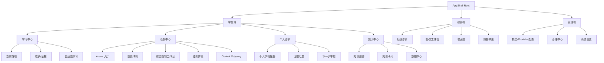
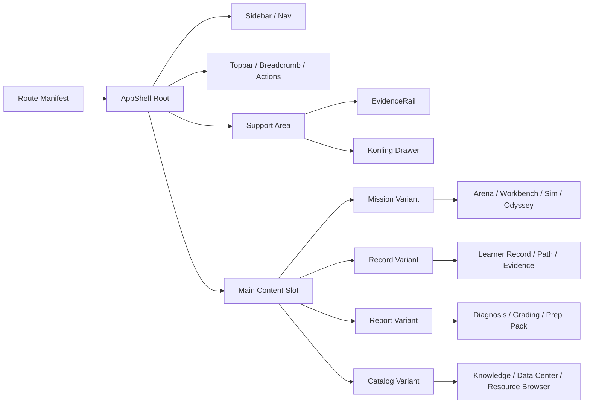

# 智控深蓝全站统一页面外壳重构报告

## 执行摘要

当前 `integration` 分支已经不缺“有没有页面能力”，而是缺“有没有一个统一、专业、可复用、能承载竞赛叙事的页面母体”。前序仓库读取结果显示，最近一批 PR 已经把平台推进到“多条业务线共用同一批页面语义”的阶段：任务工作区已经形成 `mission-workspace` 语义，具备 `provenance`、`returnTarget`、`evidenceRail`、`supportDrawer` 等壳层元素；学习者数据面已经围绕 `learner record`、`current path`、`evidence confidence`、`missing sources` 和 `next action` 重构；知识图谱/数据中心开始显式暴露 `source quality`、`freshness`、`privacy scope`、`status` 等治理型元数据。也就是说，竞技场 UI 已经不只是“竞技场页面”，而是最接近全站统一外壳雏形的一组实现。fileciteturn64file6 fileciteturn64file4 fileciteturn64file5

更关键的是，项目当前前端基础已经升级到 Next.js 16、React 19、Tailwind CSS 4、Prisma 7，这意味着用 App Router 的根布局与嵌套布局承载统一页面外壳，在工程上是顺势而为，而不是逆流重构。与此同时，`docs/ProjectDescription.md` 与当前运行栈存在一定漂移，因此这次 UI 外壳统一应以代码现状而不是旧文档作为事实基准。fileciteturn9file0L7-L14 fileciteturn9file0L82-L120 fileciteturn6file0L23-L31

我的判断很明确：**下一步不该继续堆“更多页面”，而应把竞技场壳层上升为全站 `AppShell`，再用变体机制承载学生任务、学习诊断、教师报告、批改工作台、增强包、知识中心和管理控制台。** 这样既能降低认知负担，也能把“智能助教闭环”的证据、路径、对话、报告统一到同一视觉和导航体系中，直接服务 XH-202620 对场景贴合、知识可追溯、个性化自适应和作品完成度的要求。fileciteturn95file0L9-L21 fileciteturn96file0L18-L27

本报告中的仓库事实，主要基于本对话前序已完成的 `yong-wei/act` `integration` 分支读取结果；本轮会话未再次暴露 GitHub 连接器条目，因此凡前序读取中未明确到文件路径或精确类型的位置，统一标注为“未指定”。`yong-wei/videos` 在前序读取中未见与页面外壳直接相关的代码事实，因此本次仅将其视为未来视觉资产与演示素材仓的候选来源，暂不作为代码重构事实依据。

## 事实基础与当前可复用资产

### 已确认纳入分析的 PR 与关键文件

前序仓库读取结果中，已经明确进入本次分析的 PR 编号主要包括两组。第一组是页面与视觉治理相关 PR，集中在最近 20 个 PR 的 UI/导航重构：`#356–#366`，其中明确出现了路由台账、导航框架、双主题品牌、学生入口、沉浸式任务工作台、知识图谱/数据中心、学习者数据面、教师/管理员操作台、报告导出与视觉治理等方向。第二组是智能助教闭环本体相关 PR：`#338`、`#339`、`#340`、`#342`、`#343`，加上与之直接相邻的基础实现 `#304`、`#305`、`#322`、`#324`、`#333`、`#335`。这些实现共同构成了“路径—证据—批改—诊断—增强包—控灵模式—模型适配”的服务与页面底座。fileciteturn64file1 fileciteturn64file2 fileciteturn64file4 fileciteturn64file5 fileciteturn64file6 fileciteturn64file8 fileciteturn70file1 fileciteturn64file16 fileciteturn64file15 fileciteturn70file0 fileciteturn64file12 fileciteturn69file9 fileciteturn69file8 fileciteturn69file7 fileciteturn69file5 fileciteturn106file0 fileciteturn103file0

已经明确出现并对 UI 壳层统一有直接影响的关键文件包括：`docs/ProjectDescription.md`、`package.json`、`learning-evidence-rag-corpus.ts`、`document-rubric-grading-workbench.ts`、`teacher-prep-pack-generation.ts`、`provider-config.ts`、`provider-registry.ts`，以及若干在 PR 描述中明确提到但路径未在前序读取中展开的 `mission-workspace contract`、`learner data plane`、`knowledge graph/data center`、`teaching assistant modes` 相关页面和契约模块。fileciteturn95file0L9-L21 fileciteturn9file0L7-L14 fileciteturn88file0L3-L35 fileciteturn76file0L18-L204 fileciteturn86file0L133-L241 fileciteturn92file0L3-L15 fileciteturn94file0L15-L36

### 当前可复用竞技场 UI 组件与样式清单

下表不是“理想组件库”，而是**已经在仓库事实中出现、可以上升为全站壳层元素**的对象。凡路径未被前序读取明确展开者，均直写“未指定”，并给出 Codex 后续应优先定位的模块范围。

| 组件名 | 文件/路径 | 已暴露 props/接口语义 | 依赖 | 复用建议 |
|---|---|---|---|---|
| MissionWorkspaceShell | 未指定；来源于 PR `#361` 的 `mission-workspace contract` | `provenance`、`returnTarget`、`evidenceRail`、`supportDrawer`、任务上下文、工作区内容槽位 | 路由上下文、证据流、控灵、任务状态 | 直接上升为 `AppShell` 的 `mission` 变体；承载 Arena、综合控制工作台、虚拟仿真、Control Odyssey |
| EvidenceRail | 未指定；与 `mission-workspace contract` 同簇 | 证据卡片、可信度、来源跳转、关联诊断/路径摘要 | `learning-evidence-rag-corpus`、路径、诊断、任务页面 | 站点级统一右侧证据栏；所有“可追溯页面”共享一套展示逻辑 |
| SupportDrawer | 未指定；与 `mission-workspace contract` 同簇 | 助手入口、上下文帮助、页面支持内容、工具入口 | Konling modes、`/api/ai/chat`、RAG 引用 | 从竞技场推广为全站辅助抽屉，替代各页面零散 AI 按钮 |
| LearnerRecordSurface | 未指定；来源于 PR `#363` | `learner record`、`current path`、`evidence confidence`、`missing sources`、`next action` | learner state、learning path、evidence cache | 作为 `record` 变体主体；统一学生画像、成长、证据、路径页面 |
| KnowledgeDataCenterSurface | 未指定；来源于 PR `#362` | `source quality`、`freshness`、`privacy scope`、`status`、数据地图语义 | RAG corpus、知识图谱、治理元数据 | 作为 `catalog/report` 变体；复用于知识中心、数据中心、证据浏览 |
| DocumentRubricGradingWorkbench | `document-rubric-grading-workbench.ts`；对应 UI 路径未指定 | submission asset、converted document、rubric、grading run、evidence reference、teacher review、writeback | MarkItDown、provider registry、诊断/证据写回 | 采用双栏 `report` 变体：左文档、右批注/评分/证据；避免另起“工作台”体系 |
| TeacherPrepPackSurface | `teacher-prep-pack-generation.ts`；对应 UI 路径未指定 | diagnosis、report metrics、path outcomes、grading summaries、resource nodes、teacher review gating | diagnosis、teacher report、resource metadata、evidence corpus | 作为教师侧 `report/studio` 变体；纳入统一顶部操作与右侧支持栏 |
| KonlingTeachingAssistantPanel | 未指定；来源于 PR `#342` | mode、scoped tools、citations、privacy policy、output contract | provider registry、RAG corpus、页面上下文、学习状态 | 站点级“控灵”容器；页面只声明 mode 与上下文，不自行拼装聊天面板 |
| RouteLedger / NavigationFrame | 未指定；来源于 `#356–#366` 路由与导航重构簇 | 路由分组、可见性、层级、返回关系、当前 section | RBAC、目录元数据、shell registry | 收束为单一 route manifest，驱动侧栏、面包屑、标题、搜索与快速跳转 |
| Theme / Brand Governance | 未指定；来源于 `#356–#366` 双主题品牌与视觉治理 | 主题预设、品牌标识、表面层级、色板 tokens | Tailwind 4、CSS 自定义属性、视觉资产 | 以 design tokens 方式统一；页面禁止私自定义大块色板与阴影体系 |

上表中的可复用对象并不是空想。`mission-workspace`、学习者数据面和数据中心等语义，前序 PR 读取中已经明确存在；而批改工作台、增强包、证据语料库与控灵助教模式也分别有服务层和契约层实现。因此，当前最合理的路线不是重做 UI，而是**把这些散布在不同页面中的“半壳层对象”抽升为统一 Shell Slot**。fileciteturn64file6 fileciteturn64file4 fileciteturn64file5 fileciteturn76file0L18-L204 fileciteturn86file0L133-L241 fileciteturn88file0L3-L35 fileciteturn70file0

## 全站统一外壳设计规范

### 外壳设计原则

统一外壳不应理解为“所有页面长得一样”，而应理解为：**所有页面都在相同的导航、证据、辅助与视觉语法下运行**。结合现状，最合理的做法是建立一个根 `AppShell`，下设四个页面变体：

| 变体 | 适用页面 | 固定区域 | 可选区域 |
|---|---|---|---|
| `mission` | Arena 大厅、挑战详情、综合控制工作台、虚拟仿真、Control Odyssey | 左侧导航、顶部上下文栏、主工作区、右侧证据/控灵栏 | 底部状态带、方法/指标切换栏 |
| `record` | 学生画像、个人学情、成长、路径、证据页面 | 左侧导航、顶部标题+面包屑、主记录区 | 右侧下一步建议、证据摘要 |
| `report` | 教师诊断、批改结果、班级报告、增强包 | 左侧导航、顶部操作区、主报告区 | 侧边对比栏、导出面板 |
| `catalog` | 知识中心、数据中心、资源浏览 | 左侧导航、顶部搜索/筛选区、卡片/表格主体 | 右侧预览栏 |

Next.js App Router 的根布局与嵌套布局天然适合承载这种结构：根布局定义全局共享 UI，分段布局为不同路由组注入变体壳层。官方文档明确指出，根布局是 `app` 目录中的最外层共享 UI；布局按路由段嵌套并包裹对应页面。citeturn3search16turn3search4turn3search8

### 响应式断点与侧栏行为

Tailwind 官方文档给出的默认响应式断点是 `sm=640px`、`md=768px`、`lg=1024px`、`xl=1280px`、`2xl=1536px`，且采用 mobile-first 机制。对于当前平台，继续沿用这五个默认断点最稳，因为它能最大限度复用 Tailwind 4 的现有类体系，避免为了“视觉格式化”而扩散自定义断点。citeturn6search0

建议的壳层行为如下：

| 断点 | 左侧栏 | 顶部栏 | 右侧证据/控灵栏 | 主内容策略 |
|---|---|---|---|---|
| `< md` | 默认隐藏，抽屉式弹出 | 固定，保留标题与返回 | 底部 Sheet 或二级 Tab，不常驻 | 单列流式布局，禁止多栏并排 |
| `md–lg` | 可收缩，图标窄栏默认，展开为全栏 | 固定，显示面包屑与主操作 | 默认折叠，可按需拉出 | 一主栏 + 条件侧栏 |
| `lg–xl` | 默认展开，可用户收缩 | 固定，完整上下文 | 常驻但可关闭 | 一主栏 + 常驻右栏 |
| `≥ 2xl` | 展开 | 固定 | 可固定为证据/控灵双层切换 | 支持双侧辅助信息，但核心内容宽度受控 |

这一策略的关键，不是“桌面端更复杂”，而是**所有复杂页面都共享一套行为规律**。这会显著降低学生和教师在 Arena、画像、批改、报告之间切换时的认知断裂。

### 顶部面包屑、全局色板与主题切换

面包屑必须成为统一壳层的强制元素，而不是个别页面的装饰。MDN 和 WAI APG 都建议面包屑使用 `nav` 地标、`ol/li` 结构，并为当前页设置 `aria-current="page"`；这既能帮助用户定位，也直接提升辅助技术可用性。citeturn3search3turn3search7turn3search11turn3search19

主题系统建议采用 **Tailwind + CSS 自定义属性** 的双层结构：Tailwind 负责布局、排版与基础工具类，CSS 变量负责品牌色、表面色、边框色、状态色、阴影和半透明层级。MDN 明确指出，自定义属性适合定义在 `:root` 以供全局引用，并可通过 `var()` 进行回退；`@property` 还可以为一部分核心视觉 token 提供类型约束。citeturn8search0turn8search2turn8search8

建议保留一个基础主题和一个竞赛展示主题，但只允许替换 token，不允许分叉组件树。推荐的 token 组如下：

```css
:root {
  --bg-app: #0b1220;
  --bg-surface: #121a2b;
  --bg-elevated: #172135;
  --fg-primary: #e8eefc;
  --fg-secondary: #98a7c2;
  --border-subtle: rgba(148, 163, 184, 0.16);
  --accent-brand: #39bdf8;
  --accent-arena: #f7b955;
  --accent-success: #2dd4bf;
  --accent-warning: #f59e0b;
  --accent-danger: #ef4444;
  --shadow-panel: 0 16px 40px rgba(2, 6, 23, 0.26);
}
```

视觉资产位置则建议固定为：

- `/public/brand/`：Logo、学校/项目品牌标识、favicon
- `/public/illustrations/`：通用插画、空状态图
- `/public/backgrounds/`：竞赛展示用背景纹理
- `/public/posters/`：课程封面、任务封面、Arena challenge hero
- `/public/demo/`：用于比赛录屏的静态素材

如果未来 `yong-wei/videos` 仓库承担媒体封面与课程视频索引，可通过 manifest 同步到 `/public/posters/` 或 CDN 映射层；在当前事实源里，这一部分仍属“未指定”。

### 可访问性与国际化要点

统一外壳必须从第一天就满足 WCAG 2.2 AA 的基本要求，尤其是键盘访问、结构地标、对比度、一致导航、错误提示和动画控制。W3C 明确将 WCAG 2.2 组织为可感知、可操作、可理解、稳健四大原则，这非常适合作为 UI 验收的顶层框架。citeturn3search2turn3search6turn3search14

具体到当前平台，必须强制落地的点是：

- 全站有 `skip to content`
- 左侧导航、面包屑、主内容、右侧支持栏都使用语义地标
- 焦点样式统一且高对比
- 所有图表与重要指标都有文本备选说明
- 动画和抽屉遵守 `prefers-reduced-motion`
- 表单与筛选器错误信息可被屏幕阅读器朗读

`prefers-reduced-motion` 是成熟且广泛支持的机制，可让系统根据用户偏好减少非必要动画；这对沉浸式工作台和抽屉/浮层很多的平台尤其重要。citeturn4search1turn4search11turn4search17

国际化方面，Next.js 官方已支持多语言路由与本地化内容组织。当前平台完全可以先保持 `zh-CN` 单语输出，但必须现在就把以下内容抽离为 route/meta/message 层：导航标题、面包屑文案、空状态文案、日期/时间/数字格式，以及 provider/model 名称的显示别名。否则后续再加英文界面或国际课程时，壳层会成为新的技术债。citeturn4search0turn4search2

## 页面信息架构与导航逻辑

### 站点地图与统一框架映射规则

全站不应继续围绕“页面来源”组织，而应围绕“用户正在做什么”组织。也就是说，导航一级类目不是“这是竞技场页面、这是画像页面、这是知识图谱页面”，而是“学习”“任务”“诊断”“教学”“治理”。



统一映射规则建议如下：

| 页面类型 | 统一壳层 | 必填 route meta | 可选 slot |
|---|---|---|---|
| 任务执行页 | `mission` | `section`、`title`、`returnTarget`、`supportMode` | `evidenceRail`、`statusStrip` |
| 学习记录页 | `record` | `section`、`title`、`learnerContext` | `nextActionPanel` |
| 报告/批改页 | `report` | `section`、`title`、`reportScope` | `comparePanel`、`exportActions` |
| 知识/资源浏览页 | `catalog` | `section`、`title`、`searchScope` | `previewDrawer` |
| 管理配置页 | `console` | `section`、`title` | `dangerZone` |

这套映射的价值在于：**二级页面不再自己决定是否出现侧栏、面包屑、助手和证据栏，而是由 route meta 驱动壳层自动装配。** 这不仅让视觉一致，也让 Codex 的批量改造成为可能。

### 推荐的路由元数据结构

参考 Next.js 布局机制，建议建立站点级 route manifest，作为壳层的单一真源。这样侧栏、面包屑、页面标题、权限、返回逻辑与快速跳转都可以从同一份声明派生，而不再散落在页面组件里。citeturn3search16turn4search0

```ts
export type ShellVariant = 'mission' | 'record' | 'report' | 'catalog' | 'console';

export interface AppRouteMeta {
  id: string;
  path: string;
  title: string;
  section: 'student' | 'teacher' | 'admin';
  navGroup: string;
  shell: ShellVariant;
  icon?: string;
  rbac?: string[];
  breadcrumb: Array<{ title: string; href?: string }>;
  returnTarget?: { title: string; href: string };
  supportMode?: 'konling' | 'evidence' | 'none';
  evidenceMode?: 'rail' | 'drawer' | 'none';
  featureFlag?: string;
}
```

这不是多一层“抽象洁癖”，而是减少维护成本。当前 PR 群已经出现“路由台账”“导航框架”“任务工作区 contract”“学习者数据面 contract”这些前兆；现在最该做的是把它们收束成一个编译期和运行期都可消费的声明层。fileciteturn64file1 fileciteturn64file6 fileciteturn64file4

## 分阶段开发计划与 OpenSpec 提案

### 前端改造分阶段 issue 列表

下表按 Codex 可直接执行的 issue 形式组织。工时按“开发人日”估算，默认已有现成 UI 与服务被复用，而不是从零开发。

| issue 名称 | 目标 | 修改文件/模块 | 估算工时 | 风险 | 验收标准 |
|---|---|---|---:|---|---|
| 收束路由台账为单一 route manifest | 让侧栏、面包屑、标题、返回逻辑从单一声明派生 | 新增 `src/navigation/route-manifest.ts`；迁移现有路由台账模块；涉及 `#356–#366` 导航相关页面 | 3–4 | 中 | 至少 20 个核心路由接入；无页面再手写重复标题与面包屑 |
| 抽离竞技场壳层为站点级 AppShell | 从 Arena/Mission UI 提炼根壳层与变体 | 新增 `app/(shell)/layout.tsx`、`components/app-shell/*`；定位 `mission-workspace contract` 实现 | 5–7 | 中高 | Arena 大厅、挑战详情、综合控制工作台切到同一壳层且视觉一致 |
| 建立统一 Sidebar / Topbar / Breadcrumb / ActionBar | 统一导航、标题、操作区 | `components/app-shell/sidebar.tsx`、`topbar.tsx`、`breadcrumb.tsx`、`page-actions.tsx` | 4–5 | 中 | 学生、教师、管理三域都复用同一套壳层组件 |
| 建立 EvidenceRail 与 KonlingSupportDrawer 站点级插槽 | 统一证据与辅助答疑入口 | 对接 `learning-evidence-rag-corpus.ts`、Konling modes、`/api/ai/chat` | 4–6 | 中 | 至少 4 类页面出现一致的证据/控灵抽屉行为 |
| 迁移 Learner surfaces 到 `record` 变体 | 统一学生画像、路径、成长、证据页面 | 定位 `#363` learner surfaces; `app/**/learner*` 范围待定位 | 4–6 | 中 | 个人画像、成长、证据、当前路径拥有统一顶部和侧栏逻辑 |
| 迁移 Teacher diagnosis / grading / prep 到 `report` 变体 | 统一教师页面视觉与操作心智 | 对接批改工作台、教师报告、增强包页面 | 5–7 | 中高 | 教师可在同一壳层内完成诊断→批改→增强包跳转 |
| Theme token 化与视觉资产治理 | 形成可替换主题，不分叉组件树 | `app/globals.css`、`tailwind` 主题层、`/public/brand` 等 | 3–4 | 低 | 页面去除散落色值；主题切换不影响布局与可读性 |
| 响应式与可访问性硬化 | 满足移动端、键盘、低运动偏好与面包屑语义 | 全站壳层组件与关键页面 | 3–5 | 中 | Lighthouse/Axe 核心问题清零；移动端关键流可跑通 |
| Provider capability UI 兼容层 | 在 UI 中显示 provider/model 能力与限制，但不阻塞主线 | `provider-config.ts`、`provider-registry.ts` 对应设置页面与 badges | 2–3 | 低 | `openai-compatible` 与 `anthropic-compatible` 的状态可见、不可用项可解释 |
| 演示/回归场景脚本化 | 为竞赛录屏与回归测试准备稳定入口 | 新增 `tests/e2e/ui-shell.spec.ts`、`demo-seed`、导航固定入口 | 3–4 | 中 | 三个演示场景一键复现；主路线录屏不依赖临场点击探索 |

这些 issue 的设计原则很明确：**先抽壳层，再迁页面；先统一行为，再修表面差异；先做竞赛可演示集，再做长尾页面。** 这比大面积“美化页面”有效得多。

### 后端 API 与数据库兼容点清单

UI 外壳统一以页面编排为主，因此不应引入大规模后端破坏性改造。后端和数据库只需要在“壳层要读什么上下文”这个层面做最小扩展。

| 受影响接口/模型 | 当前事实 | 向后兼容策略 | 迁移脚本建议 | 数据模型变更或兼容层 |
|---|---|---|---|---|
| `/api/ai/chat` | 已能读取 course/page context，并把 learner state、path、memory、scoped tools 注入 Konling runtime | 新增可选 `routeMeta`、`shellVariant`、`supportMode` 字段；旧调用不受影响 | 无需脚本 | 仅扩展请求 schema；默认值回退为 `none` |
| `learning-evidence-rag-corpus` 相关接口 | 已存在 course-content、knowledge-card、runtime-handout、diagnosis、grading-artifact、simulation-summary、arena-summary、teacher-report 等 source type | 不改语料结构，只新增 UI 读取所需的轻量 projection | 无需脚本 | 增加 `EvidenceCardDTO` 适配层，不动真源模型 |
| `teacher report` API | 已能读取班级学生、LearningPath、StudentCompetencySnapshot、StudentEvidenceFeatureCache 生成报告 | 维持原 API；前端层新增 `report shell` 适配器 | 无需脚本 | 无数据库变更 |
| `document rubric grading` 流程 | 已有 submission、MarkItDown conversion、rubric grading、teacher approval、evidence writeback | 保持服务层不动，只加 viewer/panel 需要的分页与 block 映射字段 | 若已有 JSON 字段可直接扩展；否则追加 nullable 字段 | 建议增加 `convertedBlockIndex` 或 `viewerAnchors` JSON，可选 |
| `provider-config.ts` / `provider-registry.ts` | 已支持 `openai-compatible`、`anthropic-compatible` 配置层；运行时尚未完成 anthropic native adapter | 前端先显示 capability 与状态，不要求本期所有 provider 可用 | 无脚本 | 无数据库变更；必要时只补 provider capabilities DTO |
| 用户偏好 | 前序读取中未见明确的 UI 偏好表 | 第一期先用 `localStorage`；第二期再落库 | 如需落库，新增 `UserWorkspacePreference` 表 | 推荐独立表，不污染核心 learner/profile 表 |

这里真正要避免的错误，是为了统一页面外壳去碰核心学习数据结构。`LearningPath`、`StudentCompetencySnapshot`、RAG corpus、批改工件、增强包输入，都已经是智能助教闭环的事实真源。壳层改造应增加**展示适配层**，而不是倒逼核心数据模型重写。fileciteturn82file0L63-L120 fileciteturn83file0L128-L139 fileciteturn88file0L188-L274 fileciteturn76file0L18-L204

### OpenSpec 提案草案

建议把本轮工作拆为六个 OpenSpec 提案。每个提案都应覆盖“设计、实现、测试、回归、发布”五段，而不是只写“改页面”。

#### 提案一：`promote-arena-shell-to-app-shell`

| 阶段 | 任务清单 | 验证规则 |
|---|---|---|
| 设计 | 梳理 `mission-workspace` 中可抽升的壳层元素；定义 `ShellVariant`、`AppRouteMeta`、slot 结构 | 设计文档必须列出 4 类变体、slot 边界、非目标页面 |
| 实现 | 新建 `AppShell`、`MissionShell`、`RecordShell`、`ReportShell`；竞技场页面先接入 | Arena 大厅、挑战详情、控制工作台全部切换成功 |
| 测试 | 增加壳层快照测试、路由 manifest 覆盖测试 | 关键 layout snapshot 稳定；manifest 中无重复 path/id |
| 回归 | 检查旧入口链接、回退逻辑、登录后默认入口 | 旧链接仍可访问；返回行为符合 `returnTarget` |
| 发布 | 在 feature flag 下灰度；先给 demo/teacher 账号启用 | 允许一键开关；回滚不需要数据库变更 |

#### 提案二：`unify-navigation-and-breadcrumbs`

| 阶段 | 任务清单 | 验证规则 |
|---|---|---|
| 设计 | 收束导航分组、RBAC、面包屑生成规则、移动端抽屉规则 | 导航结构图与路由表一一对应 |
| 实现 | 完成 Sidebar、Topbar、Breadcrumb、Quick Switch | 至少 20 个核心页面共享同一套导航组件 |
| 测试 | 键盘导航、焦点顺序、`aria-current` 检测 | Axe 无 breadcrumb/nav 结构错误 |
| 回归 | 检查教师/学生/管理员跨域切换 | 用户不会看到无权限入口 |
| 发布 | 替换旧导航组件并删除冗余实现 | 代码库中旧面包屑与侧栏实现减少到单实例 |

#### 提案三：`sitewide-evidence-and-konling-rail`

| 阶段 | 任务清单 | 验证规则 |
|---|---|---|
| 设计 | 定义 `EvidenceRail` 与 `SupportDrawer` 统一接口；约定页面如何声明 `supportMode` | 接口只消费 DTO，不直接绑服务实现 |
| 实现 | 对接 RAG corpus、Konling teaching assistant modes、`/api/ai/chat` | Arena、个人诊断、批改、教师报告至少四类页面可用 |
| 测试 | 引用卡片渲染测试、空状态测试、权限测试 | 引用缺失时 UI 不崩，且提示“无可用证据” |
| 回归 | 检查右栏在移动端、桌面端的行为一致性 | 移动端改为 sheet/tab，桌面端可常驻 |
| 发布 | 对旧页面 AI 入口做适配/合并 | 全站不再出现三种不同 AI 入口形态 |

#### 提案四：`migrate-learner-and-teacher-surfaces`

| 阶段 | 任务清单 | 验证规则 |
|---|---|---|
| 设计 | 将 learner、diagnosis、grading、prep page 映射到 `record/report` 变体 | 页面迁移清单完整，含非目标页面 |
| 实现 | 迁移学生学习面、教师班级诊断、批改工作台、增强包页面 | 四条核心业务链路视觉/导航一致 |
| 测试 | 页面切换与深链访问测试 | 任意子页刷新后仍保留正确壳层 |
| 回归 | 对比迁移前后的功能缺失 | 迁移不导致核心按钮/表单丢失 |
| 发布 | 分域灰度：先 student，再 teacher | 每次只迁一个域，便于回滚 |

#### 提案五：`theme-tokenization-and-accessibility-hardening`

| 阶段 | 任务清单 | 验证规则 |
|---|---|---|
| 设计 | 定义 token 表、主题属性、动效等级、可访问性矩阵 | token 表覆盖颜色、边框、阴影、间距和状态色 |
| 实现 | 全局 CSS 变量落地；统一焦点环、空状态、表格与卡片样式 | 页面去除散落硬编码色值 |
| 测试 | 对比度、键盘、`prefers-reduced-motion`、移动端测试 | WCAG AA 核心项通过；动画可降级 |
| 回归 | 检查图表、暗色背景、Banner、Hero 卡片 | 不出现暗底暗字、亮底亮字问题 |
| 发布 | 先在竞赛主题中启用，再回写默认主题 | 主题切换不影响组件功能 |

#### 提案六：`demo-regression-and-competition-pack`

| 阶段 | 任务清单 | 验证规则 |
|---|---|---|
| 设计 | 定义三条录屏主线、 demo 账号入口、固定数据 seed | 三条主线覆盖学生、教师、平台智能闭环 |
| 实现 | 新增 demo landing、隐藏开关、固定导航入口与示例数据 | 录屏不需要临时构造数据 |
| 测试 | 端到端脚本、录屏走查、失败场景补救文案 | 三条主线连续录制成功率 100% |
| 回归 | 每次 UI 调整后跑一遍 demo e2e | 比赛路线不能被普通重构破坏 |
| 发布 | 生成回归报告、演示脚本、release note | 赛前 freeze 后只允许修 Bug 不改交互结构 |

## 兼容点、验收标准与演示脚本

### UI/UX 验收标准

统一外壳改造不是“看起来像一套”，而是“行为上必须是一套”。建议把验收标准收束为以下五类：

| 维度 | 验收标准 |
|---|---|
| 一致性 | 所有核心页面都使用同一导航、面包屑、标题区、页面动作区、右侧支持区语法 |
| 可定位性 | 任意页面刷新后，用户都能凭面包屑、section 高亮、返回目标立刻知道自己在哪 |
| 可维护性 | 路由元数据为单一真源；新增页面接入壳层不超过一个 manifest 声明 + 一个 page component |
| 可访问性 | 通过基本 Axe/Lighthouse 检查；键盘可达；低运动偏好可用；面包屑与 landmarks 正确 |
| 演示稳定性 | 学生、教师、管理员三类典型流可以在固定账号与固定数据下连续演示，无随机入口依赖 |

这些标准不是抽象要求，而是直接对应评审观感。竞赛评委不会沿着源码看你有没有 `layout.tsx`，他们只会感受到：页面是否专业、跳转是否自然、信息层级是否清晰、AI 与证据是否像一个系统而不是插件拼接。

### 端到端演示脚本

#### 场景一：学生从 Arena 进入统一任务壳层

**步骤**

1. 学生登录后进入“任务中心”，默认看见统一左侧导航与顶部上下文栏。  
2. 打开 Arena 大厅，点击某个控制校正挑战。  
3. 进入挑战详情页后，壳层不变，仅主内容切换为挑战卡片、评测标准和进入工作台按钮。  
4. 点击“进入工作台”，进入综合控制工作台；右侧证据栏显示相关知识卡、任务说明与路径上下文。  
5. 在控灵抽屉中提问，回答带引用且不跳出当前壳层。  

**期望结果**

- 学生始终处于同一 `mission` 壳层；  
- 返回路径清晰，`returnTarget` 有效；  
- 右侧辅助区由“证据/控灵”切换，不出现新窗口式 UI；  
- Arena、挑战详情、工作台三页的标题体系、按钮位置、侧栏行为一致。fileciteturn64file6 fileciteturn88file0L3-L35 fileciteturn70file0

#### 场景二：学生查看个人学情并跳转到路径执行

**步骤**

1. 学生从左侧导航进入“个人诊断”。  
2. 页面以 `record` 变体展示雷达图/维度卡、定性解读、证据摘要与下一步举措。  
3. 点击“当前路径”，主内容切换为路径视图，但保留同一顶部文脉与右侧支持区。  
4. 点击某个知识节点，进入知识卡或讲义页面；顶部面包屑准确反映层级。  
5. 使用浏览器回退或壳层返回按钮，能够回到路径页与诊断页。  

**期望结果**

- 学情页、路径页、知识页共用同一 `record/catalog` 壳层语法；  
- 学生不会因页面风格切换而迷失；  
- 证据摘要与下一步行动的视觉布局在多个页面中保持一致。fileciteturn64file4 fileciteturn88file0L188-L274

#### 场景三：教师从班级诊断进入批改与增强包

**步骤**

1. 教师登录后进入“班级诊断”。  
2. 查看班级报告，在同一壳层中切换个体诊断与汇总指标。  
3. 点击某次作业批改入口，进入文档批改工作台；左侧为文档/Markdown，右侧为 Rubric、证据、评审意见。  
4. 完成审核后，跳转到“增强包”页面，查看系统根据诊断与批改结果生成的下次课增强建议。  
5. 教师选择若干增强项，插回课程主干，导出增强包摘要。  

**期望结果**

- 班级报告、批改、增强包共享 `report` 变体；  
- 教师不用在多个“孤岛工作台”之间跳转；  
- 导出、审核、回写的操作区位置稳定。fileciteturn82file0L63-L120 fileciteturn76file0L18-L204 fileciteturn86file0L133-L241

## 里程碑与优先级建议

### 优先级判断

#### 最高优先级

最高优先级不是“把所有页面都迁过去”，而是先打通**最小可演示闭环**。具体说来，就是以下三条链路：

- Arena 大厅 → 挑战详情 → 综合控制工作台
- 个人学情 → 当前路径 → 知识/证据页
- 班级诊断 → 批改工作台 → 增强包

只要这三条链路在统一壳层中成立，竞赛演示就已经从“很多功能”跃迁到“一个专业系统”。这也是为什么本报告把 UI 壳层统一放在功能扩展之前。

#### 次高优先级

其次才是视觉 token 化、可访问性硬化、provider 能力展示、管理端页面纳入统一框架。这些都重要，但它们不是决定演示为什么成立的第一因。

### 里程碑建议

| 时间窗口 | 目标 | 交付物 |
|---|---|---|
| 六月中下旬 | 壳层基础落地 | `route-manifest`、`AppShell`、`mission` 变体、统一 Sidebar/Topbar/Breadcrumb |
| 七月上旬 | 学生侧迁移完成 | Arena/Workbench、个人诊断、当前路径、知识页进入统一壳层 |
| 七月下旬 | 教师侧迁移完成 | 班级报告、批改工作台、增强包统一为 `report` 变体 |
| 八月上旬 | 视觉与可访问性硬化 | token 化主题、移动端适配、Axe/Lighthouse 基线、低运动支持 |
| 八月下旬 | 竞赛演示冻结 | 三条录屏主线、demo seed、e2e 回归、导出脚本 |
| 九月提交前 | 最小可演示集 + 材料固化 | Demo 视频、演示脚本、截图手册、OpenSpec 变更记录、回归报告 |

### 九月赛期最小可演示集

面向 9 月提交，最小可演示集不应再继续扩大。建议冻结为以下集合：

- 全站统一 `AppShell`
- 三条演示主线全部打通
- 统一控灵抽屉与证据栏
- 统一学生诊断页与教师报告页
- 批改工作台页面进入统一壳层
- 增强包页面进入统一壳层
- 主题与品牌切换可演示，但不做过多花哨特效
- `anthropic-compatible` 在 UI 中可配置、可见状态；运行时适配可并行推进，但**不是 UI 壳层统一的阻塞项**

最后这一点需要单独说明。前序读取表明，`provider-config.ts` 已经声明了 `openai-compatible` 与 `anthropic-compatible` 两类 provider 能力，但 `provider-registry.ts` 运行时当前只真正创建了 `siliconflow` 和 `openai-compatible` 适配器；如果选择 `anthropic-compatible`，会抛出“需要原生 adapter”的错误。因而，从竞赛 UI 壳层统一的主线来说，**Anthropic-compatible adapter 不是本任务的先决条件**；只有当你准备把“多 Provider 切换”作为可运行演示的一部分时，它才会从“并行事项”升级为“必要项”。fileciteturn92file0L3-L15 fileciteturn92file0L40-L55 fileciteturn94file0L15-L36 citeturn9search0turn9search1

## 参考代码片段与示意图

下面这段示意代码不是替代实现，而是给 Codex 的最小落点：用一个根壳层 + route manifest，把当前竞技场壳层推广为站点壳层。

```tsx
// app/(shell)/layout.tsx
import { AppShell } from '@/components/app-shell/app-shell';
import { getRouteMeta } from '@/navigation/route-manifest';

export default async function ShellLayout({
  children,
  params,
}: {
  children: React.ReactNode;
  params: Promise<{ slug?: string[] }>;
}) {
  const routeMeta = await getRouteMeta(params);
  return (
    <AppShell
      section={routeMeta.section}
      shell={routeMeta.shell}
      breadcrumb={routeMeta.breadcrumb}
      returnTarget={routeMeta.returnTarget}
      supportMode={routeMeta.supportMode}
      evidenceMode={routeMeta.evidenceMode}
    >
      {children}
    </AppShell>
  );
}
```

```tsx
// components/app-shell/app-shell.tsx
export function AppShell(props: {
  section: 'student' | 'teacher' | 'admin';
  shell: 'mission' | 'record' | 'report' | 'catalog' | 'console';
  breadcrumb: Array<{ title: string; href?: string }>;
  returnTarget?: { title: string; href: string };
  supportMode?: 'konling' | 'evidence' | 'none';
  evidenceMode?: 'rail' | 'drawer' | 'none';
  children: React.ReactNode;
}) {
  return (
    <div className="min-h-screen bg-[var(--bg-app)] text-[var(--fg-primary)]">
      <Sidebar section={props.section} />
      <main className="lg:pl-72">
        <Topbar breadcrumb={props.breadcrumb} returnTarget={props.returnTarget} />
        <div className="mx-auto flex max-w-[1600px] gap-6 px-4 py-4 lg:px-6">
          <section className="min-w-0 flex-1">{props.children}</section>
          <ShellSupportArea supportMode={props.supportMode} evidenceMode={props.evidenceMode} />
        </div>
      </main>
    </div>
  );
}
```

再用一张结构图把这次重构的本质说清楚：



这张图表达的其实是整份报告的核心判断：**你当前真正需要统一的不是“外观”，而是“页面语法”**。因为竞赛要看到的不是零散功能，而是一个有秩序、有证据、有路径、有治理能力的教学系统。当前 `integration` 分支已经给了你足够多的壳层前体；下一步把竞技场提升为全站外壳，正是把这些前体压缩成成品的最短路径。