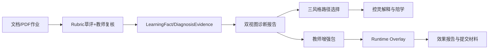

# 自动控制原理智能助教闭环硬化开发计划

## 执行摘要

integration 分支已具备统一 AppShell、控制校正诊断、文档批改、三风格路径、备课增强包、控灵多模式与效果报告骨架，已从“功能设计期”进入“竞赛化硬化期”。当前最大差距不是缺模块，而是诊断证据灌入不足、批改仍偏 scaffold、RAG 引用尚未产品化、控灵页面上下文未全接通、效果验证与演示资产未固化。下面给出面向 Codex、可直接转为 OpenSpec 的 8 个提案与验收标准。

## 已读取的仓库事实

本报告依据本轮对话中已读取并可引用的 integration 分支事实整理，覆盖：`docs/ProjectDescription.md`、项目记忆、Prisma schema 中 `DiagnosisReportSnapshot` / `CourseEnhancementPack` 等模型、控制校正诊断画像与 spec、文档 Rubric 批改工作流、学习路径 spec、Learning Evidence RAG、Konling teaching assistant modes、AI provider registry、教师增强包与测试、AppShell/UI 统一化相关实现；最近 PR 至少包括 #384、#386、#387、#388、#389、#398、#399、#400、#401、#402、#403、#410、#412。`yong-wei/videos` 在当前可引用片段中未出现目录/文件清单，因此本报告只把它作为“演示资产落库目标”，不据此做事实判断。

## 差距分析

| 场景          | 现有实现                                                     | 具体缺口                                                     | 风险点                                                       | 结论                  |
| ------------- | ------------------------------------------------------------ | ------------------------------------------------------------ | ------------------------------------------------------------ | --------------------- |
| 学情诊断      | 已有控制校正诊断 indicator engine、9 维能力、percentile/growth/limitations、学生/教师 drilldown 页面与 snapshot 持久化。   | 证据映射仍偏窄，尚未把批改、自适应题、仿真、Arena、路径执行统一物化为稳定 `DiagnosisEvidenceRecord`；班级群体根因与学生行动建议还未在双视图中拉开层次。 | 诊断可解释性不足会直接削弱“学情精准诊断”评分。               | P0 硬化               |
| 文档/作业批改 | 已有 document submission、转换、draft grading、teacher review、student feedback、writeback preview。   | `createDraftRubricGrading` 仍是按 evidence block 取中间等级的 scaffold，缺专业 LLM 评分器、公式/图表规则、教师修改率与一致性指标。 | 若直接参赛，内容质量度和可信度会被质疑。                     | P0 硬化               |
| 路径规划      | 已有 deterministic + graph-search 路径、三风格路径、执行/偏离/干预/终端验证。   | 还缺“路径选择信号回写诊断/偏好画像”“路径选择页与诊断页的一跳闭环”“学生侧显式风格对比解释”。 | 若只是推荐列表，助学场景亮点不够。                           | P1 硬化               |
| 控灵陪学      | Konling 已有 diagnosis-explainer、path-advisor、grading-assistant、feedback-explainer、class-summarizer、prep-coauthor 等模式。 | 业务上下文默认多为 false，很多模式仍需 serverModeContext 显式注入；页面侧尚未普遍把 Rubric、draft、report、prep-pack 等真实上下文接入。 | 模式很多但容易“看起来强、用起来空”。                         | P0 硬化               |
| RAG/引用      | 已有 Learning Evidence RAG corpus source types 与 citation verification，支持 authority/permission/hash/span 审核。  | 仍偏协议层，缺前端可点击引用、runtime/知识卡/Rubric/作业片段/仿真-Arena 摘要的统一可视化索引与回归指标。 | “内容可追溯”无法被评委直观看到。                             | P0 硬化               |
| UI/演示       | AppShell 已统一 learner、ops、Arena、Workbench，并有 desktop expanded/collapsed 与 mobile drawer 的视觉治理要求。     | 比赛核心页还缺统一壳层下的短路径故事线、固定账号 demo seed、1440/320 双分辨率截图基线。 | 页面虽多，但不一定能 3 分钟讲清。                            | P0 硬化               |
| 模型兼容      | 已有 OpenAI-compatible 支持；Anthropic-compatible 当前为 metadata-only，registry 报 `adapter-missing`。   | 是否补齐 Anthropic native adapter 未决。                     | 若主线模型稳定，可不做 P0；若要在材料中声称“兼容 Anthropic 运行态”，就必须补。 | 非 P0，建议说明性处理 |

这里真正关键的是：**赛题差距已经不是“有没有功能”，而是“是否形成由受治理证据驱动、UI 一致、可追溯、可验证的助教+助学闭环”。** 赛题本身强调助教的智能备课/批改/学情诊断和助学的路径规划/知识问答/陪伴，以及知识库、RAG、智能工作流、可追溯与个性化自适应，所以当前最优策略不是扩功能，而是压缩并硬化现有闭环。

## OpenSpec 提案总表

| 提案                                            | 目标                                       | 预期产出                                                | 验收标准                                              | 优先级 | 粗估人日 |
| ----------------------------------------------- | ------------------------------------------ | ------------------------------------------------------- | ----------------------------------------------------- | -----: | -------: |
| `freeze-competition-baseline`                   | 固化当前能力与比赛主线                     | 能力地图、演示路书、页面清单、seed 数据脚本             | OpenSpec 通过；固定 demo 账号可全链路跑通             |     P0 |        2 |
| `harden-diagnosis-dual-view`                    | 把诊断做成双视图、强证据、可点击报告       | 学生/教师诊断页、证据 drilldown、分位数/增长分位数      | 9 维全部 report-ready；双端截图齐全                   |     P0 |        5 |
| `professionalize-document-grading`              | 将 PDF/Markdown 批改升级为专业 Rubric 评阅 | LLM evaluator、教师工作台增强、学生反馈增强、一致性统计 | 1 份 PDF 能完成转换→草评→教师复核→写回→学生反馈       |     P0 |        6 |
| `productize-rag-citations`                      | 把 RAG 从协议变成可见产品能力              | CitationChip、证据面板、索引任务、引用审计              | 无引用回答拦截；核心页均可点击引用                    |     P0 |        4 |
| `close-loop-path-selection`                     | 将三风格路径与诊断/偏好画像闭环            | 路径对比页、选择回写、执行追踪、终端验证页              | 选择一条路径后可生成偏好信号且不直接抬高 mastery      |     P1 |        4 |
| `wire-konling-teaching-context`                 | 打通控灵多模式页面上下文                   | mode context loaders、降级提示、引用型回答              | 6 个关键模式在对应页 ready 且状态准确                 |     P0 |        4 |
| `activate-prep-pack-overlay-flow`               | 让教师增强包嵌回课程主干                   | 生成/审核/预览/激活/回滚完整流程                        | overlay 不改 base runtime，课后能回收 impact evidence |     P1 |        4 |
| `polish-competition-surfaces-and-effect-report` | 完成统一壳层、效果报告与提交材料           | Playwright 截图基线、effect report、视频脚本/素材目录   | 1440/320 截图齐全；3 分钟 demo 与材料模板完备         |     P0 |        5 |

## 提案实施细则

### `freeze-competition-baseline`

**目标**
把现有工程状态压成一条“控制校正设计作业→诊断→路径→控灵→增强包→效果报告”的比赛主线，冻结赛前范围。依据是当前已经存在统一壳层、诊断、批改、路径、增强包和效果报告骨架。

**面向 Codex 的 issue**

- `issue: capability-map-doc`：生成 `docs/competition/xh-202620-capability-map.md`；验收为功能-赛题映射表完整。
- `issue: demo-route-ledger`：整理比赛核心路由、固定 return target、面包屑；验收为 1 张路由图与 1 份 click path。
- `issue: seeded-demo-accounts`：生成教师/学生 demo 账号与 seed 数据；验收为本地一键 seed 成功。

**API/数据库/UI**

- API：建议新增 `GET /api/competition/demo-map`、`POST /api/competition/seed-demo`。
- DB：优先复用现有 `DiagnosisReportSnapshot`、`CourseEnhancementPack`、path execution/deviation/intervention、evidence outbox；如需 demo 标记，新增可选 `isDemoSeed` 字段或独立 `DemoScenario` 表，避免污染真实数据。
- UI：新增 `/competition/demo-index`，挂到 AppShell 的 report/ops archetype；1440 与 320 都要截图。
- 验收测试：Playwright 执行教师登录→批改工作台→诊断页→prep pack→effect report；学生登录→诊断→路径→反馈页。

### `harden-diagnosis-dual-view`

**目标**
把控制校正诊断升级为真正的“双视图能力报告”：同一事实真源，学生侧强调行动建议与路径入口，教师侧强调群体差异、根因、下次课干预。当前 spec 与实现已经要求 governed indicators、至少 3 个指标、snapshot 记录 score/confidence/window/limitations，但仍需扩充证据映射与页面表达。

**面向 Codex 的 issue**

- `issue: diagnosis-evidence-mappers`：把 LearningFact、document grading、adaptive answers、SimulationRun、ArenaSubmission、LearningPathExecution 映射到诊断证据；验收为 9 维均可命中 3 个以上指标。
- `issue: student-diagnosis-report-ui`：雷达图、班级分位数、增长分位数、建议行动卡、路径入口；验收为 1440/320 截图通过。
- `issue: teacher-class-root-cause-ui`：班级分布、群体聚类、根因摘要、增强包入口；验收为 drilldown 可回到具体证据。
- `issue: diagnosis-evidence-drawer`：点击任一维度弹出证据抽屉，显示来源、时间窗、置信度、limitations；验收为每维能点开明细。

**API**

- `GET /api/diagnosis/students/:studentId/report`
- `GET /api/diagnosis/classes/:classId/report`
- `GET /api/diagnosis/reports/:snapshotId/evidence`
- `POST /api/diagnosis/recompute`（教师/管理员）

**数据库兼容**

- 复用 `DiagnosisReportSnapshot`；新增建议表 `DiagnosisObservationRecord`：`snapshotId, dimensionKey, indicatorKey, value, percentile, growthPercentile, evidenceRefsJson, confidence, limitationJson, windowStart, windowEnd`
- 若不想新增表，则将 observation 落入 snapshot JSON，但建议单表便于 drilldown 和回归测试。

**前端/AppShell**

- 路由：`/learner/diagnosis`, `/teacher/diagnosis/class/[classId]`, `/teacher/diagnosis/student/[studentId]`
- 插槽：主内容区 + `evidence rail` + `support drawer`
- Mobile：雷达图改为纵向卡组；抽屉式 evidence/next-actions

**Konling 注入点**

- diagnosis-explainer 必注入 snapshot + selectedDimension + visibleEvidenceRefs
- 学生端仅暴露本人证据；教师端暴露班级聚合和经过权限清洗的个体摘要

**RAG/引用**

- 诊断页的每个 EvidenceChip 调 `verify-citation`
- 课程 runtime/知识卡优先为“权威证据”，学生行为证据为“学习证据”

**验收与 3 分钟脚本片段**

- 脚本：学生打开诊断报告→点开“频域裕度分析”→看到班级分位数、增长分位数和 3 条证据→点击“进入路径A”
- Playwright：`/learner/diagnosis` 与 `/teacher/diagnosis/class/demo-class` 在 1440/320 截图

### `professionalize-document-grading`

**目标**
把 PDF/Markdown 作业批改从“中间等级 scaffold”升级为“教师可审批的专业 Rubric 评阅”。当前 pipeline 已具备转换、草评、教师审批和学生反馈，但草评算法仍是启发式。

**面向 Codex 的 issue**

- `issue: control-correction-rubric-v1`：建立控制校正作业 Rubric v1；验收为 criterion、level、evidence requirement、writeback mapping 齐全。
- `issue: llm-grading-evaluator-json`：新增 LLM 输出 JSON evaluator；验收为 schema 校验 + evidence 必填。
- `issue: teacher-workbench-criterion-edit`：教师可改分、改批注、改证据锚点；验收为审批前后 diff 可见。
- `issue: student-feedback-action-cards`：学生反馈页显示“错误→建议→对应路径”；验收为每条批注至少一条行动建议。
- `issue: grading-quality-metrics`：统计 AI/教师差异、override rate、blocked citations；验收为 effect report 可读取。

**API**

- `POST /api/grading/submissions`：上传 PDF/Office，触发 MarkDown 转换
- `GET /api/grading/submissions/:id/converted`
- `POST /api/grading/submissions/:id/draft-evaluate`
- `POST /api/grading/submissions/:id/approve`
- `POST /api/grading/submissions/:id/return-for-edit`
- `GET /api/grading/submissions/:id/feedback`

**数据库兼容**

- 复用现有文档批改表；新增建议：
  - `RubricCriterionAssessment`：`submissionId, criterionId, aiScore, teacherScore, aiComment, teacherComment, evidenceRefsJson, finalStatus`
  - `GradingQualityMetricSnapshot`
- 若现有表已有 JSON metadata，优先 additive JSON 字段而非大改 schema。

**前端/AppShell**

- 路由：`/teacher/grading-workbench/[submissionId]`, `/assessment/document-feedback/[submissionId]`
- 框架：与 Arena 相同 AppShell；左侧 submission 目录，中心内容，右侧 evidence/comment dock
- Mobile：PDF/Markdown 预览与批注面板切 tab

**Konling 注入点**

- grading-assistant 注入：rubric、converted blocks、draft assessments、teacher review state
- feedback-explainer 注入：student feedback + remediation links

**RAG/引用**

- 批改时必须返回 evidence anchors；反馈页的每条批注可跳转原文 block/pageRef
- 引用优先 Rubric、标准解题链、课程知识卡、学生作业片段

**验收测试**

- 运行现有批改工作台与路由测试，并新增“LLM evaluator schema invalid 时拒绝写回”用例。现有相关测试位于数据治理测试与工作台/路由测试文件。
- 演示脚本：教师打开一份 PDF 控制校正报告→查看草评→手工修正一项 criterion→批准→学生刷新反馈页看到行动卡

### `productize-rag-citations`

**目标**
让 “可追溯” 成为前端看得见的产品能力，而不仅是后台协议。当前已有 corpus 与 citation verification，但要把它做成页面上的 CitationChip、证据抽屉和索引回归。

**面向 Codex 的 issue**

- `issue: citation-chip-component`：统一 CitationChip/SourceBadge；验收为诊断、批改、路径、控灵回答均复用。
- `issue: rag-index-jobs`：为 runtime、知识卡、Rubric、作业片段、仿真/Arena 摘要建立索引任务；验收为种子数据可检索。
- `issue: citation-audit-page`：显示 verified/rejected/redacted/downgraded 数量；验收为管理员页可见。
- `issue: no-citation-guardrail`：无引用时阻止高风险回答；验收为回退消息正确。

**API**

- `POST /api/rag/index/rebuild`
- `POST /api/rag/search`
- `POST /api/rag/verify-citations`
- `GET /api/rag/audit`

**数据库兼容**

- 建议新增 `RagCitationAudit` 表；或复用 evidence outbox 并增加 `citationAuditJson`
- 对资源对象仅新增 `ragSourceType`、`authorityLevel` 等 nullable 字段

**前端/AppShell**

- `/admin/rag-audit`, `/teacher/report/citations`
- 关键页加 `evidence rail`，点击引用弹侧边抽屉

**Konling 注入点**

- 所有 mode 输出 contract 加 `citations[]`
- server 端强制 `verify-citations` 后再回包

**演示脚本**

- 学生问“为什么推荐路径B”→控灵回答中出现 3 个 CitationChip→点击跳到诊断证据、知识卡、作业批注

### `close-loop-path-selection`

**目标**
把三风格学习路径从“可生成”推进到“可选择、可执行、可反馈”的助学主线。当前三风格路径已在 spec 中明确，但路径选择信号用于画像的回写还未成为清晰产品。

**面向 Codex 的 issue**

- `issue: path-compare-view`：三路径并排对比 deficits、effort、modality、terminal validation；验收为学生可一键选。
- `issue: path-selection-signal`：记录路径风格选择，不直接增加 mastery；验收为写回偏好画像但不改能力分。
- `issue: path-execution-checkpoints`：显示节点完成、偏离、干预、终端验证；验收为 timeline 完整。
- `issue: terminal-validation-summary`：展示仿真/Arena/作业反馈形成的路径结果卡；验收为一页可看懂。

**API**

- `GET /api/paths/recommendations?goal=control-correction`
- `POST /api/paths/:pathId/select-style`
- `POST /api/paths/:pathId/checkpoint`
- `GET /api/paths/:pathId/terminal-validation`

**数据库兼容**

- 复用 path execution/deviation/intervention 表；建议新增 `PathSelectionSignal`
- 若不加表，可在 execution metadata 中开 `selectionStrategy`

**前端**

- `/learner/path-center`, `/learner/path-center/[pathId]`
- 同 AppShell mission/workspace archetype
- Mobile：三路径改为纵向卡组 + sticky 选择栏

**Konling 注入点**

- path-advisor 注入 selected deficits、available styles、history signals、terminal validation strategy

### `wire-konling-teaching-context`

**目标**
把控灵多模式从“模式已注册”变成“对应页面真实 ready”。当前模式齐全，但很多上下文默认不可用。

**面向 Codex 的 issue**

- `issue: diagnosis-context-loader`
- `issue: grading-context-loader`
- `issue: class-report-context-loader`
- `issue: prep-pack-context-loader`
- `issue: mode-readiness-badges`

验收统一为：对应页进入后，mode readiness badge 正确显示 `ready / degraded / unavailable`，且能给出原因。

**API**

- `GET /api/konling/modes/:mode/readiness?route=...`
- `POST /api/ai/chat` 增加 `modeContextId` / `allowedCitationTypes`

**数据库兼容**

- 不主张新增表，优先用现有 snapshot/report/pack/submission id 作为上下文定位键
- 若需审计，新增 `KonlingModeInvocationAudit`

**前端**

- 在诊断、批改、路径、教师报告、prep-pack 页统一挂右下 Support Dock
- Mobile 通过底部浮动按钮拉起

**验收脚本**

- 依次在 6 个页面打开控灵，检查每个模式 readiness 与引用返回
- 回归现有 `konling-agent-runtime` 相关测试并补 context missing 测试。

### `activate-prep-pack-overlay-flow`

**目标**
把教师增强包真正嵌入课程主干：从班级诊断出发，生成候选增强项，经教师审核后以 runtime overlay 激活，下课后回收 impact evidence。现在底层已经具备候选项、pack、overlay、preview、activate、rollback、archive 机制。

**面向 Codex 的 issue**

- `issue: diagnosis-to-preppack-entry`：班级诊断页增加入口；验收为一跳可生包。
- `issue: prep-pack-review-ui`：候选项审核、插入点预览、runtime diff；验收为 reject/approve/activate 均可走通。
- `issue: overlay-impact-tracking`：学生完成增强包产生 impact evidence；验收为 effect report 可聚合。

**API**

- `POST /api/prep-packs/generate`
- `GET /api/prep-packs/:id`
- `POST /api/prep-packs/:id/review`
- `POST /api/prep-packs/:id/activate`
- `POST /api/prep-packs/:id/rollback`

**数据库兼容**

- 复用 `CourseEnhancementPack`
- 视需要新增 `CourseEnhancementPackImpactRecord`

**前端**

- `/teacher/prep-pack/[packId]`
- AppShell 使用 report/workspace archetype，右侧显示 impact/evidence rail

**Konling 注入点**

- prep-coauthor 注入 diagnosis summary、candidate resources、teacher review state，但禁止 publish

### `polish-competition-surfaces-and-effect-report`

**目标**
把比赛涉及的所有页面全部纳入统一 AppShell，并用效果报告收口，输出 9 月材料模板。当前 AppShell 已统一多组页面，且已有 closed-loop demo effect report。

**面向 Codex 的 issue**

- `issue: competition-route-inventory`：确认比赛核心页全部进入 route ledger；验收为无 unexplained legacy shell。
- `issue: playwright-visual-baseline`：每页采集 1440/320 截图；验收为 golden 更新。
- `issue: effect-report-v1`：整合批改效率、教师 override rate、路径采纳率、增强包后变化、引用点击率；验收为报告可导出。
- `issue: demo-asset-manifest`：生成视频脚本、账号、截图清单、配音文案、素材目录；验收为 `docs/competition/assets-manifest.md` 完整。`yong-wei/videos` 若仓库尚未固化目录，建议同步建立 `xh-202620/raw`、`xh-202620/cuts`、`xh-202620/script` 三层目录。

**API**

- `GET /api/effect-report?classId=...`
- `GET /api/competition/assets-manifest`
- `POST /api/competition/export-report`

**数据库兼容**

- 建议新增 `EffectReportMetricSnapshot`；若已有报告表，可用快照 JSON
- 真实/合成数据必须带来源标记 `dataOrigin`

**前端**

- `/teacher/effect-report`, `/competition/assets`
- 所有页面统一 desktop expanded / collapsed / mobile drawer 状态截图

**Playwright 截图清单**

- `teacher/grading-workbench/[id]` 1440 / 320
- `assessment/document-feedback/[id]` 1440 / 320
- `learner/diagnosis` 1440 / 320
- `teacher/diagnosis/class/[id]` 1440 / 320
- `learner/path-center` 1440 / 320
- `teacher/prep-pack/[id]` 1440 / 320
- `teacher/effect-report` 1440 / 320

## 9 月提交物与演示脚本

赛题最终提交应至少固定以下材料：项目 Demo 视频、可运行代码/标签、模型接入说明、效果验证报告、伦理与隐私说明、测试数据说明与账号脚本；教学类作品还应给出真实目标用户反馈与效果数据。

**建议交付清单**

- `Demo 视频`：3 分钟主视频 + 30 秒补充片段；存放于 `yong-wei/videos` 的比赛目录
- `Demo 账号`：1 个教师、2 个学生、1 个管理员
- `Demo 脚本`：点击路径、旁白、页面截图编号、失败回退方案
- `代码`：比赛提交 commit/tag，例如 `xh-202620-submission-rc1`
- `模型说明`：OpenAI-compatible baseURL provider 为正式运行方案；Anthropic-compatible 当前仅 metadata/评估说明，不宣称已运行态兼容，除非补齐 native adapter。
- `效果验证报告模板`：班级样本、试用周期、批改效率、教师修改率、路径采纳率、增强包前后变化、学生反馈摘要、真实/合成数据区分
- `伦理/隐私声明`：权限边界、学生数据脱敏、AI 批改须教师审批、引用可追溯
- `测试数据说明`：seed 脚本、mock 与真实数据边界、可重复演示步骤

**3 分钟 Demo 脚本**

- 第 0–30 秒：教师进入批改工作台，打开 PDF 设计报告，看到 Rubric 草评和证据锚点
- 第 30–60 秒：教师改一项 criterion 并审批，系统展示 writeback preview
- 第 60–100 秒：学生端打开诊断报告，看到雷达图、班级分位数、增长分位数与证据胶囊
- 第 100–140 秒：学生在三条路径中选择一条，控灵解释“为什么是这条”
- 第 140–170 秒：教师打开班级诊断，生成并激活下次课增强包
- 第 170–180 秒：效果报告页展示批改效率、路径采纳率、增强包效果与引用审计

**对 Anthropic-compatible 的结论**
当前不是必须补齐。只要 OpenAI-compatible baseURL provider 运行稳定，且参赛材料不宣称“Anthropic 运行态已支持”，就不应把 native adapter 作为 P0 阻塞项；更合理的做法是在材料中明确：Anthropic-compatible 当前停留在兼容矩阵/metadata 层，比赛实现以 OpenAI-compatible 或已接入正式 provider 为准。

**面向 Codex 的最终 issue 列表摘要**

- `freeze-competition-baseline / capability-map-doc`：验收为能力-赛题映射文档与 demo 路书
- `harden-diagnosis-dual-view / diagnosis-evidence-mappers`：验收为 9 维全部 report-ready
- `professionalize-document-grading / llm-grading-evaluator-json`：验收为 PDF→草评→审批→反馈闭环
- `productize-rag-citations / citation-chip-component`：验收为 4 类核心页均可点击引用
- `close-loop-path-selection / path-selection-signal`：验收为路径选择回写偏好画像但不增 mastery
- `wire-konling-teaching-context / mode-readiness-badges`：验收为 6 个关键模式 ready/degraded 状态准确
- `activate-prep-pack-overlay-flow / prep-pack-review-ui`：验收为 generate→review→activate→rollback 全链路
- `polish-competition-surfaces-and-effect-report / playwright-visual-baseline`：验收为核心页 1440/320 截图与 effect report 导出完成

这套计划的核心不是继续“加 AI 功能”，而是把已有 integration 分支压缩成**一条证据驱动、可追溯、可演示、可验证的自动控制原理智能助教闭环**。如果下一轮用 Pro 深挖，最值得继续研究的是：哪几个提案可以先用最小数据闭环跑通，再逐步换真实用户数据，而不是再扩一层新能力。