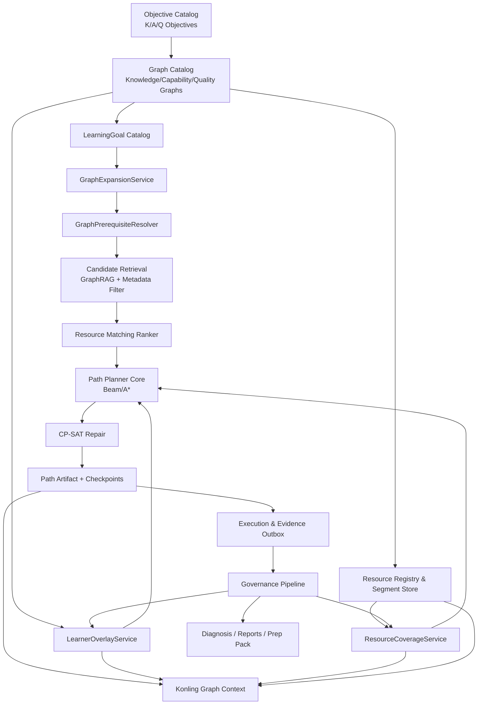
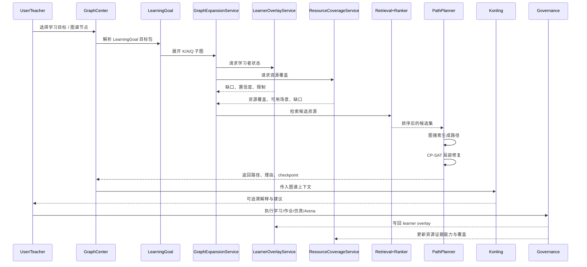

# 图谱驱动的路径规划、资源-学习者匹配与资源治理执行方案

**Executive Summary**  
启用连接器：**github**。基于当前已确认的 `act` 集成分支变更基线与后续将全部落地的假设，本方案建议采用“**K/A/Q 图谱 + LearningGoal 目标包 + 七维画像 + GraphRAG 候选检索 + 多目标排序 + 图搜索/CP-SAT 修复 + 证据写回治理**”的混合架构：先用图谱约束“学什么/先学什么/如何证明会了”，再用资源属性分组与分段治理支撑多模态资源，最后以可解释、可追溯、可审计的方式服务路径规划、控灵回复、学情诊断和教师备课闭环。对于 `act`，最优先不是上 RL，而是先打通 **LearningGoal 目标包、LearnerOverlay、资源图谱绑定、Konling Graph Context** 四个中枢。这里的 LearningGoal 是现有目标体系的升级扩展，不是另起一套平行体系。

## 启用连接器与研究范围

本次研究应明确使用的启用连接器为：

- **github**

研究的优先对象应为：

- `yong-wei/act` 的 `integration` 分支
- `yong-wei/videos`

本报告以下“仓库事实核查”部分，以你此前已确认的 `integration` 分支当前状态为基础撰写；若某一仓库细节在现有上下文中未明确，则标记为**未指定**。外部资料部分补充了知识图谱驱动学习路径、知识追踪、约束规划、GraphRAG、OCR/ASR 与多目标排序等一手或高质量资料。RAG/GraphRAG 的价值在于把外部权威知识与 LLM 结合，并让回答具备可追溯来源；GraphRAG 则进一步利用图结构提升多跳检索和结构化推理能力。

## 当前仓库事实核查与基线判断

按照当前已确认的 `integration` 分支状态，`act` 已经不是“单一知识图谱页面”或“单一助教 Demo”，而是正在形成统一壳层、图谱中心、资源覆盖、控灵上下文、路径规划与数据治理闭环的综合平台。现有关键事实可按模块归纳如下。

在 UI 与导航层面，平台已经形成以 **AppShell** 为核心的统一外壳：统一的 route ledger、workspace slots、return targets、侧栏折叠/移动抽屉、面包屑与路由治理规范，核心教学页面正在持续迁入同一壳层。这意味着后续 Graph Center、资源中心、路径规划、教师工作台和控灵会话面板可以在统一信息架构下协同，而不再是各自为政的独立页面。

在图谱层面，当前已明确存在 **K/A/Q（知识/能力/素质）目标体系**、**七维画像**、**三类图谱 schema**、**自动控制种子目标/图谱目录**、**Graph Center** 与 **ResourceCoverage overlay**。这说明平台已经具备把“教学目标—图谱—资源—画像”拉通的骨架。你此前明确接受的七维画像分别是：控制建模与系统表征、系统分析与性能解释、控制设计与参数综合、仿真验证与证据推理、工程约束与安全责任、跨域迁移与综合应用、反思改进与 AI 协同；这比旧 6 维更适合承接后续能力图谱与素质图谱。

在助学与路径层面，当前路径系统仍主要建立在现有 `AdaptiveLearningGoal`、`ResourceNode`、`PlanningUnit`、知识/能力 targets 之上，尚未彻底切换为 **LearningGoal 目标包 → K/A/Q 子图 → 候选资源 → 路径方案** 的 graph-driven 模式。因此，图谱中心虽已具备展示与筛选能力，但尚未真正驱动路径生成。

在控灵层面，当前已确认存在 **Konling mode runtime** 与 **knowledge/capability grounding context**，但还没有完整接入 **K/A/Q 子图、learner overlay、resource coverage、LearningGoal 目标包**。这意味着控灵已经有了“可接地”的机制，但还没有真正做到“图谱感知、证据感知、路径感知”的回答契约。

在资源与治理层面，平台当前已具有 `ResourceNode`、`ResourceSemanticProjection`、`PlanningUnit`、`knowledgeCoverage`、`abilityImpact`、`retrieval chunk/citation target` 等结构，并且已开始建设 `ResourceCoverageService`。这说明资源治理方向是正确的，但仍需升级为**按 K/A/Q 图谱节点绑定、按分段资源治理、按场景选择属性组**。GraphRAG 与教育知识图谱相关研究都表明，只有当图结构同时承载概念关系、资源映射和检索约束时，图谱才真正参与推荐和问答，而不是留在展示层。

对 `yong-wei/videos`，当前上下文只明确其应作为教学媒体上游仓库参与资源中心治理；关于仓库内部目录结构、元数据规范、字幕/章节策略，目前**未指定**。因此在本方案中，我把它定位为“**多模态媒体资源源仓库**”，后续通过资源分段与 metadata manifest 接入 `act` 的图谱与资源中心。

## 目标与假设

本方案建立在两个前提之上。

第一个前提是：**当前 Graph Center、K/A/Q 目标体系、七维画像、资源覆盖相关变更均将落地实现。**

第二个前提是：平台的目标不是只做“知识点导航”，而是要做成**图谱驱动的智慧教学平台**，支撑：

- K/A/Q 图谱中心
- LearningGoal 目标包
- 七维画像
- 统一资源中心
- Graph-aware 路径规划
- Graph-aware Konling
- 证据写回与数据治理
- 教师班级诊断与备课增强包

因此，后续设计必须满足四个硬要求：

- **可解释**：每条路径和每次推荐都能说清“为什么是它”。
- **可追溯**：控灵与诊断输出必须能回到图谱节点、资源段、证据 refs。
- **可治理**：资源、图谱、overlay、学习目标必须有版本与审计。
- **可演示**：面向竞赛和智慧课程申报，必须能够稳定跑通 Demo 脚本。

## 算法调研与选型结论

面向 `act` 的图谱驱动路径规划与资源匹配，不建议押注单一算法，而应采用**“图搜索 + 多目标排序 + 约束修复 + 轻量在线调整”**的分层方案。原因是教育路径规划既需要先修图约束，又需要解释性、证据/置信度处理、多模态资源匹配与工程可落地性；单一 RL 或单一 ILP 都会在工程上失衡。

下面比较至少 6 类可用方法，并给出适配建议。

| 方法类 | 适合解决的问题 | 优点 | 局限 | 对证据/置信度 | 对多模态/终端验证 | 工程建议 |
|---|---|---|---|---|---|---|
| 基于图搜索的路径规划 | 先修关系、目标子图展开、基础路径生成 | 可解释、容易绑定 K/A/Q 图谱、易调试 | 最优性受启发式影响，复杂约束表达弱 | 可直接把节点 confidence 编入代价 | 支持，只要资源有属性 | **P0 主算法** |
| 约束规划 / CP-SAT / ILP | 时间预算、硬先修、必经 checkpoint、资源冲突修复 | 硬约束能力强，结果可验证 | 建模复杂，规模大时求解成本上升 | 可把 confidence 当约束或 penalty | 适合终端验证和选课式编排 | **P1 局部修复器** |
| 约束 RL / 带约束 RL | 在线个性化顺序优化、长期回报 | 适合连续交互与重规划 | 冷启动难、样本需求高、可解释性弱 | 可处理 reward/cost，但证据可解释性有限 | 能融入终端验证 reward | **P2 仅做局部 policy** |
| 启发式搜索 + ILP/CP 混合 | 大规模候选筛选后做小规模精修 | 兼顾效率与约束满足 | 两段式实现更复杂 | 好，前段吸收置信度，后段修约束 | 好 | **最适合 act** |
| 因果 / 贝叶斯网络先修推理 | 先修缺口判断、掌握度不确定性传播 | 不确定性建模强，可解释 | 结构学习与参数估计昂贵，数据稀疏敏感 | **强** | 中等 | **P1 用于 overlay/诊断** |
| 推荐系统多目标排序 / LTR / Bandit | 候选资源排序、局部下一个最佳资源 | 工程容易扩展，多目标权衡方便 | 容易忽略全局先修链 | 可把 evidence 作为 feature | 好 | **P0-P1 排序器** |

基于图搜索的路径规划非常契合教育场景，因为知识与能力先修关系天然是有向图结构；教育知识图谱研究和可解释学习路径推荐研究都强调，路径的可解释性来自于显式先修边、目标节点与资源映射，而不是黑盒序列生成。

约束规划方面，Google OR-Tools 的 CP-SAT 明确适合整数约束优化，能够表达硬约束、可行/最优状态，并在很多组合优化问题中优于传统 MIP。对于学习路径，这类方法很适合处理“必须先过 checkpoint 才能进入后续资源”“总时长上限”“某些终端验证资源不可并行”等规则。

强化学习与带约束 RL 在“动态个性化内容序列”上很有吸引力，但教育场景的工程难点在于：离线数据偏差、冷启动、实时反馈噪声、解释性不足。约束 RL 文献表明，安全/可达约束可以被建模，但实现和验证成本较高，更适合作为后期局部在线调优，而不是 P0 主规划器。教育内容排序的 RL/Bandit 研究也更适合替代“下一个资源”的局部策略，而非从零生成整条可治理路径。

贝叶斯网络、知识追踪与先修图联合建模，最适合承担**LearnerOverlay 与不确定性传播**。BKT、DKT、SAKT、PSI-KT 等研究都说明，学习状态估计本质上是对“学生在概念/技能节点上的隐藏状态”的动态估计；其中 PSI-KT 明确强调了**可解释性、可扩展性和与先修结构的耦合**，非常适合你想要的“图谱 + 画像 + 可解释”路线。

多目标排序/LTR 更适合作为**候选资源排序层**。学习路径不只有“最相关”，还同时受知识覆盖、能力贡献、证据产出概率、时间成本、认知负荷、偏好匹配、可访问性与新鲜度影响。学习排序领域与多目标排序研究都适合用来做第二阶段 ranker，而不直接替代路径生成。

因此，针对 `act` 的最优选型是：

- **主路径生成**：K/A/Q 子图上的启发式图搜索 / beam search
- **候选资源检索**：GraphRAG + 图谱约束 + metadata filters
- **候选资源排序**：多目标排序器
- **局部可行性修复**：CP-SAT
- **学生状态估计**：规则 + KT/BN 混合 overlay
- **在线调整**：轻量 contextual bandit；暂不做全局 RL

## 图谱驱动的总体架构

建议把现有平台扩展为“**目标层—图谱层—资源层—状态层—路径层—控灵层—治理层**”七层联动架构。

### 组件关系图



### 数据流图



## 面向 `act` 的核心服务与接口设计

下面的接口，是把你当前已规划/部分实现的 K/A/Q 图谱、GraphCenter、ResourceCoverage、Konling context 和 AdaptivePathPlanner 真正串起来所必需的“中间件”。

### LearningGoal 目标包

LearningGoal 目标包不等于 K/A/Q 三级目标，也不等于旧 `AdaptiveLearningGoal` 的简单改名。它是“学生可理解、系统可推荐、内部可展开为 K/A/Q 子图”的目标包：面向学生表达一个实际学习目标，内部绑定知识、能力、素质子目标、路径策略、资源偏好和证据要求。它必须在现有 registered goal、goal slice、K/A/Q objective 与 adaptive path planner 基础上升级扩展，不应新建一套平行目标目录。

建议扩展现有目标相关模块，并在必要时新增兼容服务：

- `src/lib/adaptive-learning-path-planner.ts`
- `src/lib/data-governance/kaq-objective-taxonomy.ts`
- `src/lib/data-governance/autocontrol-kaq-graph-catalog.ts`
- `src/lib/learning-goals/goal-package-types.ts`
- `src/lib/learning-goals/goal-package-service.ts`

核心字段建议：

```ts
export interface LearningGoalPackage {
  id: string;
  title: string;
  description: string;
  intentType:
    | 'concept-understanding'
    | 'analysis-skill'
    | 'controller-design'
    | 'simulation-validation'
    | 'arena-challenge'
    | 'transfer-application'
    | 'frontier-bridge';
  knowledgeObjectiveIds: string[];
  capabilityObjectiveIds: string[];
  qualityObjectiveIds: string[];
  targetGraphNodeIds?: string[];
  preferredResourceTypes: string[];
  requiredEvidenceTypes: string[];
  terminalValidationPolicy:
    | 'none'
    | 'simulation'
    | 'arena-official'
    | 'report-rubric'
    | 'mixed';
  pathPolicyFamily:
    | 'foundation-remediation'
    | 'guided-design'
    | 'simulation-first'
    | 'challenge-first'
    | 'teacher-assigned';
  status: 'draft' | 'path-ready' | 'fully-governed';
}
```

### GraphExpansionService

作用：把 LearningGoal 目标包展开为 K/A/Q 子图，并附带先修、后继、整合节点。

建议新增：

- `src/lib/graphs/graph-expansion-service.ts`

接口建议：

```ts
export interface ExpandedGoalSubgraph {
  learningGoalId: string;
  graphVersion: string;
  knowledgeNodes: string[];
  capabilityNodes: string[];
  qualityNodes: string[];
  requiredEdges: string[];
  recommendedEdges: string[];
  terminalValidationNodes: string[];
  checkpointSuggestions: string[];
  limitations: string[];
}
```

### GraphPrerequisiteResolver

作用：把图谱边从“都叫相关”升级为**硬先修、软先修、并修、补救、拓展**，供路径规划直接使用。

建议新增：

- `src/lib/graphs/graph-prerequisite-resolver.ts`

关系建议：

- `hard_prerequisite`
- `soft_prerequisite`
- `co_requisite`
- `remediation`
- `extension`
- `transfer_to`
- `evidence_for`

### ResourceCoverageService

当前已有方向，但需要升级为“覆盖 + 约束 + 缺口建议”。

建议保持/扩展：

- `src/lib/graphs/resource-coverage-service.ts`

除了当前基础覆盖指标，新增：

- `resourceSuitabilityByNode`
- `missingCoverageByScene`
- `missingEvidenceCapability`
- `segmentAvailability`
- `verifiedCitationRate`

### LearnerOverlayService

这是路径规划和控灵真正个性化的关键。

建议新增：

- `src/lib/graphs/learner-overlay-service.ts`
- `src/lib/graphs/class-overlay-service.ts`

输出字段至少应包括：

- `state`
- `score`
- `confidence`
- `evidenceCount`
- `lastEvidenceAt`
- `evidenceRefs`
- `limitationTags`
- `recommendedAction`

### PathPlanner 接口

PathPlanner 升级必须纳入提案。建议不要继续只接受旧的 `goalId + knowledgeTargets/capabilityTargets`，而是把既有 `adaptive-learning-path-planner.ts` 扩展为 graph-driven planner。这里的原则是升级现有 planner 合同，不另建平行 planner；后续 ranking、CP-SAT 和在线重规划可以作为辅助模块接入，但不能绕开既有 path round、ResourceNode audit、terminal validation 和 Konling path tool 合同。

建议扩展：

- `src/lib/adaptive-learning-path-planner.ts`
- `src/lib/control-correction-path-rounds.ts`
- `src/lib/konling-agent-runtime.ts` 中现有 path tool 调用边界

后续可新增辅助模块，但它们应服务既有 planner：

- `src/lib/graphs/graph-expansion-service.ts`
- `src/lib/graphs/graph-prerequisite-resolver.ts`
- `src/lib/path-planning/path-constraint-repair.ts`

接口建议：

```ts
export interface GraphDrivenPathPlanningRequest {
  learnerId: string;
  classId?: string | null;
  learningGoalId: string;
  expandedSubgraph: ExpandedGoalSubgraph;
  learnerOverlay: LearnerGraphOverlayPayload;
  resourceCoverage: ResourceCoveragePayload;
  timeBudgetMinutes?: number;
  preferredModalities?: string[];
  accessibilityNeeds?: string[];
  teacherPolicy?: string[];
}
```

### Konling Graph Context

控灵后续应消费的是完整 Graph Context，而不是单纯一些知识点 id 列表。

建议新增：

- `src/lib/konling/konling-graph-context.ts`

结构建议：

```ts
export interface KonlingGraphContext {
  learningGoal?: LearningGoalPackage;
  selectedGraphNodeIds: string[];
  expandedSubgraph?: ExpandedGoalSubgraph;
  learnerOverlay?: LearnerGraphOverlayPayload;
  resourceCoverage?: ResourceCoveragePayload;
  pathArtifact?: PlannedPathArtifact;
  citationRefs: string[];
  evidenceRefs: string[];
  missingGrounding: string[];
}
```

### 证据写回与治理

建议新增：

- `src/lib/data-governance/kaq-evidence-writeback.ts`
- `src/lib/data-governance/overlay-materialization.ts`
- `src/lib/data-governance/graph-audit.ts`

写回规则：知识证据、能力证据、素质证据要分流，不允许把所有成绩都粗暴写成“掌握度”。

## 资源属性组与分段策略

图谱系统要服务路径规划、控灵与诊断，前提是资源不再只是“一个文件/一条记录”，而是**带属性组的可切片资源对象**。这也是为什么 `yong-wei/videos` 必须被看作媒体源仓库，而不是简单素材库。

### 建议的资源属性组

| 属性组 | 关键字段 | 主要用途 |
|---|---|---|
| 身份属性 | `resourceId` `sourceRepo` `sourcePath` `version` `owner` | 追溯、审计、版本 |
| 分段属性 | `segments` `timecode/page/anchor` `chapter` `chunkHash` | 检索、路径节点、引用 |
| 知识映射 | `knowledgeNodeIds` `prerequisiteRefs` | 知识图谱与 RAG |
| 能力映射 | `capabilityNodeIds` `abilityImpact` `evidencePotential` | 路径规划、学情 |
| 素质映射 | `qualityNodeIds` `scenarioTags` | 任务化素质培养 |
| 路径属性 | `estimatedTime` `cognitiveLoad` `difficulty` `parallelizable` | 规划与调度 |
| 证据属性 | `evidenceTypes` `terminalValidation` `rubricRefs` | overlay/诊断/批改 |
| RAG 元数据 | `citationTargets` `verifiedCitation` `authorityLevel` | Konling 与可追溯回答 |
| 隐私/许可 | `privacyTier` `license` `aiUsable` | 合规与使用约束 |
| 场景可用性 | `forPath` `forKonling` `forDiagnosis` `forPrepPack` | 资源场景路由 |

### JSON Schema 示例

```json
{
  "$schema": "https://json-schema.org/draft/2020-12/schema",
  "$id": "https://act.local/schemas/resource-node-graph-profile.json",
  "title": "ResourceNodeGraphProfile",
  "type": "object",
  "required": [
    "resourceId",
    "resourceType",
    "identity",
    "segmentation",
    "graphBinding",
    "pathProfile",
    "evidenceProfile",
    "ragProfile",
    "governance"
  ],
  "properties": {
    "resourceId": { "type": "string" },
    "resourceType": {
      "type": "string",
      "enum": [
        "textbook",
        "textbook_section",
        "video",
        "audio",
        "image",
        "slides",
        "knowledge_card",
        "quiz",
        "simulation",
        "arena_task",
        "report_template",
        "konling_prompt"
      ]
    },
    "identity": {
      "type": "object",
      "required": ["sourceRepo", "sourcePath", "version"],
      "properties": {
        "sourceRepo": { "type": "string" },
        "sourcePath": { "type": "string" },
        "version": { "type": "string" },
        "owner": { "type": "string" },
        "license": { "type": "string" }
      }
    },
    "segmentation": {
      "type": "object",
      "required": ["segments"],
      "properties": {
        "segments": {
          "type": "array",
          "items": {
            "type": "object",
            "required": ["segmentId", "kind", "anchor", "chunkHash"],
            "properties": {
              "segmentId": { "type": "string" },
              "kind": {
                "type": "string",
                "enum": [
                  "chapter",
                  "section",
                  "paragraph",
                  "formula",
                  "figure",
                  "video_clip",
                  "audio_clip",
                  "slide_page",
                  "simulation_task",
                  "arena_protocol"
                ]
              },
              "anchor": {
                "type": "object",
                "properties": {
                  "page": { "type": "integer" },
                  "timeStartMs": { "type": "integer" },
                  "timeEndMs": { "type": "integer" },
                  "figureId": { "type": "string" }
                }
              },
              "chunkHash": { "type": "string" }
            }
          }
        }
      }
    },
    "graphBinding": {
      "type": "object",
      "properties": {
        "knowledgeNodeIds": { "type": "array", "items": { "type": "string" } },
        "capabilityNodeIds": { "type": "array", "items": { "type": "string" } },
        "qualityNodeIds": { "type": "array", "items": { "type": "string" } },
        "objectiveIds": { "type": "array", "items": { "type": "string" } }
      }
    },
    "pathProfile": {
      "type": "object",
      "properties": {
        "estimatedTimeMinutes": { "type": "integer" },
        "cognitiveLoad": { "type": "number", "minimum": 0, "maximum": 1 },
        "difficulty": { "type": "number", "minimum": 0, "maximum": 1 },
        "parallelizable": { "type": "boolean" },
        "preferredForPolicies": { "type": "array", "items": { "type": "string" } }
      }
    },
    "evidenceProfile": {
      "type": "object",
      "properties": {
        "evidenceTypes": { "type": "array", "items": { "type": "string" } },
        "terminalValidation": { "type": "boolean" },
        "rubricRefs": { "type": "array", "items": { "type": "string" } }
      }
    },
    "ragProfile": {
      "type": "object",
      "properties": {
        "citationReady": { "type": "boolean" },
        "verifiedCitation": { "type": "boolean" },
        "authorityLevel": { "type": "string", "enum": ["high", "medium", "low"] }
      }
    },
    "governance": {
      "type": "object",
      "properties": {
        "privacyTier": { "type": "string", "enum": ["public", "course", "class", "private"] },
        "aiUsable": { "type": "boolean" },
        "scenes": {
          "type": "array",
          "items": {
            "type": "string",
            "enum": ["path", "konling", "diagnosis", "grading", "prep-pack", "report"]
          }
        }
      }
    }
  }
}
```

### 教材、视频与多模态分段策略

教材不应以整本为路径节点，而应以**章/节/小节/段落/公式/图表**为分段单位。基于教材构建概念图谱的研究表明，教材中的概念与先修结构适合被抽取为图，并按概念—关系—资源共同建模，而不是把整本教材视为单一资源。

视频与音频建议采用三层分段：

- **结构层**：章节/场景/主题段
- **语义层**：知识点对齐段
- **引用层**：精确到时间码的 clip 段

技术上，语音转写可由 Whisper 完成；Whisper 官方说明其具备多语言 ASR、翻译与一般场景鲁棒性。视频章节可以直接存为 FFmpeg/ffmetadata chapter 元数据，便于后续 timecode 对齐和导出。

扫描教材、讲义和图像资源建议采用 **OCRmyPDF / Tesseract / PaddleOCR** 组合：OCRmyPDF 适合把扫描 PDF 变为可搜索文本层；Tesseract 提供开源 OCR 引擎；PaddleOCR 近年的文档解析能力更强，适合中文、多版式、公式/图表/表格解析。

面向 `yong-wei/videos`，建议新增每个媒体资源对应的 `manifest.json` 或 `resource.yaml`，至少包含：

- 原始文件路径
- 字幕/转写路径
- chapter/scene 清单
- 图谱绑定节点
- 允许切片范围
- 可引用 clip 段
- AI 使用许可

## 资源-学习者匹配算法框架

`act` 的资源-学习者匹配不应是简单推荐系统，而应是“**目标缺口识别 → 候选检索 → 多维打分 → 路径装配 → 在线调整 → 证据写回**”的治理化流水线。

### 核心步骤

第一步是**目标缺口识别**。  
输入为 `LearningGoal 目标包 + LearnerOverlay`，输出为：

- 未满足的知识节点
- 未证明的能力节点
- 需要触发/补强的素质节点
- 被锁定的硬先修节点
- 具有低置信度的模糊节点

这里不建议只看分数，应看“状态 + 证据数 + 置信度 + 新近性”。知识追踪研究一再表明，掌握度需要结合历史交互与时序上下文，而不是单次正确率。

第二步是**候选资源检索**。  
建议采用“GraphRAG + metadata filter”的两阶段检索：

- 以缺口节点集为 query seed
- 检索绑定这些节点的 segments
- 用 relation 扩展到先修/补救/拓展/终端验证节点
- 过滤掉场景不适用、隐私不允许、无 verified citation、无 segment anchor 的资源

GraphRAG 的价值在于：它不只是相似度搜 chunk，而是把“图结构 + 局部子图 + 文本 chunk”作为检索上下文，从而更适合多跳依赖与可解释推荐。

第三步是**多维评分函数**。  
建议对每个候选资源 \(r\) 计算：

\[
Score(r \mid learner, goal) =
w_k K(r) + w_c C(r) + w_e E(r) + w_p P(r) + w_a A(r) + w_f F(r) - w_t T(r) - w_l L(r)
\]

含义建议如下：

- \(K(r)\)：知识覆盖度
- \(C(r)\)：能力贡献度
- \(E(r)\)：证据产出概率
- \(P(r)\)：偏好匹配
- \(A(r)\)：可访问性与设备适配
- \(F(r)\)：新鲜度/版本一致性
- \(T(r)\)：时间成本
- \(L(r)\)：认知负荷/超载风险

如果目标是高阶能力或迁移任务，应把 `terminalValidation` 和 `verifiedCitation` 加大权重。

第四步是**路径生成**。  
路径不是把 top-k 资源直接拼接，而是基于子图和先修关系装配为 DAG 或准线性序列。硬先修必须先满足；软先修可以并入脚手架；补救和拓展节点可作为分支。复杂约束（时间预算、并行资源冲突、必须包含终端验证、checkpoint 数量）交给 CP-SAT 做局部修复。CP-SAT 的建模与求解特性很适合这种“候选已缩小”的小规模组合优化。

第五步是**在线调整**。  
当学生执行路径后，新的 evidence 会改变 overlay：如果某节点一次通过，则后续补救资源可以跳过；如果仿真失败或 Arena 官方验证失败，则局部回规划。这里建议一开始采用规则 + bandit，而不是全局 RL。教育内容序列的 contextual bandit 方案更适合逐步选择“下一步最佳资源”，而不是替代离线规划器。

第六步是**置信度传播与不确定性处理**。  
对图谱节点的 confidence，不建议简单平均。实践上可用“证据置信度 × 新近性 × 来源权威 × 一致性”的组合，再沿图边做降权传播。BN/KT 模型后续可以替代规则层，但 P0 可以先用受治理规则。

### 伪代码

```python
def plan_learning_path(request):
    # 1) expand goal
    subgraph = expand_learning_goal(request.learningGoalPackageId)

    # 2) learner state
    overlay = materialize_learner_overlay(
        learner_id=request.learner_id,
        subgraph=subgraph
    )

    # 3) identify gaps
    gaps = identify_gaps(subgraph, overlay)
    # gaps = {
    #   "hard_locked_nodes": [...],
    #   "knowledge_gaps": [...],
    #   "capability_gaps": [...],
    #   "quality_opportunities": [...],
    #   "low_confidence_nodes": [...]
    # }

    # 4) retrieve candidates by graph + metadata
    candidate_map = {}
    for node in gaps.all_targetable_nodes():
        candidate_map[node] = retrieve_resources(
            graph_nodes=[node] + expand_neighbors(node),
            scenes=["path"],
            privacy_ok=True,
            citation_ready=True
        )

    # 5) score candidates
    scored = {}
    for node, candidates in candidate_map.items():
        scored[node] = []
        for r in candidates:
            score = (
                wk * knowledge_coverage(r, node)
                + wc * capability_contrib(r, node)
                + we * evidence_probability(r, node)
                + wp * preference_match(r, request)
                + wa * accessibility_fit(r, request)
                + wf * freshness_score(r)
                - wt * time_cost(r)
                - wl * cognitive_load_penalty(r, overlay)
            )
            if requires_terminal_validation(node):
                score += wv * terminal_validation_bonus(r)
            scored[node].append((r, score))

        scored[node].sort(key=lambda x: x[1], reverse=True)

    # 6) assemble initial path via graph search / beam search
    draft_path = beam_search_path(
        subgraph=subgraph,
        gaps=gaps,
        scored_candidates=scored,
        beam_width=8,
        max_depth=24
    )

    # 7) repair constraints with CP-SAT
    repaired_path = cpsat_repair(
        draft_path,
        time_budget=request.time_budget_minutes,
        must_include_checkpoints=True,
        must_include_terminal_validation=subgraph.terminal_validation_nodes
    )

    # 8) attach checkpoints and explanations
    explained_path = attach_explanations(
        repaired_path,
        gaps=gaps,
        overlay=overlay
    )
    return explained_path
```

### 复杂度估计

若目标子图大小为 \(|V_g|, |E_g|\)，每个节点平均候选资源数为 \(m\)，评分特征数为 \(f\)，beam 宽度为 \(b\)，路径深度为 \(d\)。

- 子图展开：\(O(|V_g| + |E_g|)\)
- 候选检索：近似索引条件下，单节点可视为 \(O(\log N + m)\)
- 候选评分：\(O(|V_g| \cdot m \cdot f)\)
- Beam Search：\(O(b \cdot d \cdot \bar{m})\)
- CP-SAT 修复：最坏情形 NP-hard，但在“已过滤后 20–80 个候选项”的局部修复规模中可接受

因此建议工程上把 CP-SAT 放在**二阶段小规模修复**，而不是一上来对全资源库建模。

## 可解释性与控灵集成

控灵要服务图谱体系，必须从“能回答”升级为“**按契约回答**”。

### 控灵回答契约

对于路径或资源推荐类回答，控灵输出必须至少包含：

- `learningGoal`
- `selectedGraphNodes`
- `why_these_nodes`
- `recommendedResources`
- `evidenceRefs`
- `citationRefs`
- `confidence`
- `missingGrounding`

建议结构：

```json
{
  "answer": "建议先完成“Bode 裕度读取”练习，再进入超前校正工作台。",
  "learningGoalPackageId": "lgp-frequency-margin-design",
  "graphGrounding": {
    "knowledgeNodeIds": ["kg-bode", "kg-phase-margin"],
    "capabilityNodeIds": ["cg-read-bode-margin", "cg-judge-stability-risk"],
    "qualityNodeIds": ["qg-system-tradeoff", "qg-evidence-integrity"]
  },
  "recommendationReasons": [
    {
      "type": "gap",
      "nodeId": "cg-read-bode-margin",
      "message": "该能力仍处于 developing，证据不足"
    },
    {
      "type": "resource-fit",
      "resourceId": "video-bode-clip-03",
      "message": "该资源能同时提供知识解释和测评证据"
    }
  ],
  "evidenceRefs": ["ev-123", "ev-456"],
  "citationRefs": ["cit-789"],
  "confidence": 0.78,
  "missingGrounding": []
}
```

### Citation Chip 与证据链写回

建议在前端统一实现两类 chip：

- **CitationChip**：链接到资源片段、教材页码、视频时间码、图表锚点
- **EvidenceChip**：链接到学生行为证据、仿真 run、Arena official submission、Rubric criterion、反思记录

写回规范建议：

- Konling 生成的建议**不直接写掌握度**
- 只有当建议引导了可验证行为并产生正式证据时，才经治理管道写回 K/A/Q overlay
- AI 生成内容必须带 `aiGenerated: true`
- 教师审核后的 Rubric/批注可以写回 capability/quality nodes
- 未经验证的 Arena preview 不得写成 terminal validation

RAG 的核心价值之一就是可溯源；在教育场景中，这应进一步升级为“**引用可追溯 + 证据可回写**”。

## 数据治理、版本管理与合规

图谱体系一旦服务路径、控灵与诊断，就不能再只靠静态 seed。必须有显式版本与审计。

### 建议的版本对象

至少为以下对象定义 version：

- `objectiveCatalogVersion`
- `graphCatalogVersion`
- `learningGoalV2Version`
- `resourceSchemaVersion`
- `resourceRegistryVersion`
- `learnerOverlayVersion`
- `pathPlanVersion`
- `konlingGroundingContractVersion`

### 审计日志

建议新增统一 audit 事件：

- `OBJECTIVE_CHANGED`
- `GRAPH_NODE_CHANGED`
- `RESOURCE_BINDING_CHANGED`
- `OVERLAY_MATERIALIZED`
- `PATH_GENERATED`
- `PATH_REPLANNED`
- `KONLING_ANSWER_EMITTED`
- `EVIDENCE_WRITTEN_BACK`
- `AI_CONTENT_FLAGGED`

### 隐私分级

资源和证据都应支持最少四级：

- `public`
- `course`
- `class`
- `private`

Overlay 与证据写回要做 role gating：

- 学生只能看自己的 overlay 与可见证据
- 教师可看本班聚合/授权明细
- 管理员可看治理审计，不一定可看学生私有内容

### 合规与伦理

- AI 生成内容必须标注
- Konling 引导内容需保留 grounding
- 学生报告中涉及素质判断时，必须显示“证据与局限”，不得伪装成绝对事实
- 终端验证结果必须区分 `simulation-preview` 与 `arena-official`

### OpenSpec 校验点

建议把以下作为 OpenSpec invariant：

- 没有图谱绑定的 `path-ready` 学习目标不得发布
- 没有 verified citation 的资源不得进入 Konling 高权威回答
- 没有 evidence policy 的 capability/quality node 不得进入 overlay materialization
- 没有 graphVersion 的 overlay/path artifact 不得写回生产画像
- 缺少 segment anchor 的视频/教材资源不得作为 citation chip 发出

## 实施计划与 OpenSpec 变更清单

下面按优先级给出**至少 8 项** OpenSpec proposal。所有 proposal 都按“Codex 可直接执行”的粒度拆分，并给出建议代码位置、验收与测试命令。

### 2026-06-21 本地探索后的提案覆盖台账

本地探索后的关键修订是：**LearningGoal 必须实现，但不另起一套目标体系。** LearningGoal 是平台 K/A/Q 目标面向学生的实际体现，一个 LearningGoal 应当把知识、能力、素质子目标打包为可选择、可解释、可生成路径的学习目标。它不是 `AdaptiveLearningGoal` 之外的平行系统，而是现有 registered goal、goal slice、K/A/Q objective、path policy 与 evidence policy 的兼容升级层。该层必须显著扩充当前路径规划只有少数固定目标的局限，为不同课程阶段、学习意图、资源组合和终端验证策略提供稳定入口。

当前后续 OpenSpec 系列应先按第一批提案落地，再继续补齐完整闭环。第一批提案不覆盖所有功能，但必须覆盖平台从“两个固定路径目标”走向“可扩展 LearningGoal 目标包”的核心骨架。

| 报告能力域 | 第一批提案覆盖 | 后续仍需覆盖 |
|---|---|---|
| LearningGoal 目标包 | `extend-learning-goals-with-kaq-graph-binding` 覆盖 LearningGoal 与 K/A/Q objective、graph node、evidence policy、path policy family、学生可见目标说明的绑定；至少扩展到 8 个 path-ready LearningGoal | 目标创建/审核 UI、教师自定义目标、跨课程目标迁移、目标版本治理的管理界面 |
| ResourceNode 升级 | `extend-resource-segments-for-kaq-scene-binding` 必须显式升级 ResourceNode、ResourceSemanticProjection、PlanningUnit 和 audit，使其支持 segment-aware、scene-aware、graph-aware、citation-aware、evidence-aware 的路径候选语义；ResourceNode 仍是路径可用性的审计合同 | 教师资源治理 UI 的批量补字段、资源质量仪表盘、跨仓库资源导入工作台 |
| 资源分段与场景属性 | `extend-resource-segments-for-kaq-scene-binding` 覆盖教材、讲义、视频、音频、图片、slides 等 segment 级资源属性、场景可用性、图谱绑定和 citation readiness；分段资源不能绕过 ResourceNode 直接成为 PathNode | 全量视频仓库导入、自动 ASR/OCR 流水线、人工抽检工作台、大规模资源质量统计 |
| 目标子图与先修策略 | `add-goal-subgraph-expansion-and-prerequisite-policy` 覆盖 LearningGoal 到 K/A/Q 子图的展开，以及硬先修、软先修、并修、补救、拓展、证据边的解释层 | 更复杂的知识追踪、贝叶斯/KT 不确定性传播、跨课程先修推理 |
| 版本与回溯 | `version-kaq-graph-overlay-path-artifacts` 提前覆盖 graph/objective/resource/overlay/path artifact 的 version、generatedAt 和回溯引用，避免持久化后无法解释旧路径 | 图谱迁移工具、历史版本差异 UI、教师可读的版本影响报告 |
| PathPlanner 升级 | `extend-adaptive-planner-for-kaq-graph-inputs` 覆盖既有 planner 对 LearningGoal、目标子图、ResourceNode graph profile、resource coverage、learner/class overlay 的输入消费；仍保持 Stage 1 rules + graph search，不另建平行 planner | 多目标 ranker、CP-SAT 局部修复、路径执行中的在线重规划 |
| ResourceCoverage overlay | 已由归档 capability `graph-resource-coverage-overlay` 覆盖，不在第一批重复提出 | 与资源治理 UI、路径候选诊断、GraphCenter 操作入口的深度联动 |
| Learner/Class overlay | 已由 active change `add-learner-class-graph-overlays` 覆盖，不在第一批重复提出 | 诊断报告、备课增强包、学生自解释视图中的统一呈现 |
| Konling Graph Context | 第一批只准备 LearningGoal、目标子图、资源段和版本输入，不直接改控灵回答契约 | `wire-konling-kaq-graph-context` 覆盖 graph grounding、citation/evidence refs、missing grounding 和控灵工具边界 |
| 证据写回治理 | 第一批只定义目标、资源、路径 artifact 的版本与引用基础 | `govern-kaq-evidence-writeback` 覆盖 K/A/Q evidence 分流、AI 标记、preview/official 证据边界和 audit event |
| GraphCenter 可操作入口 | 第一批只准备图谱目标、资源覆盖、overlay 和路径输入 | `make-graph-center-actionable` 覆盖从节点进入路径、资源、诊断、备课包；不得变成图谱编辑器 |
| 诊断与备课增强闭环 | 第一批不覆盖教师报告和 prep pack 串联 | `connect-kaq-diagnosis-preppack-loop` 覆盖 class overlay、资源缺口、教师报告和备课增强包联动 |
| 在线重规划 | 第一批明确不覆盖 RL/contextual bandit | `contextual-bandit-online-replanning` 仅作为 P2 局部重排序，有规则 planner fallback |

第一批提案的依赖顺序建议为：

1. `extend-learning-goals-with-kaq-graph-binding`
2. `extend-resource-segments-for-kaq-scene-binding`
3. `add-goal-subgraph-expansion-and-prerequisite-policy`
4. `version-kaq-graph-overlay-path-artifacts`
5. `extend-adaptive-planner-for-kaq-graph-inputs`

Issue 依赖登记建议：

| change | GitHub `depends_on` | 前置状态说明 |
|---|---|---|
| `extend-learning-goals-with-kaq-graph-binding` | `[]` | 第一批目标包入口，不依赖其他新 change |
| `extend-resource-segments-for-kaq-scene-binding` | `[]` | 第一批 ResourceNode/segment 入口，不依赖其他新 change |
| `add-goal-subgraph-expansion-and-prerequisite-policy` | `extend-learning-goals-with-kaq-graph-binding` | 需要 LearningGoal package 作为展开入口 |
| `version-kaq-graph-overlay-path-artifacts` | `extend-learning-goals-with-kaq-graph-binding`, `extend-resource-segments-for-kaq-scene-binding`, `add-goal-subgraph-expansion-and-prerequisite-policy` | 版本引用需要目标、资源与子图合同稳定 |
| `extend-adaptive-planner-for-kaq-graph-inputs` | `extend-learning-goals-with-kaq-graph-binding`, `extend-resource-segments-for-kaq-scene-binding`, `add-goal-subgraph-expansion-and-prerequisite-policy`, `version-kaq-graph-overlay-path-artifacts`, `add-learner-class-graph-overlays` | 消费第一批目标/资源/子图/版本合同，并依赖仍在 active 状态的 learner/class overlay；resource coverage 依赖已归档 spec `graph-resource-coverage-overlay`，不登记为待完成 issue |

这五项完成后，平台应具备以下可验证状态：LearningGoal 已成为 K/A/Q 子目标的学生可见目标包；ResourceNode 已升级为可承载 segment、scene、graph、citation、evidence 与 PlanningUnit 语义的路径候选审计合同；资源段可以按图谱节点和使用场景进入检索、引用和路径候选，但不能绕过 ResourceNode 直接成为 PathNode；目标子图可解释先修与补救关系；路径与 overlay artifact 可回溯版本；既有路径规划器能消费这些输入并生成比当前两类目标更丰富的可解释路径。

### P0：扩展 LearningGoal 与 K/A/Q 图谱绑定

**Proposal 名称**：`extend-learning-goals-with-kaq-graph-binding`

**实现任务**

- 扩展现有 registered goal、goal slice、K/A/Q objective 和 adaptive path goal 合同，不新建平行目标体系
- 定义学生可见的 LearningGoal 目标包字段：标题、目标说明、学习意图、适用阶段、资源偏好、终端验证策略和学生可理解的完成标准
- 将当前 path-ready 目标（如控制校正、频率响应基础）升级为 LearningGoal 目标包
- 新增至少 6 个自动控制课程核心 LearningGoal，使 path-ready 目标总数不少于 8 个
- 每个 LearningGoal 绑定 K/A/Q objectives、graph nodes、evidence policy 与 path policy family
- 增加 `status: draft | path-ready | fully-governed`

**验收标准**

- 至少提供 8 个 `path-ready` LearningGoal
- 每个 goal 至少绑定 1 个知识目标、1 个能力目标和 1 个素质目标
- 若素质证据尚未完全治理，必须保留素质目标并记录 evidence limitation
- 每个 goal 必须说明面向学生的目标语义，而不是只暴露内部 graph id 或 policy id
- 每个 goal 必须能作为路径规划入口，并能声明允许的资源组合与终端验证策略
- GraphCenter 可从 goal 跳转到目标子图
- 旧目标定义仍可兼容读取

**测试与命令**

```bash
rtk openspec validate extend-learning-goals-with-kaq-graph-binding --strict
npm run test -- src/lib/adaptive-learning-path-planner
npm run test -- src/lib/data-governance
```

### P0 已接管：构建 Learner/Class Graph Overlay

**Active Change 名称**：`add-learner-class-graph-overlays`

该能力已经由当前 active change 接管，后续第一批提案不应重复提出。若后续发现 LearningGoal 目标包需要新增 overlay 字段，应修订该 active change 或在依赖提案中声明输入消费边界，而不是重新创建第二套 LearnerOverlay。

**实现任务**

- 新增 `src/lib/graphs/learner-overlay-service.ts`
- 新增 `src/lib/graphs/class-overlay-service.ts`
- 统一知识/能力/素质三类 overlay 状态机
- 接入已存在的 evidence sources：题目、作业、仿真、Arena、Konling、path execution
- GraphCenter 接入 learner/class mode

**验收标准**

- 单个 learner 可 materialize knowledge/capability/quality overlay
- 返回 `state/score/confidence/evidenceCount/limitations`
- 班级热力模式可显示分布
- GraphCenter 不修改本体，仅叠加 overlay

**测试与命令**

```bash
rtk openspec validate add-learner-class-graph-overlays --strict
npm run test -- src/lib/graphs
npm run test:e2e -- graph-center-overlay
```

### P0：目标子图展开与先修策略

**Proposal 名称**：`add-goal-subgraph-expansion-and-prerequisite-policy`

**实现任务**

- 新增 `src/lib/graphs/graph-expansion-service.ts`
- 新增 `src/lib/graphs/graph-prerequisite-resolver.ts`
- 把 LearningGoal 目标包展开为 K/A/Q 子图
- 把图谱关系解释为硬先修、软先修、并修、补救、拓展、证据边和终端验证建议
- 输出 planner、Konling、GraphCenter 都能消费的 `ExpandedGoalSubgraph`

**验收标准**

- 能从 LearningGoal 目标包展开 K/A/Q 子图
- 能识别硬/软先修、补救、拓展和终端验证候选
- 能输出子图解释和 limitation，不生成路径、不排序资源
- 展开结果必须带 graphVersion 和 LearningGoal id

**测试与命令**

```bash
rtk openspec validate add-goal-subgraph-expansion-and-prerequisite-policy --strict
npm run test -- src/lib/graphs
```

### P0：扩展路径规划器的 K/A/Q 图谱输入

**Proposal 名称**：`extend-adaptive-planner-for-kaq-graph-inputs`

**实现任务**

- 扩展既有 `src/lib/adaptive-learning-path-planner.ts` 输入，不新建平行 path planner
- 让 planner 消费 `LearningGoal 目标包 + ExpandedGoalSubgraph + ResourceNode graph profile + ResourceCoverage + Learner/Class Overlay`
- 将既有 registered goal 与新增 LearningGoal 目标包兼容映射
- 保留 Stage 1 `rules-plus-graph-search`，P0/P1 不引入 RL 或 contextual bandit
- 输出 path artifact 时记录 goalVersion、graphVersion、resourceRegistryVersion 与 overlayVersion
- 保持既有 path round、execution、deviation、Konling path tool 和 terminal validation 合同兼容

**验收标准**

- 能从不少于 8 个 path-ready LearningGoal 生成可解释路径
- 生成结果包含目标子图、ResourceNode graph profile、资源覆盖、overlay 证据和缺口说明
- 冷启动学生仍能获得可执行 starter path
- 路径节点仍必须来自 audited ResourceNode 或 checkpoint contract
- p95 路径生成延迟：种子图谱规模下 `< 1500ms`

**测试与命令**

```bash
rtk openspec validate extend-adaptive-planner-for-kaq-graph-inputs --strict
npm run test -- src/lib/adaptive-learning-path-planner
npm run test -- src/lib/graphs
```

### P0：资源分段与图谱绑定

**Proposal 名称**：`extend-resource-segments-for-kaq-scene-binding`

**实现任务**

- 显式升级 `src/lib/resource-node-registry.ts` 的 ResourceNode、ResourceSemanticProjection、PlanningUnit、CitationTarget、RetrievalChunk 和 audit 合同
- 扩展 `src/lib/data-governance/learning-evidence-rag-corpus.ts` 的资源段、场景和图谱绑定元数据
- 新增 `src/lib/resources/resource-segment-scene-binding.ts`
- 新增 `src/lib/resources/resource-segmentation-service.ts`
- 新增 `src/lib/resources/resource-binding-audit.ts`
- 为教材、视频、讲义、图片建立 segment 级绑定
- 为 `yong-wei/videos` 设计媒体 manifest 约定
- 明确 ResourceSegment、RetrievalChunk、CitationTarget 不能自动成为 PathNode；必须经 ResourceNode/PlanningUnit 审计后才能进入路径

**验收标准**

- 至少完成：1 本教材的 section/paragraph/figure 分段，3 个视频的 clip 分段
- 每个 segment 可绑定图谱节点
- 缺失 anchor/verified citation 的 segment 自动降级
- path-eligible 仍由 ResourceNode/PlanningUnit audit 决定，而不是由 chunk 或 citation target 决定
- ResourceNode graph profile 能暴露 graph node refs、scene availability、citation readiness、evidence capability、path profile 和 governance limitations
- `videos` 媒体 manifest 校验通过

**测试与命令**

```bash
rtk openspec validate extend-resource-segments-for-kaq-scene-binding --strict
npm run test -- src/lib/resources
```

### P0：Konling 图谱上下文契约

**Proposal 名称**：`wire-konling-kaq-graph-context`

**实现任务**

- 新增 `src/lib/konling/konling-graph-context.ts`
- 修改 `src/lib/konling-agent-runtime.ts`
- 注入 LearningGoal 目标包、ExpandedGoalSubgraph、LearnerOverlay、ResourceCoverage
- 统一回答契约与 missing grounding 行为

**验收标准**

- 控灵对路径建议类问题必须返回 graph grounding
- 控灵引文必须落到 citation chip
- 缺少 grounding 时必须降级说明
- Konling 不得直接写回掌握度

**测试与命令**

```bash
rtk openspec validate wire-konling-kaq-graph-context --strict
npm run test -- src/lib/konling
```

### P1：资源-学习者匹配排序引擎

**Proposal 名称**：`resource-learner-matching-ranker`

**实现任务**

- 新增 `src/lib/adaptive-planning/resource-retrieval.ts`
- 新增 `src/lib/adaptive-planning/resource-ranker.ts`
- 引入多维评分函数
- 支持 path/Konling/diagnosis 不同场景权重组
- 支持 accessibility 与 freshness feature

**验收标准**

- 对同一目标可输出 top-k 可解释推荐资源
- 排序理由必须包含至少 3 个 feature 贡献
- 排序稳定性回归测试通过
- p95 候选检索+排序：`< 800ms`（seed 数据集）

**测试与命令**

```bash
rtk openspec validate resource-learner-matching-ranker --strict
npm run test -- src/lib/adaptive-planning
```

### P1：CP-SAT 路径约束修复

**Proposal 名称**：`cpsat-path-repair-and-checkpoints`

**实现任务**

- 新增 `src/lib/adaptive-planning/path-cpsat-repair.ts`
- 建模时间预算、硬先修、checkpoint、terminal validation、并行/串行规则
- 仅对缩小后的候选路径做修复，不直接全库求解

**验收标准**

- 能修复“不满足时间预算/缺 checkpoint/终端验证缺失”的路径
- 对 infeasible 场景返回明确原因
- 对 20–80 个候选资源的 repair p95 `< 1200ms`

**测试与命令**

```bash
rtk openspec validate cpsat-path-repair-and-checkpoints --strict
npm run test -- src/lib/adaptive-planning
```

### P1：证据写回与治理硬化

**Proposal 名称**：`kaq-evidence-writeback-governance`

**实现任务**

- 新增 `src/lib/data-governance/kaq-evidence-writeback.ts`
- 新增 `src/lib/data-governance/graph-audit.ts`
- 定义 evidence source 分类与可信等级
- 限制 preview/agent-only evidence 的写回范围

**验收标准**

- knowledge/capability/quality 写回路径分流明确
- official verification 才能写 terminal validation
- AI 生成内容标记与审计日志生效
- audit event 可查询

**测试与命令**

```bash
rtk openspec validate kaq-evidence-writeback-governance --strict
npm run test -- src/lib/data-governance
```

### P1：图谱中心从只读升级为可操作入口

**Proposal 名称**：`make-graph-center-actionable`

**实现任务**

- 修改 `src/features/graph-center/*`
- 学生模式：从节点进入路径/资源
- 教师模式：从节点进入资源缺口、备课增强包
- 管理员模式：查看图谱/资源审计问题

**验收标准**

- 桌面与移动端都可从图谱中心触发操作
- 节点详情支持学习目标、资源、证据、路径入口
- Playwright 截图覆盖：
  - 1440px 标准图谱
  - 1440px learner mode
  - 390px mobile drawer
  - 390px node detail

**测试与命令**

```bash
rtk openspec validate make-graph-center-actionable --strict
npm run test:e2e -- graph-center
```

### P2：在线重规划与 contextual bandit

**Proposal 名称**：`contextual-bandit-online-replanning`

**实现任务**

- 新增 `src/lib/adaptive-planning/online-replanner.ts`
- 基于执行反馈选“下一步最佳资源”
- 不替代全局规划器，只做局部重排序
- 收集 reward/cost 日志供后续离线评估

**验收标准**

- 仅在 path 执行中触发局部调整
- 有完整 fallback 到规则规划器
- 记录可审计的决策日志

**测试与命令**

```bash
rtk openspec validate contextual-bandit-online-replanning --strict
npm run test -- src/lib/adaptive-planning
```

### P2：K/A/Q 诊断与备课增强包闭环

**Proposal 名称**：`kaq-diagnosis-preppack-loop`

**实现任务**

- 把 class overlay 接入班级诊断
- 把资源缺口与薄弱子图接入 prep pack 生成
- 让教师报告按知识/能力/素质节点解释问题分布

**验收标准**

- 班级热力报告能高亮 K/A/Q 薄弱节点
- Prep pack 可指向具体图谱节点和资源缺口
- 演示脚本可从 GraphCenter → 报告 → PrepPack 跑通

**测试与命令**

```bash
rtk openspec validate kaq-diagnosis-preppack-loop --strict
npm run test -- src/lib/data-governance
npm run test:e2e -- teacher-kaq-loop
```

### P0：版本化与快照管理

**Proposal 名称**：`version-kaq-graph-overlay-path-artifacts`

该提案应进入第一批，不能等到 P2。只要 overlay、path artifact、资源绑定和控灵 grounding 被持久化，就必须能回溯它们基于哪个 graph/resource/goal 版本生成。

**实现任务**

- 为 graph/objective/resource/overlay/path 引入 version
- 增加 snapshot artifact
- 老证据能回溯到历史图谱版本

**验收标准**

- overlay/path artifact 带 version + generatedAt
- 变更后旧数据仍可解释
- Audit 查询可定位某次路径和 Konling grounding 所基于的图谱版本

**测试与命令**

```bash
rtk openspec validate version-kaq-graph-overlay-path-artifacts --strict
npm run test -- src/lib/versioning
```

## 总体验收标准

### 平台级验收

- GraphCenter 能按 K/A/Q 图谱切换，并支持 standard / learner / class / resource 四种模式
- LearningGoal 目标包至少 8 个 path-ready 目标可用
- Path planner 能从 LearningGoal 目标包生成可解释路径
- Konling 在路径建议/图谱解释场景下返回 graph grounding 与 citation/evidence chips
- 资源中心能按图谱节点和场景属性筛选资源
- 证据写回分流到 knowledge/capability/quality overlay
- Demo 脚本能完成：
  - 选择目标
  - 看到图谱缺口
  - 生成路径
  - 执行资源/仿真
  - 看到 overlay 变化
  - 由 Konling 解释变化原因

### 测试与质量门槛

建议将以下门槛写入 proposal：

- 新增核心模块单元测试覆盖率：**行覆盖 ≥ 80%**
- 路径规划核心与治理关键分支覆盖率：**分支覆盖 ≥ 70%**
- GraphCenter Playwright 截图：
  - desktop 1440
  - desktop collapsed
  - mobile 390
- `openspec validate --strict` 对所有 proposals 通过
- `npm run lint` 与 `npm run build` 通过
- 路径生成 p95 `< 1.5s`
- 候选检索+排序 p95 `< 0.8s`
- overlay materialization p95 `< 0.8s`
- Konling grounding 预处理 p95 `< 0.4s`

### Demo/Seed 交付物

每个 proposal 至少交付：

- spec/proposal/tasks 文档
- seed 数据
- 演示脚本片段
- 最低测试用例
- 必要截图

## 风险与替代方案

### 数据稀疏与证据噪声

教育场景最大风险之一是：知识证据、能力证据、素质证据的稀疏度和可信度不同。深度 KT 模型虽然效果好，但也容易受 sparse interactions 影响；注意力式 KT 如 SAKT/AKT 也主要改善“预测”，不自然解决“审计性”。

**缓解策略**：  
P0 用规则 + evidence policy；P1 再逐步引入 KT/BN。先保解释性与治理，再追求更强预测。

### 模型供应商与推理成本限制

GraphRAG、多模态 OCR/ASR、Konling grounding 都会增加在线成本；若某供应商或某模型适配受限，就会影响吞吐与稳定性。GraphRAG 更适合作为**候选检索增强层**，不建议在 P0 把所有流程都做成 LLM-heavy。

**缓解策略**：  
离线做图谱扩展与资源分段；在线只做子图裁剪、候选检索和小规模排序。

### 实时性与可解释性冲突

越复杂的在线算法，越难实时；越黑盒的模型，越难解释。教育路径规划与智慧课程评审都更偏向可解释和可治理。

**缓解策略**：  
先上“图搜索 + 多目标排序 + CP-SAT repair”，把 RL 留到 P2 的局部在线调整。

### 资源多模态分段成本高

教材、视频、图像、音频统一治理会带来较高数据加工成本。OCR 与字幕处理虽成熟，但图表锚点、公式/结构化解析仍需工程工作。OCRmyPDF、Tesseract、PaddleOCR 可以显著降低落地门槛，但仍需 manifest 与人工抽检。

**缓解策略**：  
先覆盖高价值资源：教材节、重点视频、仿真/Arena 任务、核心讲义页；不要一开始追求全量。

### 私有仓库与版本漂移

`act` 与 `videos` 若持续快速演进，图谱/目标/资源/overlay 之间容易失配。

**缓解策略**：  
强制 versioning + audit；所有 path artifact 和 overlay 都附 graphVersion/resourceVersion。

## 结论

对于 `act`，最合理的路线不是“先做一个更复杂的 AI 路径大脑”，而是把当前已经成形的 **K/A/Q 目标、七维画像、GraphCenter、ResourceCoverage、Konling runtime、AdaptivePathPlanner** 真正拉通成一个治理化系统：

- **图谱负责约束与解释**
- **资源中心负责承载与分段**
- **Overlay 负责学习者状态**
- **路径规划负责组合与重规划**
- **Konling 负责基于图谱和证据的解释**
- **治理层负责版本、写回、审计与合规**

如果按本方案推进，GraphCenter 就不会停留在可视化页面，而会成为路径规划、控灵回复、学情诊断、资源治理和备课增强包的共同入口。

## 下一步行动建议

- **最高优先级**：先落地 `LearningGoal 目标包 + 资源分段场景绑定 + 目标子图展开 + artifact 版本化 + 既有 planner 图谱输入扩展` 五件套，再谈复杂推荐算法。  
- **第二优先级**：把 `ResourceNode` 升级为 segment-aware、scene-aware、graph-aware 的资源对象，并完成 `videos` 媒体 manifest 规范。  
- **第三优先级**：为 Konling 落地统一的 `Graph Context Contract` 与 citation/evidence chip，不让回答再次退化为“会说但不可追溯”。
