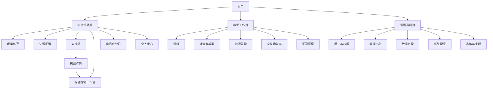
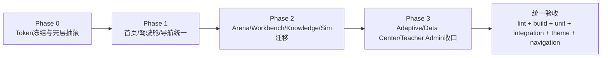

# ACT 平台集成分支 UI 深度研究与统一重构规范

## 执行摘要

已启用且本次实际使用的连接器只有 **GitHub**。基于 `yong-wei/act` 的 **integration** 分支实现、对应的路由文件、主题层、页面壳层、角色入口、Arena/Workbench/Adaptive 相关代码，以及 integration 分支上的 openspec 变更文档，我的结论非常明确：**这个平台并不是“没有设计系统”，而是“同时存在一个全局设计系统和多个局部设计系统”**。仓库已经具备类级暗黑主题、`surface-*` 语义表层、角色跳转逻辑、Arena 到统一控制工作台的核心链路，以及教师端/管理员端的若干成熟页面；但与此同时，大量页面仍然直接写死 `bg-slate-*`、局部十六进制色值、页面私有 token 命名空间和各自的 header/nav 方案，导致产品层表达不统一。fileciteturn91file0 fileciteturn92file0 fileciteturn96file0 fileciteturn97file0 fileciteturn98file0 fileciteturn62file0 fileciteturn84file0 fileciteturn86file0 fileciteturn108file0

从产品结构上看，平台当前最强的核心不是首页，也不是单一仿真，而是 **Arena → 挑战详情 → 综合控制工作台** 这条已经被代码明确建立起来的闭环。`workspace-routing.ts` 已经把绝大多数挑战任务路由到 `/interactive-learning/control-workbench`，只保留 `control-odyssey` 例外；挑战详情页也已经把“方案提交应在工作台内部完成”写成测试与实现约束。这意味着后续 UI 重构不应再把控制设计能力分散在多个“看起来像不同产品”的页面里，而应围绕一个统一壳层和统一导航心智来收敛。fileciteturn56file0 fileciteturn57file0 fileciteturn55file0 fileciteturn99file0 fileciteturn107file0

自适应学习部分的现状与目标之间存在最明显裂缝。现有仓库里，`/ai` 是样例数据驱动的个人学习中心，`/ai/copilot` 是页面级独立 AI 助教，`/assessment/adaptive-practice` 是可运行但以内存状态为核心的自适应练习，而 `/profile` 又单独展示推荐、画像和练习摘要；但 integration 分支上的 openspec 明确要求持久化 learner state、ResourceNode registry、路径规划、解释视图、Konling 服务端上下文与分层记忆，而且任务清单仍全部未勾选。这说明平台已经有“功能样机”，但还没有“统一、自解释、可治理的 adaptive layer”。fileciteturn61file0 fileciteturn62file0 fileciteturn63file0 fileciteturn68file0 fileciteturn80file0 fileciteturn82file0 fileciteturn75file0 fileciteturn76file0 fileciteturn87file0 fileciteturn88file0 fileciteturn89file0

因此，最优整改路线不是“逐页美化”，而是分三层推进：先做 **品牌化设计 token + 统一 AppShell + 角色导航 schema**，再把首页、学生驾驶舱、Arena/Workbench、知识图谱、虚拟仿真、自适应学习、数据中心等核心页面迁到同一组件库与语义主题体系上，最后再用 feature flag 把 openspec 中尚未落地的 adaptive/resource-node/teacher-management 变更挂接进来。仓库现有 `lint`、`build`、`test`、主题类测试、导航测试和 Playwright 集成测试脚本，足以支撑这种分阶段重构与回滚。fileciteturn101file0

## 研究范围与限制

本报告的主要证据基础包括：integration 分支中的源码路由、页面壳层、组件、主题实现、角色跳转逻辑、Arena/Workbench 领域代码，以及 integration 分支上的 openspec 变更文档。尤其是 `build-xh202620-adaptive-learning-platform` 提案和任务清单，直接说明了未来自适应学习层的目标边界、依赖关系与未实现状态。fileciteturn75file0 fileciteturn76file0

需要透明说明的是：**当前研究环境无法直接重新解析和自动化抓取 `act.adapt-learn.online` 域名**，因此本轮没有补充新的 live site 逐页截图；下面的“部署页面 ↔ 仓库文件”关系，采用的是 integration 分支的路由与组件映射，并结合你在上下文中提供的 demo 账号信息以及此前调查背景进行产品级整合判断。也因此，报告中的“当前页面逻辑”部分，优先以后端/前端代码的高置信事实为准，而不再假装给出未经本轮验证的在线截图结论。

另外，仓库脚本中存在固定测试账号与口令，说明教师端和管理员端的入口确实被预置在开发/测试流程中；但出于安全原因，本文只讨论角色 UI 与导航布置，不复述具体口令字符串。fileciteturn73file0 fileciteturn74file0

## 页面与代码映射

下表给出当前主要部署页面与 integration 分支实现的高置信映射。它既可作为后续重构时的“页面清册”，也可直接作为 openspec change package 的影响面清单。

| 路由 | 当前实现文件 | 关键组件/逻辑 | 当前界面特征 | 证据 |
|---|---|---|---|---|
| `/` | `src/app/page.tsx` | `LoginModal`、`ShipModelPreview`、首页轮播/任务序列/三大入口矩阵 | 首页视觉完成度最高，但入口矩阵仅覆盖 3 个核心模块，且移动端缺少显式菜单抽屉。 | 仓库路由与首页壳层。fileciteturn93file0 fileciteturn94file0 fileciteturn95file0 |
| `/login` | `src/app/(auth)/layout.tsx`、`src/app/(auth)/login/page.tsx` | 独立认证布局 + 卡片登录表单 | 与首页弹窗登录并存，登录入口形态割裂。 | 认证布局与登录页。fileciteturn78file0 fileciteturn77file0 |
| `/dashboard` | `src/app/(main)/dashboard/page.tsx` | 学生驾驶舱、统计卡、功能模块卡、快速开始 | 具备“驾驶舱”定位，但模块卡未把竞技场、综合控制工作台、自适应学习作为一级核心入口。 | 学生驾驶舱。fileciteturn102file0 fileciteturn103file0 |
| `/missions` | `src/app/(main)/missions/page.tsx` | 任务大厅、筛选、任务卡、学习路径 | 使用 `surface-*` 体系，风格相对统一。 | 任务大厅。fileciteturn67file0 |
| `/profile` | `src/app/(main)/profile/page.tsx` | 六维画像、竞技场画像、补强路径、自适应练习摘要 | 信息密度大，但已具备学生成长中心雏形。 | 个人中心。fileciteturn68file0 |
| `/simulations` | `src/app/simulations/page.tsx` | 仿真场景列表、课程设计模态框、`FeaturePageNav` | 仿真 Hub 完整，但沿用另一套页面导航组件。 | 仿真总入口。fileciteturn106file0 |
| `/simulations/destroyer` 等场景页 | `src/app/simulations/destroyer/page.tsx` 等 | 动态加载 3D 仿真资源，SSR 关闭 | 场景页直接写死深色背景，壳层没有并入全局 AppShell。 | 驱逐舰场景页。fileciteturn108file0 |
| `/knowledge` | `src/app/knowledge/page.tsx` | `KnowledgeGraphSystem`、`UnifiedTopBar` | 已是独立核心模块，但仍属专用页面壳。 | 知识图谱入口与核心组件。fileciteturn46file0 fileciteturn47file0 |
| `/interactive-learning` | `src/app/interactive-learning/page.tsx` | `UnifiedTopBar`、学习模式三入口 | 信息架构开始成形，但与首页/驾驶舱仍未完全对齐。 | 互动学习首页。fileciteturn64file0 |
| `/interactive-learning/control-workbench` | `src/app/interactive-learning/control-workbench/page.tsx` | `ControlWorkbenchShell`、session resolver、面板配置 | 已是统一控制工作台主入口，建议升级为平台级核心壳层。 | 路由与壳层。fileciteturn57file0 fileciteturn58file0 |
| `/arena` | `src/app/arena/page.tsx` | `ArenaHall`、`ArenaPageShell` | Arena 单独拥有侧边导航和面包屑体系。 | Arena 首页与壳层。fileciteturn48file0 fileciteturn49file0 fileciteturn50file0 |
| `/arena/challenges/[taskId]` | `src/app/arena/challenges/[taskId]/page.tsx` | `ChallengeDetail`、publication 可见性判定、工作台跳转 | 已有产品级挑战详情页，且提交逻辑要求在工作台内完成。 | 挑战详情路由/详情组件/测试。fileciteturn107file0 fileciteturn99file0 fileciteturn55file0 |
| `/ai` | `src/app/ai/page.tsx` | `PersonalLearningCenter` | 视觉独特，但使用样例数据，尚未变成真实自适应学习中枢。 | `AI工坊` 入口与个人学习中心。fileciteturn61file0 fileciteturn63file0 |
| `/ai/copilot` | `src/app/ai/copilot/page.tsx` | `useChat`、`usePageAIContext`、Konling 品牌页 | 独立风格最强、与全局壳层偏离最大。 | Copilot 页面。fileciteturn62file0 |
| `/assessment/adaptive-practice` | `src/app/assessment/adaptive-practice/page.tsx` | 诊断 + 自适应练习题 + AI 生成题 | 页面可演示，但数据层离 openspec 要求差距很大。 | 自适应练习页。fileciteturn80file0 |
| `/teacher` | `src/app/teacher/layout.tsx`、`src/app/teacher/page.tsx` | `TeacherDashboard`、角色守卫 | 教师端拥有独立顶部栏和专属首页。 | 教师布局与首页。fileciteturn100file0 fileciteturn18file0 fileciteturn19file0 |
| `/teacher/resources` | `src/app/teacher/resources/page.tsx` | `TeacherResourceManager`、互动/课堂/知识三标签 | 已具备资源管理雏形，但尚非 openspec 所需的 ResourceNode 管理入口。 | 教师资源页与资源管理器。fileciteturn83file0 fileciteturn84file0 fileciteturn89file0 |
| `/admin` | `src/app/admin/page.tsx` | `AdminConsoleHome`、`AdminConsoleHeader`、配置入口 | 管理端已成体系，但使用另一套命名空间设计语言。 | 管理员首页与配置。fileciteturn24file0 fileciteturn26file0 fileciteturn27file0 fileciteturn70file0 |
| `/admin/states` | `src/app/admin/states/page.tsx` | `AdminStatesDashboard`、demo/real 数据切换 | 非常适合演示型数据大屏，但目前风格与学生端分裂。 | 管理员数据页。fileciteturn85file0 fileciteturn86file0 |

## 现状诊断

当前最需要解决的不是“单个页面难看”，而是 **视觉语义和导航心智不连续**。下面这张诊断表概括了我认为最关键的产品级问题。

| 问题 | 当前证据 | 影响 | 优先级 |
|---|---|---|---|
| 全局主题机制存在，但没有真正成为全站唯一主题源 | 现有 Tailwind 已使用 `darkMode: ['class']`，全局 `globals.css` 已定义 `surface-page / surface-topbar / surface-card` 与 light/dark 变量，`ThemeProvider` 也负责根节点主题切换；但 AI Copilot、仿真场景页、教师布局、教师资源管理、管理员数据页仍大量直接写死 `bg-slate-*`、十六进制色值或私有命名空间。fileciteturn92file0 fileciteturn96file0 fileciteturn91file0 fileciteturn62file0 fileciteturn84file0 fileciteturn86file0 fileciteturn100file0 fileciteturn108file0 | 深浅色切换不能做到真正“全局一致、非硬编码、可扩展品牌化”，后续任何页面新增都会继续漂移。 | P0 |
| 导航壳层过多，重复导航顺序不一致 | 首页、认证页、学生驾驶舱、`FeaturePageNav`、`UnifiedTopBar`、ArenaPageShell、TeacherLayout、AdminConsoleHeader 都各自维护一套返回逻辑与标题区。fileciteturn93file0 fileciteturn78file0 fileciteturn102file0 fileciteturn48file0 fileciteturn50file0 fileciteturn100file0 fileciteturn105file0 | 用户会不断“换产品”，不利于建立空间记忆，也不符合重复导航应保持一致相对顺序的可用性要求。citeturn7view0 | P0 |
| 学生主导航没有把平台真正的核心能力全部一级化 | 首页矩阵只放了竞技场、知识图谱、互动学习三项；学生驾驶舱强调任务、仿真、AI、个人中心、伦理、知识库，却没有把 Arena、综合控制工作台、自适应学习作为一级常驻入口。fileciteturn94file0 fileciteturn102file0 fileciteturn103file0 | 平台核心能力被掩埋，演示与竞赛时不利于快速切入重点。 | P0 |
| Arena 与 Control Workbench 在逻辑上已经统一，在视觉上却仍像两个产品 | 挑战详情页通过 `getArenaWorkspaceHref` 跳到统一控制工作台，测试也要求提交只能在工作台里完成；但 Arena 仍保留自己的 shell、边栏和视觉规则。fileciteturn56file0 fileciteturn57file0 fileciteturn55file0 fileciteturn99file0 | 用户从“竞赛说明”进入“控制设计”时发生认知断裂。 | P0 |
| 自适应学习入口与实现都分散，且数据持久化未完成 | `/ai` 是样例学习中心，`/ai/copilot` 是独立 AI 页面，`/assessment/adaptive-practice` 是练习器，`/profile` 又单独展示推荐摘要；同时 `adaptive-engine.ts` 以全局内存 Map 为核心 store。fileciteturn61file0 fileciteturn62file0 fileciteturn63file0 fileciteturn68file0 fileciteturn80file0 fileciteturn82file0 | 目前更像多个 demo，而不是一个完整的 adaptive loop。 | P0 |
| openspec 目标与现有 UI 之间存在明显落差 | integration 的 adaptive-learning change proposal 要求 learner state、ResourceNode、path planning、Konling runtime、teacher ResourceNode management、隐私治理等；任务清单全部未勾选。fileciteturn75file0 fileciteturn76file0 fileciteturn87file0 fileciteturn88file0 fileciteturn89file0 | 如果只做 UI 美化，不补齐中台契约，后续仍会反复返工。 | P0 |
| 教师端/管理员端功能有价值，但没有纳入同一品牌化信息架构 | 教师仪表盘已经配置了班级、学生、教案、历史、资源等快速入口；管理员端已经配置用户管理、系统使用量、数据治理、系统配置等版块。fileciteturn69file0 fileciteturn70file0 | 角色端各自为战，缺少统一品牌识别和统一导航约束。 | P1 |
| 数据大屏基础具备，但呈现仍偏“管理员页面”而非“演示级数据中心” | `AdminStatesDashboard` 已支持 mock/real 切换、图表、趋势、模块访问、仿真访问等，非常适合演示；但配色、壳层、入口还留在 admin 语义下。fileciteturn86file0 | 无法充分支持高竞争力展示、评审材料与对外演示。 | P1 |

我建议用一句话概括整改目标：**把当前“多个局部体验”收束为“一个品牌、三类角色、六个核心模块、一个统一工作台、一个统一数据中心”。**

## 统一 UI 规范

现有仓库已经提供了可复用基础：类级暗黑模式、语义 `surface-*`、局部主题 provider、Tailwind 变量色值映射。最佳方案不是推翻，而是**把这些基础升级成真正的平台设计系统**：一个 token 源、一个 ThemeProvider、一个 AppShell、一个组件库、多个模块主题别名，而不是多个页面级 token 岛。fileciteturn91file0 fileciteturn92file0 fileciteturn96file0 citeturn5view1

建议采用如下统一设计 token 规范。这里的数值是重构建议，不是对现有仓库的摘录。

| 类别 | Token | Light | Dark | 用途 |
|---|---|---:|---:|---|
| 品牌色 | `--brand-500` | `199 89% 48%` | `196 82% 56%` | 主 CTA、选中态、关键强调 |
| 品牌辅色 | `--brand-600` | `204 82% 40%` | `201 90% 62%` | hover / active |
| 画布 | `--bg-canvas` | `210 40% 98%` | `222 38% 8%` | 整页背景 |
| 一级表层 | `--bg-surface-1` | `0 0% 100%` | `222 30% 12%` | 卡片/面板主容器 |
| 二级表层 | `--bg-surface-2` | `200 36% 96%` | `220 24% 16%` | 次级卡片/侧栏 |
| 三级表层 | `--bg-surface-3` | `198 34% 92%` | `220 20% 20%` | 表格头、标签、tag |
| 正文 | `--fg-primary` | `222 47% 11%` | `210 40% 98%` | 标题/正文 |
| 次要文本 | `--fg-secondary` | `215 22% 32%` | `214 20% 72%` | 说明文/注释 |
| 分隔线 | `--stroke-default` | `205 28% 86%` | `217 22% 24%` | 边框/分割 |
| 成功 | `--success-500` | `154 53% 42%` | `154 62% 52%` | 通过/健康 |
| 警告 | `--warning-500` | `38 92% 50%` | `42 95% 58%` | 风险/提醒 |
| 危险 | `--danger-500` | `0 84% 60%` | `0 72% 62%` | 错误/失败 |
| 阴影 | `--shadow-lg` | `0 16px 40px rgba(15,23,42,.10)` | `0 18px 48px rgba(2,8,23,.32)` | 大卡片/浮层 |
| 圆角 | `--radius-sm/md/lg/xl` | `8/12/16/24px` | 同左 | 组件统一曲率 |
| 间距 | `--space-1..8` | `4/8/12/16/20/24/32/40px` | 同左 | 布局间距 |
| 字体层级 | `display / h1 / h2 / h3 / body / caption` | `40 / 32 / 24 / 20 / 16 / 12px` | 同左 | 统一标题系统 |

在实现层面，建议把当前 `.light/.dark` 和 `surface-*` 体系升级为 **语义 token + 角色/模块别名**。保留 Tailwind 的 class dark mode 机制，但同时给根节点打 `data-theme` 与 `data-brand`，让颜色源不再依赖页面级硬编码。Tailwind 官方明确支持用选择器驱动 dark variant，而不是仅靠 `prefers-color-scheme`；这非常适合当前仓库已有的 class 方案继续演进。citeturn5view1

```css
/* src/styles/tokens.css */
:root[data-theme='light'] {
  --bg-canvas: 210 40% 98%;
  --bg-surface-1: 0 0% 100%;
  --bg-surface-2: 200 36% 96%;
  --fg-primary: 222 47% 11%;
  --fg-secondary: 215 22% 32%;
  --stroke-default: 205 28% 86%;
  --brand-500: 199 89% 48%;
  --brand-600: 204 82% 40%;
  --success-500: 154 53% 42%;
  --warning-500: 38 92% 50%;
  --danger-500: 0 84% 60%;
}

:root[data-theme='dark'] {
  --bg-canvas: 222 38% 8%;
  --bg-surface-1: 222 30% 12%;
  --bg-surface-2: 220 24% 16%;
  --fg-primary: 210 40% 98%;
  --fg-secondary: 214 20% 72%;
  --stroke-default: 217 22% 24%;
  --brand-500: 196 82% 56%;
  --brand-600: 201 90% 62%;
  --success-500: 154 62% 52%;
  --warning-500: 42 95% 58%;
  --danger-500: 0 72% 62%;
}

:root[data-brand='act'] {
  --hero-gradient-start: 199 89% 48%;
  --hero-gradient-end: 223 58% 18%;
}
```

```tsx
// src/components/providers/app-theme-provider.tsx
'use client';

import { createContext, useContext, useEffect, useMemo, useState } from 'react';

type ThemeMode = 'light' | 'dark' | 'system';
type ThemeContextValue = {
  resolvedTheme: 'light' | 'dark';
  theme: ThemeMode;
  setTheme: (theme: ThemeMode) => void;
};

const ThemeContext = createContext<ThemeContextValue | null>(null);

export function AppThemeProvider({ children }: { children: React.ReactNode }) {
  const [theme, setTheme] = useState<ThemeMode>('system');
  const [resolvedTheme, setResolvedTheme] = useState<'light' | 'dark'>('dark');

  useEffect(() => {
    const systemDark = window.matchMedia('(prefers-color-scheme: dark)').matches;
    const next = theme === 'system' ? (systemDark ? 'dark' : 'light') : theme;
    const root = document.documentElement;

    root.dataset.theme = next;
    root.dataset.brand = 'act';
    root.classList.toggle('dark', next === 'dark');
    root.style.colorScheme = next;

    setResolvedTheme(next);
  }, [theme]);

  const value = useMemo(() => ({ theme, setTheme, resolvedTheme }), [theme, resolvedTheme]);
  return <ThemeContext.Provider value={value}>{children}</ThemeContext.Provider>;
}

export function useAppTheme() {
  const ctx = useContext(ThemeContext);
  if (!ctx) throw new Error('useAppTheme must be used within AppThemeProvider');
  return ctx;
}
```

组件层建议以 **AppShell / AppHeader / AppSidebar / AppCard / ChartPanel / AppFormField / AppModal / AppBreadcrumb / ThemeSwitcher** 为第一期统一库。现在最优先要替换的，不是所有业务组件，而是“所有正在定义页面风格的外围组件”。

| 优先级 | 组件 | 要替换的现状 | 目标 API |
|---|---|---|---|
| P0 | Header | `FeaturePageNav`、`UnifiedTopBar`、Teacher 顶栏、Admin 顶栏、Arena Header 各自实现 | `<AppHeader title subtitle breadcrumbs actions />` |
| P0 | Sidebar | Arena 独立侧栏、未来教师/管理员二级导航分散 | `<AppSidebar items collapsed mobileDrawer />` |
| P0 | Card | `surface-card`、`admin-console-surface`、`interactive-course-hub-module-card` 等并存 | `<AppCard tone="default|muted|hero|danger" />` |
| P0 | Breadcrumbs | Arena 独有、其他页多用“返回按钮”替代 | `<AppBreadcrumb items />` |
| P0 | ThemeSwitcher | 当前用户菜单没有统一主题切换入口 | `<ThemeSwitcher mode="icon|segmented" />` |
| P1 | Chart Wrapper | 管理端 Recharts 面板、未来数据大屏、知识图谱统计面板风格不一致 | `<ChartPanel title subtitle toolbar />` |
| P1 | Form Field | 登录页、弹窗登录、资源管理、Arena 筛选、管理员表单各写各的 | `<AppField label hint error><Input /></AppField>` |
| P1 | Modal / Drawer | 登录弹窗、自定义 overlay、Radix wrapper 混用 | `<AppModal />`、`<AppDrawer />` |

```tsx
// 统一导航与壳层契约示例
export type Role = 'student' | 'teacher' | 'admin';

export type NavItem = {
  key: string;
  label: string;
  href: string;
  icon?: React.ComponentType<{ className?: string }>;
  badge?: string;
  children?: NavItem[];
  roles?: Role[];
  featureFlag?: string;
};

export interface AppShellProps {
  role: Role;
  topNav: NavItem[];
  sideNav?: NavItem[];
  breadcrumbs?: Array<{ label: string; href?: string }>;
  title: string;
  subtitle?: string;
  actions?: React.ReactNode;
  children: React.ReactNode;
}
```

所有新组件都应遵守同一套交互与可访问性底线：普通文本对比度至少 4.5:1、可点击目标至少满足 24×24 CSS 像素、320px 宽度下不出现无意义双向滚动、重复导航保持稳定相对顺序。对于产品内控，我建议把一级按钮和图标按钮统一抬到 **40px 以上触达高度**，高于 WCAG 的最低线。citeturn5view2turn6view0turn7view1turn7view0

## 导航与模块重构任务

建议未来的统一信息架构如下。重点不是把所有模块塞进同一侧栏，而是让用户始终知道自己位于哪一层：**平台层 → 角色驾驶舱层 → 核心模块层 → 工作流层**。



建议的角色导航规范如下。这里给的是**目标态**，不是当前态；其中某些页面当前尚未完全实现，但它们与现有代码和 openspec 方向是兼容的。

| 角色 | 顶层导航 | 二级导航规则 | 面包屑规范 |
|---|---|---|---|
| 学生 | 首页、虚拟仿真、知识图谱、竞技场、综合控制工作台、自适应学习、个人中心 | 二级仅在模块内出现；Arena、仿真、Knowledge、Adaptive 各自保持固定顺序 | `首页 / 模块 / 子页 / 详情` |
| 教师 | 总览、班级、课堂与教案、资源管理、竞技场发布、学习洞察 | 教学组织优先，资源和发布并列，数据洞察靠后 | `教师工作台 / 模块 / 子页` |
| 管理员 | 总览、用户与权限、数据中心、数据治理、系统配置、品牌与主题 | 以治理和运维为主，不与教师资源型页面混淆 | `管理员后台 / 模块 / 子页` |

页面级重构任务建议如下。为了便于研发排期，我按核心模块给出当前问题、目标、代码影响、工时和测试要点。

| 模块 | 当前问题 | 目标 UI/UX | 主要代码改动 | 预估工时 |
|---|---|---|---|---:|
| 首页 | 首页视觉强，但一级矩阵只覆盖 3 个模块，移动端缺少统一产品菜单；认证入口既有独立登录页又有首页弹窗。fileciteturn93file0 fileciteturn94file0 fileciteturn95file0 | 首页只承担三件事：品牌叙事、角色分流、核心入口。把“核心模块快速入口”扩成 6 卡矩阵，增加“开始演示”“进入数据中心”隐藏式演示入口，登录统一为抽屉/模态与独立页共享同一表单组件。 | `src/app/page.tsx`、`src/components/shared/login-modal.tsx`、新增 `src/components/app-shell/*`、`src/components/navigation/*` | 16–24h |
| 虚拟仿真 | 仿真 Hub 已成形，但场景页沿用 `FeaturePageNav + bg-slate-950` 的独立壳层；未来 openspec 还要求拆分 simulation scene shell。fileciteturn106file0 fileciteturn108file0 fileciteturn75file0 | 仿真统一为“Hub → 场景 → 任务/讲解/控制面板”三级；所有场景页共享 `SimulationSceneShell`，右上统一显示主题切换、返回、帮助、记录、进入竞技场。 | `src/app/simulations/page.tsx`、`src/app/simulations/*/page.tsx`、新增 `src/features/simulations/shell/*` | 24–40h |
| 知识图谱 | 已是核心模块，但与其他模块的导航/卡片视图语义未完全统一。fileciteturn46file0 fileciteturn47file0 | 统一为双栏工作区：左侧知识导航与筛选，右侧图谱/卡片/资源面板；资源卡、知识节点卡和 Arena/仿真关联跳转保持同一视觉语言。 | `src/app/knowledge/page.tsx`、`src/features/knowledge/knowledge-graph-system.tsx`、知识资源面板组件 | 24–36h |
| 竞技场 | Arena 已有独立 shell、挑战详情和榜单浏览，但与学生主导航、工作台壳层风格断裂。fileciteturn48file0 fileciteturn49file0 fileciteturn50file0 fileciteturn99file0 | Arena 重构为“大厅 / 挑战详情 / 榜单 / 发布上下文”四类页面，但统一挂到平台 AppShell；侧栏保留为模块内二级导航，不再自成一套产品外观。 | `src/app/arena/page.tsx`、`src/app/arena/challenges/[taskId]/page.tsx`、`src/features/arena/arena-page-shell.tsx`、榜单相关组件 | 32–48h |
| 综合控制工作台 | 已有统一路由和丰富面板逻辑，但视觉层仍偏“实验系统”，不是平台主舞台。fileciteturn57file0 fileciteturn58file0 fileciteturn56file0 | 把 Control Workbench 提升为平台级主舞台：固定顶部任务上下文、左侧对象/方案/视图配置、中间多视图画布、右侧提交/指标/建议；Arena、自由探索、课程任务仅改变上下文，不再改变产品语言。 | `src/app/interactive-learning/control-workbench/page.tsx`、`src/features/control-workbench/shell/control-workbench-shell.tsx`、view/plugin/preset 相关文件 | 40–64h |
| 自适应学习 | `/ai`、`/ai/copilot`、`/assessment/adaptive-practice`、`/profile` 四处分裂，且 adaptive-engine 以内存为中心。fileciteturn61file0 fileciteturn62file0 fileciteturn63file0 fileciteturn68file0 fileciteturn80file0 fileciteturn82file0 | 合并成“自适应学习中心”：概览、当前路径、练习、AI 学伴、证据解释五个标签页；保留旧路由为兼容别名，但视觉上都回到同一中心。 | `src/app/ai/page.tsx`、`src/app/ai/copilot/page.tsx`、`src/app/assessment/adaptive-practice/page.tsx`、相关 API、`src/features/assessment/*`、`src/features/ai/*` | 32–48h |
| 数据中心 | 管理端数据页已可演示，但局限在 admin 语义；尚未成为平台级演示大屏与材料页。fileciteturn85file0 fileciteturn86file0 | 新增平台级 “数据中心” 展示模式：核心指标概览、模块访问态势、学习轨迹大屏、竞技表现、课堂活跃、演示快照；管理员保留深度治理视图。 | `src/app/admin/states/page.tsx`、`src/features/admin/states/admin-states-dashboard.tsx`、新增 `src/app/data-center/page.tsx` 与共享 chart panel | 24–36h |

对应测试与验收建议如下。

| 模块 | 关键测试案例 | 对应 openspec change package 建议名 |
|---|---|---|
| 首页 | 角色登录后 CTA 跳转正确；320px 下导航可用；首页 6 大入口顺序固定；主题切换无闪烁 | `unify-home-shell-and-entry-matrix` |
| 虚拟仿真 | 所有场景页都落在同一 shell；返回路径一致；场景页主题切换不影响 WebGL；弱网回落海报图正常 | `standardize-simulation-scene-shell-ui` |
| 知识图谱 | 图谱/列表/详情三视图切换一致；资源跳转统一；键盘导航到节点详情可达 | `unify-knowledge-graph-workspace-ui` |
| 竞技场 | 大厅→详情→工作台路径一致；publication 上下文保留；榜单面板在不同角色视角下可见性正确 | `unify-arena-shell-and-breadcrumbs` |
| 综合控制工作台 | 不同 preset 下壳层不变；面板布局可保存恢复；Arena 返回链接正确；提交面板与指标区一致 | `promote-control-workbench-to-platform-stage` |
| 自适应学习 | 旧路由跳转到统一中心正确；练习状态持久化；AI 学伴读取真实 learner state；解释视图与路径视图可用 | `converge-adaptive-learning-surfaces` |
| 数据中心 | 演示/真实数据切换清晰；大屏与管理版共用 chart wrapper；导出截图 PDF 不错位 | `build-platform-data-center-ui` |

## 实施路线图与 openspec 变更包

建议按 **Phase 0–3** 推进，不要一口气改完整站。这样可以一边维持当前可运行功能，一边逐步把最核心的页面迁到新壳层和新组件库上。



| Phase | 目标 | 主要动作 | Git 工作流 | 风险控制 |
|---|---|---|---|---|
| Phase 0 | 建基础 | 冻结 token、落地 `AppThemeProvider`、`AppShell`、`AppHeader`、`AppSidebar`、`ThemeSwitcher`、`AppCard`、`AppBreadcrumb` | 从 `integration` 拉 `feat/ui-foundation`，只改基础设施不改业务逻辑 | feature flag：`ui_unified_shell_v1` |
| Phase 1 | 统一入口 | 迁移首页、登录、学生驾驶舱、个人中心、任务大厅 | `feat/ui-entry-and-student-cockpit` | 保留旧 header 组件兼容 1 个迭代 |
| Phase 2 | 统一核心模块 | 迁移 Arena、Control Workbench、Knowledge、Simulation Hub/Scene | `feat/ui-core-modules` | 逐模块挂 flag：`ui_arena_v2`、`ui_workbench_v2` 等 |
| Phase 3 | 统一高级能力 | 合并 Adaptive surfaces、重构 Teacher/Admin、增加 Data Center 演示模式 | `feat/ui-adaptive-and-data-center` | 旧 `/ai`、`/assessment/*`、`/admin/states` 保留兼容别名 |

CI 与回滚建议直接利用仓库已有脚本：至少执行 `lint`、`build`、`test`、主题相关测试、导航测试、Playwright 集成测试，并在 UI foundation 阶段增补 Story/截图回归。仓库当前已经有主题测试、知识图谱测试、导航测试、管理员数据页测试及 Playwright 集成测试脚本，这使得“分阶段上线 + feature flag 回滚”是现实可行的。fileciteturn101file0

**验收清单** 建议固定为以下 4 组，不再让每个模块自己发明标准：

- **可访问性**：普通文本对比度 ≥ 4.5:1；图标按钮/菜单项可点击区 ≥ 24×24 CSS px；键盘可完整走通；焦点环不被遮挡；重复导航相对顺序稳定。citeturn5view2turn6view0turn7view0turn7view1
- **响应式**：320px、768px、1024px、1440px 四档布局不中断；大屏优先支持演示投屏；移动端所有顶部导航都有可见替代入口。citeturn7view1
- **性能**：3D/图谱/图表按需加载；控制工作台首屏只载入必要 panel；Data Center 图表避免首屏全量渲染。
- **测试**：单元测试覆盖主题、导航 schema、组件 props；集成测试覆盖“首页→登录→角色驾驶舱→核心模块→返回”的主链路。

下面给出一个可以直接转成 openspec change package 的样例，目标页选择 **Layout/Header**，因为它是整个产品收敛的第一步。

```yaml
change: unify-platform-shell-and-header
type: ui-foundation
owners:
  - frontend
  - design-system
goals:
  - 用统一 AppHeader/AppShell 替换首页、学生端、教师端、管理员端、Arena、FeaturePageNav 的外层头部实现
  - 提供统一 breadcrumb、role-nav、theme-switcher、快速入口槽位
featureFlags:
  - ui_unified_shell_v1
affectedFiles:
  - src/components/app-shell/app-shell.tsx
  - src/components/app-shell/app-header.tsx
  - src/components/app-shell/app-sidebar.tsx
  - src/components/navigation/app-breadcrumb.tsx
  - src/components/navigation/theme-switcher.tsx
  - src/components/shared/feature-page-nav.tsx
  - src/components/shared/unified-top-bar.tsx
  - src/app/page.tsx
  - src/app/(main)/dashboard/page.tsx
  - src/app/teacher/layout.tsx
  - src/features/arena/arena-page-shell.tsx
  - src/features/admin/admin-console-header.tsx
  - src/app/globals.css
  - tailwind.config.ts
diffOutline:
  - 新增 app-shell 目录与统一导航 schema
  - 旧页面头部调用改为 AppHeader
  - 将页面级硬编码边框/背景/按钮状态迁到语义 token
  - 在 UserMenu 或 Header actions 中加入 ThemeSwitcher
acceptanceCriteria:
  - 所有核心页面头部高度、标题层级、返回区、操作区、用户区结构一致
  - 学生/教师/管理员进入驾驶舱动作一致且角色重定向正确
  - 320px 宽度下 Header 可操作，无功能丢失
  - 切换 light/dark 后页面不出现硬编码深色块残留
  - 首页、Arena、Teacher、Admin 至少四类页面通过截图回归
rollback:
  - 关闭 ui_unified_shell_v1 后回退到旧 header 组件
  - 保留旧 FeaturePageNav / UnifiedTopBar 至少一个版本周期
```

最后给出一句可执行的落地判断标准：**当用户从首页、学生驾驶舱、Arena、Workbench、知识图谱、自适应学习、教师端、管理员端任意两页切换时，不再有“像进入另一个系统”的感受，这次重构才算完成。** 当前仓库已经具备实现这一目标的大部分底层条件；真正缺的是把这些条件收束成一个统一的产品壳层，并用 openspec 把后续 adaptive 与 ResourceNode 变更纳入同一条演化路线。fileciteturn91file0 fileciteturn92file0 fileciteturn56file0 fileciteturn75file0 fileciteturn76file0