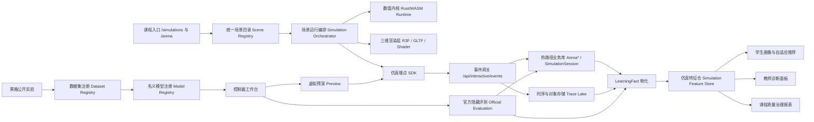

# yong-wei/act 仓库虚拟仿真实现深度研究报告

## 执行摘要

这不是一个“单一仿真模块”的仓库，而是两条并行但尚未完全打通的虚拟仿真链路。

第一条链路是 `/simulations` 下的七类船舶/平台三维仿真场景：`src/app/simulations/page.tsx` 明确把平台定义为“虚拟仿真实验室”，列出 **7 个仿真场景**，并分别为驱逐舰、LNG 船、集装箱船、邮轮、钻井平台、破冰船、挖泥船配置独立入口；各入口页通过 `next/dynamic` 懒加载对应三维仿真组件。第二条链路是 `src/features/arena/**` 下的竞技场式黑箱闭环：**黑箱实验数据集 → 学生名义模型/控制器工件 → 虚拟仿真预演 → 官方隐藏评测**，并且文档明确规定“预演结果不能进入正式榜单”。 fileciteturn88file0L3-L3 fileciteturn89file0L3-L3 fileciteturn77file0L3-L3 fileciteturn76file0L3-L3

仓库的强项很清楚：有实质性的场景配置、模型族谱、Rust/WASM 运行时边界、浏览器三维呈现、Arena 评测隔离、预算和归属校验、基础数据治理骨架。这说明仓库已经越过“PPT 式仿真”的阶段，进入了可教学、可交互、可评测的原型系统。它尤其适合高等控制课程中的对象建模、控制器设计、黑箱辨识、隐藏评测和教学证据采集。 fileciteturn49file0L3-L3 fileciteturn44file0L3-L3 fileciteturn42file0L3-L3 fileciteturn67file0L3-L3

但短板同样明显，而且其中若干设计是可以被推翻的。最关键的不是“功能不够多”，而是**体系不够闭合**：七类三维仿真与 Arena 黑箱预演之间模型并不统一；名义模型只是“引用/标签”，不是可追溯、可复现、可验证的正式辨识产物；数据治理侧虽然有 `LearningFact`、`ArenaSubmission`、`ArenaEvaluationRun` 等表，但高频仿真轨迹、随机种子、模型版本、资产版本、回放校验、隐私/治理元数据并未标准化。更严重的是，证据目录写的是 `SimulationLog`，Schema 里实际存在的是 `SimulationSession`，这已经暴露出数据治理对象与落库现实不一致。 fileciteturn66file0L3-L3 fileciteturn75file0L3-L3 fileciteturn54file0L3-L3 fileciteturn95file0L3-L3 fileciteturn97file0L3-L3

如果把目标定位为“高校/科研平台可长期运营的在线虚拟仿真与适应性学习基础设施”，那么当前仓库最合理的判断不是“继续堆场景”，而是：**保留现有模型与黑箱评测雏形，重构为统一场景协议、统一仿真运行协议、统一埋点协议、统一回放协议，再把 Arena 闭环纳入课程证据流和自适应学习闭环。** 这比继续在页面里叠功能更有长期价值。 fileciteturn49file0L3-L3 fileciteturn77file0L3-L3 fileciteturn78file0L3-L3

## 仓库中的虚拟仿真实现全景

当前仓库中，与虚拟仿真直接相关的实现可以归纳为六层：**入口路由层、模型与场景配置层、运行时与物理内核层、三维渲染层、Arena 黑箱/官方评测层、数据治理与证据层**。下面给出按“路径—职责—关键类/函数—注释/文档证据”整理后的清单。为了避免碎片化，我只列出与“当前虚拟仿真能力”直接相关的核心位置。 fileciteturn88file0L3-L3 fileciteturn77file0L3-L3

| 类别 | 位置 | 关键类/函数 | 证据与判断 |
|---|---|---|---|
| 仿真总入口 | `src/app/simulations/page.tsx` | `SimulationsPage` | 文件直接定义 7 个仿真入口与教学目标，并在页头显示“7 个仿真场景”。这是整个三维仿真子系统的总索引。 fileciteturn88file0L3-L3 |
| 独立场景路由 | `src/app/simulations/{destroyer,lng,container,cruise,drilling,icebreaker,dredger}/page.tsx` | 页面组件 + `next/dynamic` | 各页面统一采用 `dynamicImport(..., { ssr: false })`，说明三维仿真渲染是**纯客户端 WebGL 管线**。已确认 `destroyer` 页如此，其余 6 个入口可由搜索结果确认路径存在。 fileciteturn89file0L3-L3 fileciteturn85file0L1-L3 fileciteturn85file12L1-L3 fileciteturn85file28L1-L3 fileciteturn85file29L1-L3 fileciteturn85file30L1-L3 fileciteturn85file31L1-L3 fileciteturn85file33L1-L3 |
| 仿真规范文档 | `docs/Simulation_Guidelines.md` | 规范而非代码 | 文档规定：数值模型统一交给 `rust/control-engine`，前端只负责固定步长调度、状态展示、图表与埋点；推荐 `dt = 1/60`、`maxSubSteps = 6`、记录间隔 `recordInterval = 0.05s`。这是当前系统最关键的架构意图文件。 fileciteturn49file0L3-L3 |
| 固定步长调度 | `src/lib/simulation/clock.ts` | `SimulationClock` | 通过 accumulator + `maxSubSteps` 推进固定步长逻辑，支撑浏览器帧率波动下的数值稳定。 fileciteturn100file0L3-L3 |
| 浏览器 WASM 运行时 | `src/resources/simulations/rust/control-engine-runtime.ts` | `preloadVirtualSimulationRuntime`, `computeVirtualSimulationStep` | 注释与实现显示浏览器侧通过 `compute_virtual_simulation_step` 调 WASM；若 runtime 未加载完成会抛错，而不是自动回退到本地模型。 fileciteturn44file0L3-L3 |
| 服务端 WASM 运行时 | `src/resources/simulations/rust/control-engine-server-runtime.ts` | `preloadVirtualSimulationServerRuntime`, `computeVirtualSimulationServerStep` | 服务器端直接加载 `index_bg.wasm`，用于 API 路由侧的数值计算。说明系统已经考虑前后端同核。 fileciteturn50file0L3-L3 |
| 统一物理 facade | `src/resources/simulations/physics/simulation-engine-facade.ts` | `nomotoStepRK4`, `nomoto2ndOrderDelayStep`, `mmg3dofStep`, `semiSub3DOFStep`, `azipod3dofStepRK4` 等 | 注释直接写明这是“Unified simulation physics facade”，用于把未来 Rust/WASM 替换隔离在单一边界后面。导出的模型族很完整。 fileciteturn42file0L3-L3 |
| 引擎工厂 | `src/resources/simulations/physics/engine-factory.ts` | `CruiseShipEngine`、`DrillingPlatformEngine`、`IcebreakerEngine`、`createSimulationEngine` | `createSimulationEngine` 的 switch 已覆盖七类对象：`destroyer-055`、`fleet-dredger-tianjing`、`fleet-lng-changheng`、`fleet-container-msc`、`fleet-cruise-adora`、`fleet-drill-hysy981`、`fleet-icebreaker-xuelong2`。这是“7类仿真问题”的代码落点。 fileciteturn41file0L3-L3 |
| 七类对象配置 | `src/resources/simulations/profiles/*.ts` | `destroyer055Profile`, `lngChanghengProfile`, `containerMscProfile`, `cruiseAdoraProfile`, `dredgerTianjingProfile`, `drillingHYSY981Profile`, `icebreakerXuelongProfile` | 这些 profile 文件不是简单文案，而是把**动力学模型、控制模式、视觉模型、场景、扰动、成功判据、伦理约束、教学映射**全部写成结构化配置。顶部注释高度浓缩了每类问题的教学语义。 fileciteturn79file0L3-L3 fileciteturn80file0L3-L3 fileciteturn81file0L3-L3 fileciteturn82file0L3-L3 fileciteturn45file0L3-L3 fileciteturn83file0L3-L3 fileciteturn84file0L3-L3 |
| 七类场景组件 | `src/resources/simulations/simulations/*.tsx` | 各仿真 React 组件 | 已检索到 `destroyer-simulation.tsx`、`lng-simulation.tsx`、`container-simulation.tsx`、`cruise-simulation.tsx`、`dredger-simulation.tsx`、`drilling-simulation.tsx`、`icebreaker-simulation.tsx` 七个具体场景组件。 fileciteturn46file2L1-L3 fileciteturn46file3L1-L3 fileciteturn46file4L1-L3 fileciteturn46file5L1-L3 fileciteturn46file6L1-L3 fileciteturn46file7L1-L3 fileciteturn85file20L1-L3 |
| 三维环境 | `src/resources/simulations/environment/maritime-environment.tsx` | `MaritimeEnvironment` | 把天空、云层、波浪海面组合成统一环境组件，说明仓库已有基础环境层，而不是页面里硬编码所有网格。 fileciteturn47file0L3-L3 |
| 水体着色器 | `src/resources/simulations/environment/wave-water.tsx` | `WaveWater`, `getWaveHeight` | 使用 React Three Fiber + Drei 的 `shaderMaterial` 自定义五层波浪顶点/片元着色器，海况等级会放大波幅。 `size=60000`、`resolution=512` 显示其视觉目标是大场景连续海面。 fileciteturn48file0L3-L3 |
| 三维模型加载 | `src/resources/simulations/simulations/cruise-simulation.tsx` | `CruiseShipModel`, `useGLTF` | 邮轮组件直接 `useGLTF('/assets/luxury-liner.glb')`，会克隆场景、修复材质、按真实船长自动缩放，并应用阴影/姿态更新。这是仓库三维模型加载的代表实现。 fileciteturn91file0L3-L3 fileciteturn92file0L3-L3 |
| Arena 任务总索引 | `docs/arena/00-index.md` | 任务计划文档 | Arena 被定义为“统一评测与排行榜层”，任务顺序中专门有“黑箱实验、虚拟仿真预演和学习证据”。这不是偶发特性，而是预定主线。 fileciteturn77file0L3-L3 |
| Arena 黑箱/预演设计文档 | `docs/arena/08-blackbox-and-virtual-simulation.md` | 任务文档 | 文档把目标明确写成“实验数据集 → 辨识模型引用 → 控制器工件 → 虚拟仿真预演 → 官方评测”的最小闭环，并规定预演不进入正式榜单。 fileciteturn76file0L3-L3 |
| Arena 适配器层 | `src/features/arena/adapters/{types,registry,cruise-roll-blackbox-adapter,whitebox-transfer-function-adapter}.ts` | `ArenaPlantAdapter`, `getArenaPlantAdapterFor...` | 当前生产级适配器真正支持预演的只有 `cruiseRollBlackBoxAdapter`；白箱 transfer-function 适配器明确返回“不支持 public experiments / virtual previews”。这很关键。 fileciteturn61file0L3-L3 fileciteturn62file0L3-L3 fileciteturn64file0L3-L3 fileciteturn63file0L3-L3 |
| Arena 黑箱实验层 | `src/features/arena/blackbox/{experiment,experiment-service}.ts` | `runArenaBlackBoxExperiment`, `createArenaBlackBoxExperiment` | 这里实现数据集生成、哈希、预算限制、持久化事务、归属查询，是 Arena 黑箱学习链路的服务端核心。 fileciteturn65file0L3-L3 fileciteturn67file0L3-L3 |
| Arena 预演层 | `src/features/arena/blackbox/controller-preview.ts` | `buildArenaVirtualSimulationPreview`, `createArenaVirtualSimulationPreviewRun` | 这里实现闭环轨迹 `trace` 与摘要 `trackingError / maxDeviation / controlEnergy / safetyViolations / smoothness`，并写入 `ArenaVirtualSimulationRun`。 fileciteturn66file0L3-L3 |
| Arena 官方评测层 | `src/features/arena/evaluation/{blackbox-evaluator,blackbox-official-metrics,blackbox-scenario-set}.ts` | `evaluateBlackBoxSubmission`, `evaluateCruiseRollOfficialMetrics` | 官方隐藏场景集、硬约束、满意度、实验调用惩罚都已实现；这层才是正式排名入口。 fileciteturn68file0L3-L3 fileciteturn69file0L3-L3 fileciteturn70file0L3-L3 |
| Arena API | `src/app/api/arena/{blackbox-experiments,virtual-simulation-runs}/route.ts` | `POST` | 两个接口都要求学生身份，分别处理黑箱实验与虚拟预演；前者持久化数据集，后者返回 `preview`。 fileciteturn71file0L3-L3 fileciteturn72file0L3-L3 |
| 工作台 UI | `src/features/control-workbench/presets/blackbox-identification-preset.tsx` | `runExperiment`, `saveNominalModel`, `applyControllerPreview`, `submitController` | 这是学生真实交互工作流的 UI 中枢：跑实验、导入数据集、保存名义模型、预演、正式提交。测试文件也专门验证了这条链路。 fileciteturn75file0L3-L3 fileciteturn102file0L3-L3 |
| Arena 埋点 | `src/features/arena/{arena-events,telemetry,arena-telemetry-client}.ts[x]` | `ARENA_CORE_EVENT_TYPES`, `sendArenaCoreEvent` | 已有高价值事件：`arena_simulation_run`、`arena_virtual_simulation_import`、`arena_submit`、`arena_evaluation_complete` 等，且明确不记录低价值浏览行为为高优先级事件。 fileciteturn56file0L3-L3 fileciteturn55file0L3-L3 fileciteturn57file0L3-L3 |
| Arena 与治理表 | `prisma/schema.prisma` | `ArenaBlackBoxExperiment`, `ArenaVirtualSimulationRun`, `ArenaSubmission`, `ArenaEvaluationRun`, `LearningFact`, `SimulationSession` | Arena 评测迹线已经有表；但“仿真会话”表名是 `SimulationSession`，不是证据目录中写的 `SimulationLog`。这是当前治理建模的不一致点。 fileciteturn54file0L3-L3 fileciteturn97file0L3-L3 |
| 证据目录 | `src/lib/data-governance/evidence-source-catalog.ts` | `EvidenceSourceId`, `CATALOG` | 证据源目录把 `ArenaSubmission`、`ArenaEvaluationRun`、`LearningFact`、`SimulationLog` 等纳入治理视图，但与实际 Schema 有偏差，说明治理抽象仍在演化中。 fileciteturn95file0L3-L3 |

一个很重要的负面观察是：仓库里**没有单独面向虚拟仿真子系统的 README 或设计总文档**，主要依赖 `Simulation_Guidelines.md`、Arena 任务文档和各文件顶部注释来传达设计意图。这会直接提高维护门槛，因为系统关键语义散落在 profile 注释、API 实现和测试文件之中，而不是集中在一份“仿真系统说明书”中。 fileciteturn49file0L3-L3 fileciteturn76file0L3-L3

## 模型、任务与数据链路分析

### 模型类型

仓库当前显式使用了四大类模型。

其一是**物理/机理模型**。七个 profile 已覆盖 `Nomoto1stOrder`、`Nomoto2ndOrder`、`NomotoVariableMass`、`MMG3DOF`、`SemiSubmersible3DOF`、`Azipod3DOF`，以及邮轮的横摇耦合 Nomoto 和减摇鳍配置。`simulation-engine-facade.ts` 也对应导出了 `nomotoStepRK4`、`nomoto2ndOrderDelayStep`、`mmg3dofStep`、`semiSub3DOFStep`、`azipod3dofStepRK4` 等统一入口。就模型谱系而言，这个仓库不是“单一一阶对象教学 demo”，而是一个已经发展出**多船型、多自由度、多扰动类型**的工程化仿真库。 fileciteturn79file0L3-L3 fileciteturn80file0L3-L3 fileciteturn81file0L3-L3 fileciteturn82file0L3-L3 fileciteturn45file0L3-L3 fileciteturn83file0L3-L3 fileciteturn84file0L3-L3 fileciteturn42file0L3-L3

其二是**控制模型**。七类场景暴露了多种控制模式：传统 `manual / p / pd / pid`，邮轮与 LNG 的 `autopilot`，集装箱船的 `pid_scheduled`，挖泥船和半潜平台的 `dp`，以及 facade 中导出的 DP 控制、推力分配、Azipod 控制器等。这说明仓库已经从“控制器参数滑块”推进到“问题结构驱动的控制模式选择”。但注意：某些 profile 文案想表达的教学能力，未必已经在交互层完全落地。例如 LNG profile 教学上强调 Smith 预估器，集装箱船强调增益调度，破冰船强调 Azipod 专用控制；从当前抓取证据看，配置层有意图，但未看到对应完整教学工作台或正式评测链路全部完成。这个落差是现状，不是推测出来的“潜在优点”。 fileciteturn81file0L3-L3 fileciteturn82file0L3-L3 fileciteturn84file0L3-L3 fileciteturn42file0L3-L3

其三是**黑箱/数据驱动模型**。Arena 黑箱链路允许学生通过受预算限制的公开实验获得输入输出数据集，再构造 `identified-model-controller` 工件，引用 `experimentDatasetHash` 和 `identificationModelId`，然后进行预演和正式提交。这里的“数据驱动”并不是成熟的辨识器，而是一个**竞技化数据引用框架**：服务端生成数据集，客户端生成“学生名义模型”引用，再进入预演/隐藏评测。也就是说，它更像“数据驱动建模教学流程”的骨架，而不是完整的辨识算法平台。 fileciteturn65file0L3-L3 fileciteturn73file0L3-L3 fileciteturn75file0L3-L3

其四是**环境扰动模型**。仓库提供海流随机游走、阵风脉冲、波浪漂移力、挖泥冲击、冰阻力/参数摄动、横风、液货晃荡等机制。尤其 `current-model.ts` 明确采用随机游走与 Ornstein-Uhlenbeck 风格更新，说明环境噪声不只是“正弦摆动背景动画”，而是已经开始侵入动力学层。问题在于，这些随机过程没有统一种子接口，复现实验目前并不坚固。 fileciteturn94file0L3-L3

### 仿真任务设置

七类三维场景在配置层都采用相似的数据结构：`startPosition`、`targets`、`seaState`、`initialConditions`、`disturbances`、`successCriteria`。这意味着仓库已经有一个事实上的**场景协议**，虽然它尚未被抽象为正式的 JSON Schema 或服务契约。驱逐舰偏向航向保持和战术机动；LNG 偏向大纯滞后与晃荡；集装箱船偏向变质量与风载荷；邮轮偏向舒适度与减摇；挖泥船偏向 DP+挖掘冲击；钻井平台偏向 3DOF 定位与推力分配；破冰船偏向 Azipod 与冰区参数摄动。七类问题都已经给出场景持续时间和成功判据。 fileciteturn79file0L3-L3 fileciteturn80file0L3-L3 fileciteturn81file0L3-L3 fileciteturn82file0L3-L3 fileciteturn45file0L3-L3 fileciteturn83file0L3-L3 fileciteturn84file0L3-L3

真正存在“训练/测试分割”的不是七类公开白箱仿真，而是 Arena 黑箱链路。学生先在公开接口上做实验，再得到名义模型，再在预演通道上观察闭环行为，最终由 `blackbox-scenario-set.ts` 提供的隐藏官方场景集完成评测。这实际上等价于一种教学友好的 public/hidden split。当前隐藏集包含 3 个 scenario，且与公开实验使用的系数并不相同。这个设计是合理的，因为它避免学生对公开数据过拟合；但它同时也表明，Arena 黑箱任务目前采用的对象不是“高保真邮轮舒适度全模型”，而是一个低阶滚转振子及其若干参数变体。 fileciteturn65file0L3-L3 fileciteturn66file0L3-L3 fileciteturn69file0L3-L3 fileciteturn70file0L3-L3

官方指标也分成两类。七类开放三维仿真以 `successCriteria` 为主，多为 `maxError`、`maxSettlingTime`、`maxPositionError`、`maxRollAngle` 等。Arena 黑箱官方评测则更正式：`trackingError`、`worstCaseDeviation`、`controlEnergy`、`constraintViolations`、`identificationFit`、`disturbanceRecovery`、`smoothness`，并进一步经过满意度归一化、硬约束过滤和实验调用惩罚。问题在于，这两套指标体系目前并没有统一到一个课程级评价框架中。三维仿真的结果更多是场景内反馈，Arena 的结果才进入正式评分与榜单。 fileciteturn45file0L3-L3 fileciteturn68file0L3-L3 fileciteturn70file0L3-L3

### 数据埋点与治理链路

从规范与代码看，仓库已经意识到“仿真不只是画面，还要成为学习证据”。

`Simulation_Guidelines.md` 要求统一记录 `time / inputs / outputs / states`，并建议 `recordInterval = 0.05s`；Arena telemetry 已定义高价值事件类型并统一发往 `/api/interactive/events`；Prisma 中已有 `ArenaBlackBoxExperiment`、`ArenaVirtualSimulationRun`、`ArenaEvaluationRun`、`ArenaSubmission` 以及更上游的 `LearningFact`。这意味着仓库已经拥有**事件层—评测层—事实层**的最小治理骨架。 fileciteturn49file0L3-L3 fileciteturn55file0L3-L3 fileciteturn56file0L3-L3 fileciteturn54file0L3-L3

但现状远谈不上“治理闭环完成”。理由有四个。第一，Arena 的高频仿真轨迹大多还是 JSON payload 方式保存在业务表里，没有统一 schema、压缩策略、回放索引或 retention policy。第二，`EvidenceSourceCatalog` 把证据源列为 `SimulationLog`，而 schema 中可见的是 `SimulationSession`，这说明治理目录和真实存储对象未完全对齐。第三，黑箱实验与预演表只记录 `userId / taskId / datasetHash / controllerHash / scenarioId / payload / createdAt` 这类业务字段，没有随机种子、模型版本、运行时版本、资产版本、环境版本、隐私级别、授权范围等治理字段。第四，当前埋点更偏“事件”和“结果”，还不是“完整可审计的仿真过程数据”。 fileciteturn54file0L3-L3 fileciteturn95file0L3-L3 fileciteturn97file0L3-L3

下面这段规范代码最能代表当前设计取向：

```ts
const clockRef = useRef(new SimulationClock({ dt: 1 / 60, maxSubSteps: 6 }));
// ...
// 记录间隔建议 recordInterval = 0.05s
```

这不是随手写的页面细节，而是项目级设计意图：**统一固定步长，前端只负责调度与展示，指标和轨迹必须成为治理对象。** fileciteturn49file0L3-L3 fileciteturn100file0L3-L3

### 三维呈现与环境模拟

仓库当前三维呈现技术栈是清晰的：**Next.js 客户端路由 + React Three Fiber + Drei + Three.js + GLTF 静态资源**。邮轮场景 `cruise-simulation.tsx` 直接引入 `Canvas`、`OrbitControls`、`Line`、`Grid`、`useGLTF`、`PerspectiveCamera`，并通过 `CruiseShipModel` 加载 `/assets/luxury-liner.glb`。环境层通过 `MaritimeEnvironment` 组合天空、云层和海面；而 `WaveWater` 用自定义 shaderMaterial 实现多层波浪顶点/片元着色器。这个实现说明三维层并不弱，它已经具备基础沉浸感，而不是只靠 ECharts 或 SVG 做轨迹图。 fileciteturn91file0L3-L3 fileciteturn92file0L3-L3 fileciteturn47file0L3-L3 fileciteturn48file0L3-L3

但它也暴露了两个工程问题。第一，页面组件仍然偏大、偏重，渲染、控制、状态和课程逻辑没有充分分层。第二，邮轮文件里既定义了一个本地 `Ocean` Shader 组件，又引入了统一 `MaritimeEnvironment`，这意味着渲染层存在**重复实现/迁移未完成**的问题。换句话说，系统在向“统一环境层”迁移，但尚未收敛完毕。 fileciteturn91file0L3-L3 fileciteturn92file0L3-L3

### 随机性与可复现性

可复现性方面，仓库是“半好半坏”。

好的一面是：规范要求固定步长；浏览器/服务端共用 WASM 运行时边界；Arena 黑箱实验、预演和官方隐藏评测在相当程度上是**确定性的**。例如 `runArenaBlackBoxExperiment` 的 PRBS/step/sine 生成和扰动公式都是显式的，`controller-preview.ts` 的闭环预演也是固定的硬编码动力学与正弦扰动，`blackbox-official-metrics.ts` 同样基于隐藏 scenario 集做确定性 replay。因此，同一 artifact 在官方评测端具有较高可重现性。 fileciteturn65file0L3-L3 fileciteturn66file0L3-L3 fileciteturn68file0L3-L3 fileciteturn69file0L3-L3

坏的一面是：更高保真的环境扰动层用到了 `Math.random()`，但没有统一 seed。`updateCurrentEnvironment` 使用随机游走，`updateWindEnvironment` 用随机阵风触发；既没有 run seed，也没有 deterministic replay 协议。对教学演示这不是致命问题，但对课程考核、A/B 对照、论文复现、事故追责和数据治理来说，这是硬伤。当前仓库在“竞技场黑箱重复评测”上是可复现的，在“七类三维仿真完整环境”上还不是。 fileciteturn94file0L3-L3

## 七类仿真问题的设计归纳与批判

`src/app/simulations/page.tsx` 明确把系统定位为“通过 7 种典型船舶的 3D 仿真理解自动控制原理在海洋工程中的应用”。这 7 类问题并不是随意拼盘，而是有明显的课程编排逻辑：从一阶 Nomoto 入门，到时滞、变质量、舒适度、MMG/DP、多变量解耦、Azipod/冰阻力。问题在于，代码中的“教学叙事”与“严谨实现”并不总是一致。下表按问题族给出设计归纳与批判。 fileciteturn88file0L3-L3 fileciteturn41file0L3-L3

| 仿真问题 | 代码与配置依据 | 基础设计与实现细节 | 当前不合理或欠缺之处 |
|---|---|---|---|
| 驱逐舰航向机动 | `destroyer-055.ts`、`destroyer page` | 一阶 Nomoto、PID、战术转向/障碍规避/回旋，是很好的本科入门对象。视觉模型为 `/assets/destroyer.glb`。 fileciteturn79file0L3-L3 fileciteturn89file0L3-L3 | 对教学友好，但过于理想化：没有执行机构饱和/延迟、没有更真实的水动力交叉项，容易把“船舶控制”误教成“标准一阶对象整定”。 |
| LNG 大时滞与晃荡 | `lng-changheng.ts` | 二阶 Nomoto + 25 秒纯时滞 + 液货晃荡，场景包括 Smith 预估器对比和急转弯晃荡。 fileciteturn81file0L3-L3 | 教学意图强于实现证据。profile 声称要教 Smith 预估器，但当前已抓取证据主要来自配置层，尚未见到对应正式控制器工作台/评测链路完成。 |
| 集装箱船变质量鲁棒控制 | `container-msc.ts` | 变质量一阶 Nomoto，支持风载荷、横摇、增益调度，场景包含满载/空载/强侧风/增益调度对比。 fileciteturn82file0L3-L3 | 变量质量与调度思想是对的，但仍停留在配置与启发式层，没有看到正式 LPV/鲁棒控制器或在线辨识闭环；“鲁棒性”讲述多，验证机制少。 |
| 邮轮舒适度与减摇 | `cruise-adora.ts`、`cruise-simulation.tsx` | 横摇耦合二阶 Nomoto、减摇鳍、陷波滤波、舒适度指标，场景有横摇抑制、陷波对比、能耗优化、Bode 扫频。三维表现最完整。 fileciteturn45file0L3-L3 fileciteturn91file0L3-L3 fileciteturn92file0L3-L3 | 这是仓库里教学设计最丰满的一类，但 Arena 黑箱用的“邮轮滚转对象”只是低阶隐藏振子，与三维邮轮高保真舒适度对象并不一致；课程叙事与竞技评测对象割裂。 |
| 挖泥船 DP 与作业冲击 | `dredger-tianjing.ts` | MMG3DOF，高精度定位，带海流和挖掘冲击力；目标是以前馈/DP 维持作业精度。 fileciteturn80file0L3-L3 | 冲击力、作业扰动更像教学级启发常量，不是土体—刀盘—船体耦合模型；适合作为课程案例，不宜直接包装成工程级验证系统。 |
| 半潜式钻井平台解耦与推力分配 | `drilling-hysy981.ts`、`current-model.ts` | SemiSubmersible3DOF、8 推进器布局、DP3 级定位、强流/故障恢复/解耦对比；环境力来自海流、风和波浪。 fileciteturn83file0L3-L3 fileciteturn94file0L3-L3 | 多变量教学价值很高，但环境扰动是未加种子的随机过程，回放不可核验；推进器故障是场景配置，不是完整容错控制框架。 |
| 破冰船 Azipod 与冰区参数摄动 | `icebreaker-xuelong.ts` | Azipod3DOF、冰阻力 stick-slip、参数摄动区间、开阔水域/冰区航道/冰区定点保持等场景。 fileciteturn84file0L3-L3 | 问题设定先进，但控制接口仍偏传统 PID 语义，Azipod/冰区的专用控制器并没有在当前抓取证据中构成完整学生工作流。其“模型先进性”高于“交互流程成熟度”。 |

把这七类问题放在一起看，仓库的课程设计思路其实很强：**从低阶可解释模型，逐步走向高阶耦合、环境扰动、约束、鲁棒性和多变量。** 真正拖后腿的不是教学设想，而是系统工程收口：统一协议、统一记录、统一回放、统一评测、统一与学习证据的连接。 fileciteturn88file0L3-L3 fileciteturn49file0L3-L3

## 与成熟在线虚拟仿真系统的对比

我选择 **Quanser Interactive Labs / QLabs** 作为对比对象，而不是更通用的 Labster 或 PhET，理由很直接：它与本仓库最接近，同样面向控制系统与动态系统教学，强调数字孪生、虚拟环境、真实控制实验和工程教育，而不是泛科学实验或纯可视化玩具。Quanser 官方站点把其控制与动力学产品集合描述为“平台、软件、资源和数字孪生构成的完整实验室集合”；QLabs 文档则明确提供虚拟环境、开放世界工作区、Python 脚本控制、设备通信与可生成对象。 citeturn4view2turn5view2turn4view3turn5view0turn5view1

下表的评分是本文研究判断，采用 1–5 分，**不是厂商自评**。

| 维度 | yong-wei/act 当前实现 | 评分 | Quanser QLabs | 评分 |
|---|---|---:|---|---:|
| 控制领域匹配度 | 七类问题都围绕船舶/平台控制，领域对口；并已显式映射课程目标。 fileciteturn88file0L3-L3 | 4 | Quanser 官方直接定位于控制系统与动态系统实验室集合。 citeturn5view2turn4view2 | 5 |
| 运行时边界清晰度 | 已有浏览器/服务端双运行时与统一 facade，边界意识明确。 fileciteturn44file0L3-L3 fileciteturn50file0L3-L3 fileciteturn42file0L3-L3 | 4 | QLabs 文档提供安装、脚本接口、设备通信与工作区结构，平台边界成熟。 citeturn4view3turn5view0turn5view1 | 5 |
| 三维沉浸与场景组织 | 基于 React Three Fiber/Drei/GLTF/着色器，已有七个三维场景和基础海洋环境。 fileciteturn91file0L3-L3 fileciteturn92file0L3-L3 fileciteturn47file0L3-L3 fileciteturn48file0L3-L3 | 3 | QLabs 有 open world/workspace、可生成 actor、设备通信与开放世界脚本控制。 citeturn5view1turn4view3 | 5 |
| 在线可扩展性 | 七类场景很多，但 Arena 生产级预演适配器目前几乎只有一个。白箱 virtual preview 仍是空实现。 fileciteturn62file0L3-L3 fileciteturn63file0L3-L3 fileciteturn64file0L3-L3 | 2 | QLabs 官方文档明示多 workspace、多 actor、命令行加载和 Python 扩展。 citeturn5view1turn4view3 | 5 |
| 正式评测与预演隔离 | 这点设计很好：文档、服务层、测试都强调预演不进榜，只有官方评测写正式提交。 fileciteturn76file0L3-L3 fileciteturn66file0L3-L3 fileciteturn102file0L3-L3 | 5 | Quanser 更偏实验平台，不以“隐藏评测竞技场”作为主设计中心。就这个维度，QLabs 不是直接对手。 citeturn4view3turn5view1 | 3 |
| 数据治理与可追溯 | 有 `LearningFact`、Arena 系列表和事件目录，但仿真高频数据、种子、版本、隐私字段明显不足，且目录与 schema 不一致。 fileciteturn54file0L3-L3 fileciteturn95file0L3-L3 fileciteturn97file0L3-L3 | 2 | 从公开官方文档可见，QLabs重心在环境与设备接口，不在学习治理链条；公开材料中未见其将治理做成核心卖点。 citeturn4view3turn5view0turn5view1 | 2 |
| 自适应学习集成 | 仓库有 `LearningFact`、证据源目录和 Arena 事件，但仿真到推荐/画像的闭环未完成。 fileciteturn54file0L3-L3 fileciteturn95file0L3-L3 | 2 | Quanser 官方公开资料更强调实验与研究资源，不强调个性化学习引擎。 citeturn4view2turn5view2 | 2 |
| 教学工作流完整度 | 仓库已具备“实验—名义模型—预演—提交”骨架，但还未与课程证据、学习资源和自适应推荐完全闭环。 fileciteturn75file0L3-L3 fileciteturn102file0L3-L3 | 3 | Quanser 提供课程化实验基础设施与资源，但对本仓库这种“竞技场隐藏评测+学习画像”融合路径，并无同构公开实现。 citeturn5view2turn4view2 | 4 |

真正的结论不是“QLabs 全面优于 act”，而是：**QLabs 在平台工程与数字孪生基础设施方面更成熟；act 在“课程竞技化、隐藏评测、学习证据”方向有自己的独特潜力，但目前还没把这种潜力工程化收口。** 前者强于平台深度，后者强于教学机制想法。若 act 被重构得当，它不是应该变成“另一个 QLabs”，而是应该成为“更懂课程证据和适应性学习的控制虚拟仿真平台”。 citeturn4view3turn5view1turn5view2 fileciteturn77file0L3-L3 fileciteturn95file0L3-L3

## 与目标平台的数据治理和自适应学习链路差距

这里我把“我方平台”按高校教学平台通常需要的能力来理解：**课程/班级上下文、学习证据治理、个性化推荐、自适应资源分发、可追溯模型训练与部署**。由于你方平台细节未提供，下表是基于当前仓库证据做的接口级差距评估，而不是对你当前系统的事实判断。

| 方面 | 仓库现有证据 | 当前缺口 | 影响 |
|---|---|---|---|
| 业务接口 | 已有 `/api/arena/blackbox-experiments`、`/api/arena/virtual-simulation-runs`、`/api/arena/evaluate`、`/api/interactive/events`。 fileciteturn71file0L3-L3 fileciteturn72file0L3-L3 fileciteturn55file0L3-L3 | 缺统一的“仿真证据导出 API”“回放 API”“特征服务 API”“推荐消费 API”“教师诊断 API” | 仿真很难稳定接到教学质量平台和个性化学习平台 |
| 数据格式 | Arena 与治理层大量使用 `Json` 字段：`payload`、`metrics`、`artifactPayload`、`contextJson` 等。 fileciteturn54file0L3-L3 | 缺统一 schema version、字段字典、事件 envelope、压缩与分层策略 | 后期很难做跨模块统计、追溯、审计与特征工程 |
| 低延迟交互 | 当前是同步 HTTP 请求/响应式模式；预演和实验都在请求链上直接算。 fileciteturn71file0L3-L3 fileciteturn72file0L3-L3 | 缺队列、缓存、SLA 指标、峰值削峰、异步批处理 | 一旦班级并发或赛时并发上来，接口尾延迟不可控 |
| 可追溯性 | `artifactHash`、`datasetHash`、`controllerHash`、`protocolVersion` 已出现。 fileciteturn54file0L3-L3 fileciteturn65file0L3-L3 fileciteturn66file0L3-L3 | 缺 `randomSeed`、`modelVersion`、`runtimeVersion`、`assetVersion`、`clientVersion`、`consentScope`、`retentionPolicy`、`replayChecksum` | 结果可复核性不够，难以支撑教学纠纷、竞赛申诉和科研复现 |
| 学习事实物化 | 有 `LearningFact` 和证据目录；Arena 事件已纳入高价值事件集合。 fileciteturn54file0L3-L3 fileciteturn95file0L3-L3 | 缺“仿真轨迹 → 能力特征”的稳定物化规则；黑箱实验/预演自身并未形成标准特征流 | 自适应学习只能消费结果，难以消费过程 |
| 仿真日志对象 | 目录里定义 `SimulationLog`，schema 里出现 `SimulationSession`。 fileciteturn95file0L3-L3 fileciteturn97file0L3-L3 | 命名与对象不对齐，说明治理抽象未收口 | 数据管道、报表和代码会互相漂移 |
| 模型训练/部署 | 学生名义模型由客户端 `buildClientNominalModelFromDataset` 构造；正式官方评测只消费 artifact 参数，不消费真正登记过的辨识模型。 fileciteturn75file0L3-L3 fileciteturn70file0L3-L3 | 缺模型注册表、训练作业、版本审批、推理服务、漂移监控 | “黑箱辨识”目前更像教学叙事，不是 MLOps/ModelOps 流水线 |
| 个性化推荐 | 证据目录和 LearningFact 已具备治理方向。 fileciteturn95file0L3-L3 fileciteturn54file0L3-L3 | 缺从仿真事件到知识点掌握度、薄弱项和资源推荐的稳定映射 | 很难自动把仿真结果转成后续学习建议 |

换句话说，当前仓库离“有治理意识”并不远，但离“可以无缝并入你方教学质量管理 + 自适应学习平台”还有一条很长的工程链：**协议统一、特征物化、模型注册、回放可证、指标分层、接口产品化。** 这条链如果不补齐，现有虚拟仿真再精彩，也只能停留在“孤岛功能”。 fileciteturn95file0L3-L3 fileciteturn54file0L3-L3

## 重构方案与实施路径

当前最优重构方向不是“重写仿真”，而是把现有成果升格为统一基础设施。核心原则有四条：

一是**保留模型，重做协议**。七类 profile、WASM 运行时边界、Arena 黑箱评测、预算事务、适配器注册器都应该保留。  
二是**保留预演—正式评测隔离**。这是当前架构最正确的部分之一。  
三是**重构页面，不重构物理内核**。单体场景页需要拆为 scene/controller/telemetry 三层。  
四是**把竞技场黑箱模型纳入教学闭环**，而不是把它孤立成一个赛题模块。 fileciteturn49file0L3-L3 fileciteturn62file0L3-L3 fileciteturn67file0L3-L3 fileciteturn70file0L3-L3



### 保留、替换与新增

| 类型 | 模块 | 处理建议 | 理由 |
|---|---|---|---|
| 保留 | `simulation-engine-facade.ts` + 浏览器/服务端 WASM runtime | 保留并继续做唯一数值入口 | 这是未来多端一致性的关键边界。 fileciteturn42file0L3-L3 fileciteturn44file0L3-L3 fileciteturn50file0L3-L3 |
| 保留 | 七类 `profiles/*.ts` | 保留，但升级为正式 `SceneSpec` 协议 | 这些 profile 已经承载绝大多数教学语义。 fileciteturn79file0L3-L3 fileciteturn80file0L3-L3 fileciteturn81file0L3-L3 |
| 保留 | Arena 黑箱预算与归属事务 | 保留 | 预算和归属校验已经是合格的服务端设计。 fileciteturn67file0L3-L3 |
| 保留 | 预演与正式评测隔离 | 必须保留 | 这是教学平台可信度的底线。 fileciteturn76file0L3-L3 fileciteturn102file0L3-L3 |
| 替换 | 单体场景 `*.tsx` 页面 | 拆成 `SceneShell + ControllerPanel + VisualizationLayer + TelemetryBridge` | 降低页面复杂度，减少场景复制粘贴。 |
| 替换 | `buildClientNominalModelFromDataset` 的客户端“名义模型” | 改为服务端模型注册对象 | 现在更像标签，不像真正的辨识模型。 fileciteturn75file0L3-L3 |
| 替换 | `whiteBoxTransferFunctionAdapter` 的空实现 | 改成真正的 white-box virtual preview adapter | 当前 registry 架构成立，但白箱预演能力是空的。 fileciteturn63file0L3-L3 |
| 替换 | `SimulationLog`/`SimulationSession` 双命名 | 统一对象命名与数据目录 | 不先收口命名，后面所有治理都漂。 fileciteturn95file0L3-L3 fileciteturn97file0L3-L3 |
| 新增 | `SceneSpec v1` | 统一描述模型、场景、扰动、评价、埋点、资产版本 | 把 profile 从“事实标准”升级为“接口标准” |
| 新增 | `SimulationTrace v1` | 统一高频轨迹、摘要、回放元数据 | 解决高频数据治理缺位 |
| 新增 | `Model Registry` | 管理 public dataset、identified model、controller artifact、official protocol 版本 | 让黑箱教学闭环可审计 |
| 新增 | `Replay Service` | 支持复算、回放、教师复核、竞赛申诉 | 这是高校平台很容易被忽视、但非常值钱的能力 |

### 标准化埋点方案

建议把现有松散 JSON 统一成最少这一级别的事件 envelope：

```json
{
  "schemaVersion": "sim-event-v1",
  "eventType": "simulation_run_start",
  "traceId": "uuid",
  "runId": "uuid",
  "taskId": "task-cruise-roll-blackbox-identification",
  "sceneId": "fleet-cruise-adora",
  "scenarioId": "roll-suppression",
  "simTime": 12.35,
  "wallTime": "2026-05-24T12:00:00Z",
  "stepIndex": 247,
  "dt": 0.05,
  "state": {},
  "output": {},
  "control": {},
  "disturbance": {},
  "metrics": {},
  "model": {
    "modelId": "roll_coupled_nomoto",
    "modelVersion": "2026-05-24",
    "runtimeVersion": "control-engine@x.y.z",
    "assetVersion": "luxury-liner.glb@sha256",
    "seed": 123456
  },
  "governance": {
    "userIdHash": "sha256",
    "classId": "optional",
    "courseId": "optional",
    "retentionDays": 180,
    "consentScope": "teaching-research",
    "pii": false
  },
  "replay": {
    "datasetHash": "optional",
    "controllerHash": "optional",
    "artifactHash": "optional",
    "replayChecksum": "sha256"
  }
}
```

这个方案不是空想，而是顺着仓库现有意图做的收口。仓库已经建议 `recordInterval = 0.05s`，已经有高价值事件集合，已经有 `datasetHash/controllerHash/artifactHash` 这些追踪键。真正缺的是把这些东西组合成**统一的仿真证据协议**。 fileciteturn49file0L3-L3 fileciteturn55file0L3-L3 fileciteturn56file0L3-L3 fileciteturn65file0L3-L3 fileciteturn66file0L3-L3

在采样层，我建议三层并行，而不是全量高频入库：

| 层级 | 频率 | 用途 |
|---|---:|---|
| 高频轨迹层 | 20 Hz 即 `0.05s` | 回放、教学分析、科研复现、争议仲裁 |
| 低频摘要层 | 1–2 Hz | 学生端实时图表、教师看板 |
| 事件层 | 场景开始/暂停/恢复/提交/告警/完成 | 数据治理、画像、推荐、班级统计 |

### 测试与验证流程

当前仓库已经有黑箱实验、预演和路由测试，这是个不错的起点。下一步应把测试体系扩大成五层。现有测试文件已经验证了“预演不进榜”“dataset 归属校验”“UI 串起 experiment → preview → submit”。这类测试要保留。 fileciteturn101file0L3-L3 fileciteturn102file0L3-L3

建议的验证流程如下：

| 层级 | 核心对象 | 验证目标 |
|---|---|---|
| 数值单元测试 | Nomoto/MMG/SemiSub/Azipod/黑箱隐藏场景 | 与基准快照一致，误差在容差内 |
| 可复现性测试 | 同 seed、同 runtime、同 modelVersion | 输出轨迹 hash 必须一致 |
| API 合约测试 | `/blackbox-experiments`、`/virtual-simulation-runs`、`/evaluate` | 字段完整、权限正确、错误码稳定 |
| 前端性能测试 | 七类 GLTF 场景 | 首屏时间、GPU 占用、掉帧率、内存泄漏 |
| 教学有效性测试 | 学生作业/实验班 | 学习增益、弱项定位准确率、推荐采纳率 |

### 将竞技场黑箱模型纳入教学与验证闭环

这个仓库现在最值得放大的，不是它的 3D，而是它的 **黑箱闭环教学结构**。合理的教学/验证工作流应该这样设计：

| 阶段 | 学生动作 | 系统动作 | 教学与治理价值 |
|---|---|---|---|
| 课前预习 | 在综合控制实验平台学习对象背景、时域/频域理论 | 推送与当前场景对应的知识点与基准模型 | 形成“先理论后实验”的入口 |
| 公开实验 | 在 Arena 跑黑箱实验，采集不同信号数据 | 生成数据集、预算、覆盖度证据 | 迫使学生理解辨识成本与实验设计 |
| 名义建模 | 保存学生名义模型，解释它与真实对象的边界 | 注册 modelRef、质量评分与来源数据集 | 避免把“拟合”误认为“真模型” |
| 控制设计 | 在综合控制实验平台上基于名义模型做控制器草稿 | 输出结构化 `ControllerArtifact` | 建立白箱理论与灰箱设计之间的桥 |
| 虚拟预演 | 把控制器导入预演场景 | 只返回 preview trace，不写正式榜单 | 让学生先看闭环行为再正式提交 |
| 官方评测 | 提交到隐藏场景集 | 服务端统一评测、写 `ArenaSubmission` | 形成可排名、可审计的正式结果 |
| 证据回流 | 结果自动进入 `LearningFact` / Feature Store | 更新画像、弱项、推荐内容 | 把“竞技场”变成“学习证据发生器” |
| 教师诊断 | 看班级弱项、实验预算使用、预演与正式差距 | 生成班级报告和个体补救建议 | 教学闭环真正完成 |

现在仓库已经有这条链的中段：实验、名义模型、预演、正式提交。你应该做的不是另起炉灶，而是把它**嵌回课程平台主链**。 fileciteturn75file0L3-L3 fileciteturn102file0L3-L3 fileciteturn54file0L3-L3

## 风险、资源与成功指标

### 实施风险

| 风险 | 具体表现 | 严重度 | 缓解策略 |
|---|---|---:|---|
| 页面级重构风险 | 七类场景 `*.tsx` 组件过大，拆分时容易破坏现有交互 | 高 | 先抽共性层，不先改物理引擎 |
| 模型一致性风险 | 三维仿真对象与 Arena 黑箱对象不一致 | 高 | 为每个教学对象建立 `SceneSpec` 和 `EvaluationSpec` 映射 |
| 可复现性风险 | `Math.random()` 无 seed，环境过程不可重复 | 高 | 引入统一 RNG/seed 协议 |
| 治理漂移风险 | `SimulationLog` vs `SimulationSession` 已出现语义漂移 | 高 | 先统一对象命名，再接特征仓 |
| 并发与延迟风险 | 同步接口在课堂/竞赛高峰下可能抖动 | 中 | 引入队列、缓存、摘要层和异步回放服务 |
| 教学可解释性风险 | 名义模型与真实隐藏对象边界不清 | 中 | 在 UI 中强制标注“学生名义模型不代表官方对象” |
| 3D 性能风险 | 浏览器端 GLTF + shader 对低配设备吃力 | 中 | 加 LOD、压缩、降分辨率策略 |

### 资源估算

以下估算面向“把当前仓库升级为高校级可运营平台”的最小可行版本，不含你方既有平台基础设施复用收益。

| 角色 | 投入 | 主要任务 |
|---|---:|---|
| 前端/Three 工程师 | 1.0–1.5 人月 | 场景拆层、统一渲染壳、GLTF 管线、性能优化 |
| 后端/平台工程师 | 1.5–2.0 人月 | 协议统一、回放服务、数据接口、队列与缓存 |
| 控制/仿真工程师 | 1.5–2.0 人月 | `SceneSpec`、模型一致性校验、种子化扰动、评测协议 |
| 数据治理工程师 | 1.0–1.5 人月 | 仿真事件 schema、特征物化、事实映射、指标口径 |
| QA/测试工程师 | 0.8–1.0 人月 | 数值回归、API 合约、性能与回放测试 |
| 教学产品/课程设计 | 0.5–1.0 人月 | 教学闭环、推荐规则、教师诊断指标 |

粗略时间上，若并行推进，**P0–P2 共 12–16 周**是现实区间：

| 阶段 | 时长 | 目标 |
|---|---:|---|
| P0 | 3–4 周 | 统一对象命名、统一仿真协议、统一埋点协议 |
| P1 | 4–6 周 | 回放服务、种子化环境、名义模型注册、黑箱闭环收口 |
| P2 | 4–6 周 | 特征仓、教师诊断、适应性推荐、性能与质量验收 |

### 成功 KPI 建议

最关键的是不要只用“访问量”“使用次数”这类浅指标。建议 KPI 分为系统、教学、治理三组。

| KPI 类别 | 指标 | 建议目标 |
|---|---|---:|
| 系统稳定性 | 仿真页面 crash-free session rate | ≥ 99.5% |
| 系统实时性 | 黑箱实验接口 P95 延迟 | ≤ 1.5 s |
| 系统实时性 | 预演接口 P95 延迟 | ≤ 2.0 s |
| 渲染质量 | 七类场景中位帧率 | ≥ 45 FPS |
| 可复现性 | 同 seed 回放一致率 | ≥ 99.9% |
| 治理完整性 | trace 完整字段覆盖率 | ≥ 95% |
| 资产治理 | model/runtime/asset version 覆盖率 | 100% |
| 评测可信度 | 预演结果误入正式榜单次数 | 0 |
| 教学效果 | 学生预演后正式提交有效率提升 | ≥ 20% |
| 教学效果 | 弱项推荐采纳率 | ≥ 30% |
| 教师使用 | 教师诊断看板周活跃率 | 按课程规模设定，建议 ≥ 60% 任课教师 |
| 课程闭环 | 仿真活动成功物化为 LearningFact 的比例 | ≥ 90% |

## 开放问题与局限

本文以 GitHub 连接器可直接检索和抓取到的仓库文件为依据，没有在本地构建运行，也没有执行数据库迁移或浏览器端真实性能测试。因此，关于“可运行质量”“图形性能”“数值精度误差界”和“所有场景组件的逐行实现状态”，我只做了源码层判断，没有做执行层验真。这个限制不会推翻文中关于**架构形态、模块边界、协议缺口、治理不一致和重构方向**的结论，但会影响对运行时性能和 bug 率的精确估计。 

另一个明确限制是：仓库对“黑箱辨识”的当前实现更接近**教学流程骨架**，不等于成熟的系统辨识平台。若后续你要拿它承载科研级灰箱/黑箱建模、模型注册和部署闭环，必须补全模型注册、训练流水线、种子协议、版本治理和回放审计。否则它会在“课程展示”层面看起来很强，在“平台工程”层面却不够稳。 fileciteturn75file0L3-L3 fileciteturn54file0L3-L3 fileciteturn95file0L3-L3