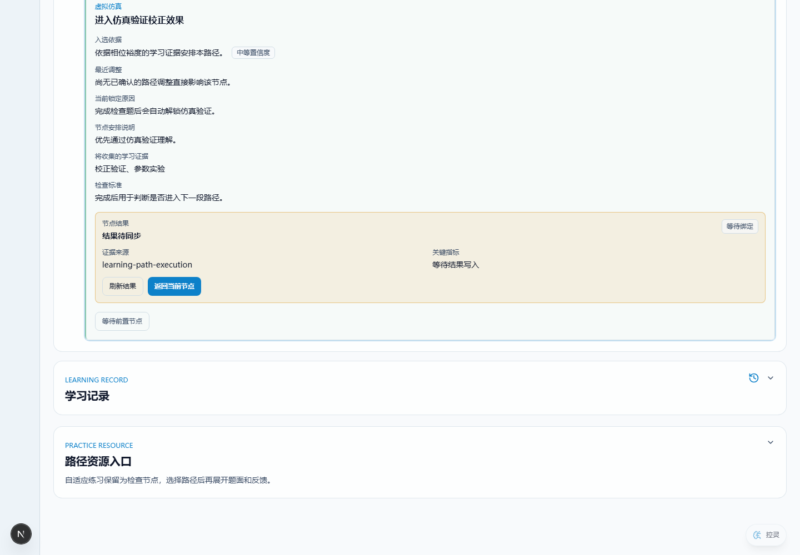

# Commercial UI Evidence

## Representative route

- `/assessment/adaptive-practice?demo=1&goal=control-correction&intent=path-execution&nodeDecisionFixture=locked`
- Legacy limitation state: `/assessment/adaptive-practice?demo=1&goal=control-correction&intent=path-execution&provenanceFixture=legacy`
- Completed and skipped history state: `/assessment/adaptive-practice?demo=1&goal=control-correction&intent=path-execution`

## Captures

### Desktop 1440 × 1000



### Mobile 320 × 900


## Acceptance record

- The first viewport contains the active-route workspace and the current node at both 1440px and 320px.
- Current-node actions remain reachable after expanding node details.
- “入选依据”, “最近调整”, and the governed “当前锁定原因” are separate and readable.
- The locked explanation uses current readiness; the skipped fixture does not retain a stale lock section.
- The legacy fixture states that node-level historical selection evidence was not recorded and does not reconstruct it from current learner state.
- Completed and skipped nodes retain their historical decision section.
- Automated geometry checks found no document-level horizontal overflow, clipped decision block, or incoherent text wrapping at 1440px or 320px.
- Existing focus-visible classes remain on the unchanged node selector and action controls. This change introduces no new control, motion, color, gradient, shell frame, status term, or module chrome.

## Automated browser command

```powershell
$env:PLAYWRIGHT_SKIP_WEB_SERVER='1'
$env:PLAYWRIGHT_BASE_URL='http://localhost:3003'
$env:NODE_OPTIONS='--max-old-space-size=8192'
npx playwright test tests/adaptive-path-node-decision-visual-acceptance.spec.ts --workers=1
```

Result: 4 tests passed, covering manifest integrity, desktop, 320px, recorded selection, dynamic lock, legacy limitation, completed history, skipped history, primary actions, and horizontal-overflow geometry.

## Verification manifest

`manifest.json` binds these captures to source revision `0eb974368bb8485f646ebcbd80fcf6dd5d9c011e`, captured at `2026-08-08T09:58:47.234Z`.

- Generator: `tests/adaptive-path-node-decision-visual-acceptance.spec.ts` (`02e1ebe4a1112cc614a97c8b29a81a29a790ffe5f1e37bd2e4db09edf8b6397f`)
- Production source: `src/app/assessment/adaptive-practice/page.tsx` (`c78e4614835670a9f8a39b1f073ca67f5cecc009673e81579d90dc2219a7ec26`)
- Desktop capture: `desktop-1440.png` (`43eaf8cce83f2d8987e2f7662d7191635405f4f2be4ea2f20237d693af15f888`)
- Mobile capture: `mobile-320.png` (`0bdc2d898ef93e6c488b8f017318d44a3b09d5f59d5ab94a0dce8ee7821237e0`)

The evidence test verifies the manifest, source hashes, screenshot hashes, required route and viewport metadata, and horizontal-overflow result. It fails when the generator or production source differs from the captured revision, rather than accepting stale evidence.
